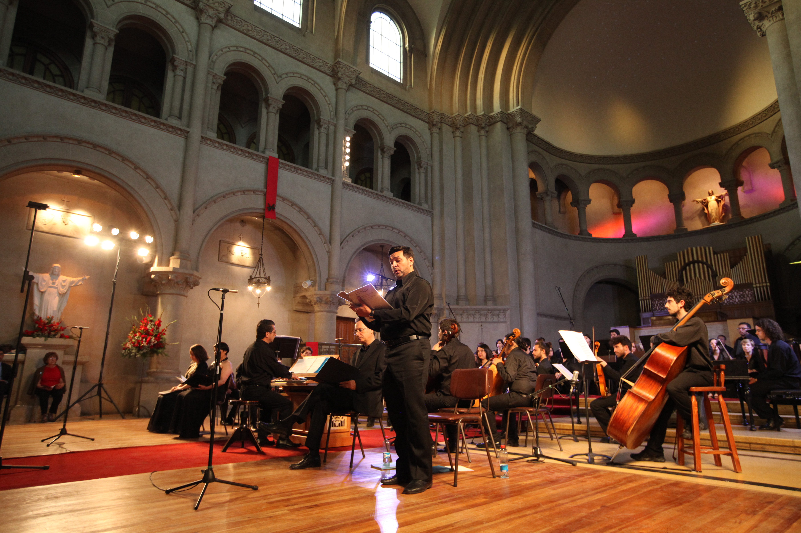
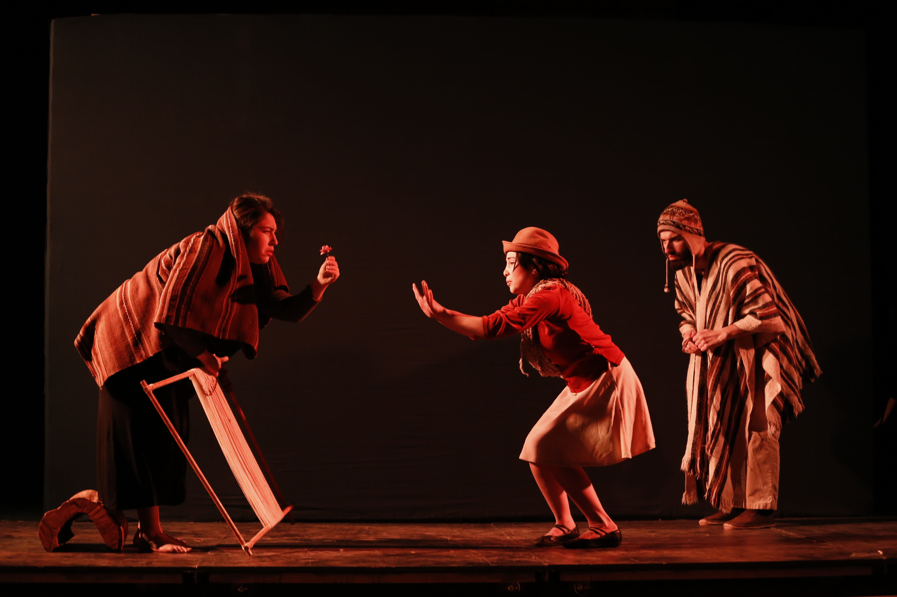
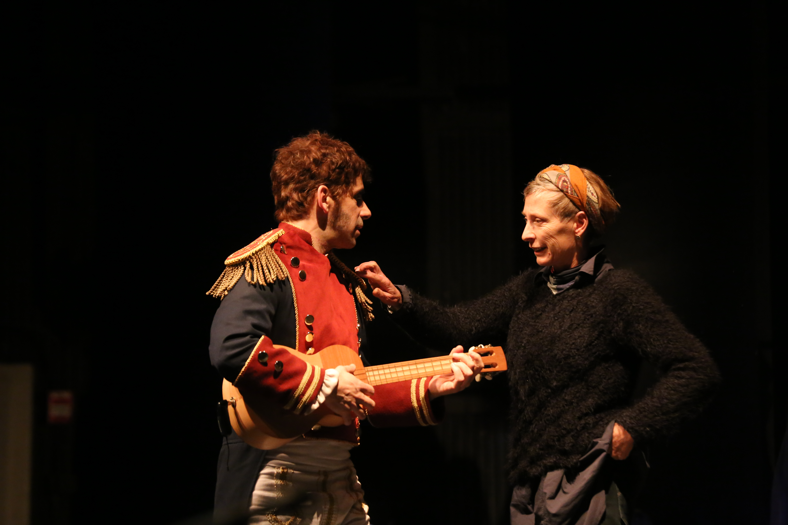
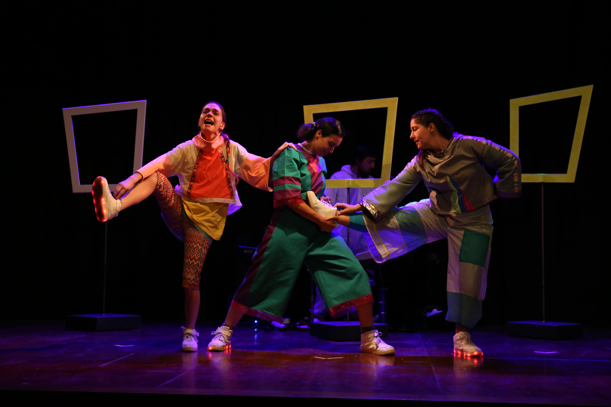
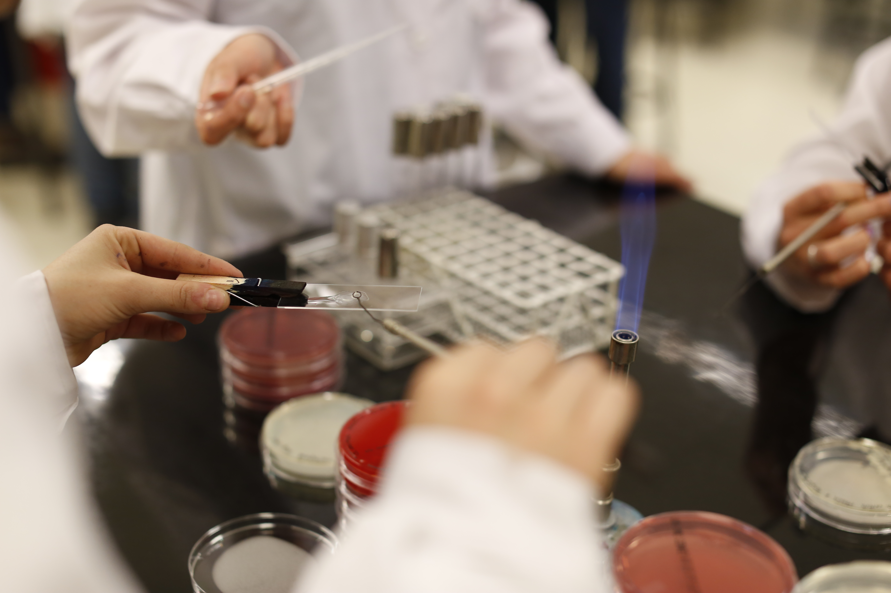
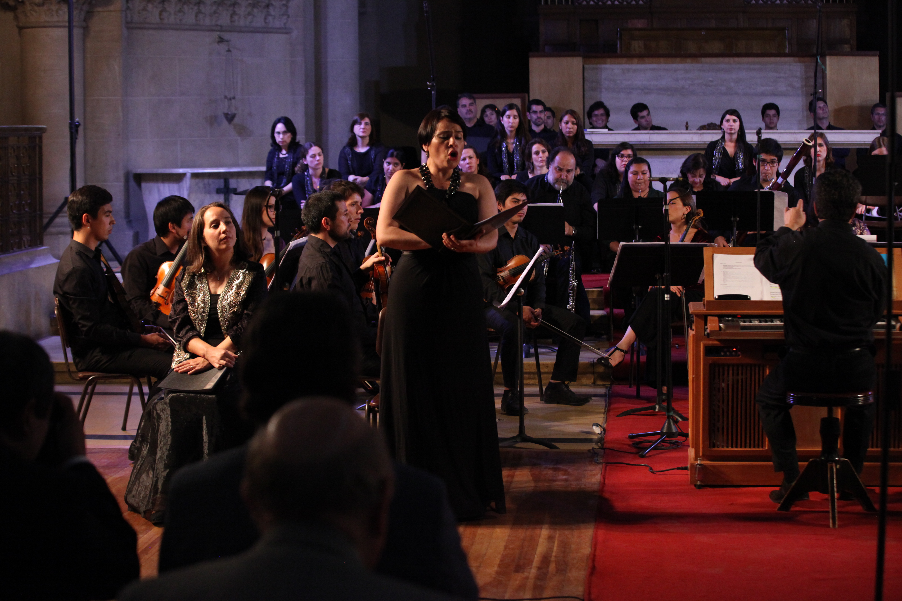

# Landing Extensión

## Extensión

Foto: buscar 

Propuestas de imagen:

La UC busca ser un actor relevante en el desarrollo del país, generando conocimiento de calidad que promueva el progreso. Para lograrlo, ha establecido instancias que buscan canalizar el aporte de la universidad a la agenda nacional.

#### En esta sección:

* Cultura y arte
* Compromiso público
* Encuestas y estudios
* Servicios y asesorías

### Cultura y arte

La Universidad entrega una oferta cultural de excelencia para aportar a la formación de las personas desde la apreciación artística y todas sus potencialidades.

Evento 1

Evento 2

Evento 3

Evento 4

Evento 5

Evento 6

Evento 7

Evento 8

Evento 9

Evento 10

#### Cine

Imagen

[Cine UC](http://cine.uc.cl)

#### Ediciones UC

Imagen \(propuesta\)

[Ediciones UC](http://ediciones.uc.cl)

#### Teatro

Imagen \(propuesta\)

[Teatro infantil](http://extension.uc.cl/teatro-infantil/cartelera)

Imagen \(propuesta\)

[Teatro UC](http://teatrouc.uc.cl/)

#### Creación e investigación

Imagen \(propuesta\)

[Dirección de Artes y Cultura](http://artesycultura.uc.cl/es/)

Imagen \(propuesta\)

[Catálogo de proyectos](http://artesycultura.uc.cl/es/creacion-investigacion/catalogo-de-proyectos)

Imagen \(Propuesta Gandarillas\)

[Guía para las Artes UC](http://artesycultura.uc.cl/es/guia-para-las-artes)

Imagen \(propuesta\)

#### Artes visuales

Imagen \(propuesta\)

[Exposiciones](http://extension.uc.cl/artes-visuales/exhibicion)

Imagen \(propuesta\)

[Bazart](http://extension.uc.cl/bazart/acerca-de)

Imagen \(propuesta\)

[Galería Macchina](http://galeriamacchina.uc.cl/)

Imagen \(propuesta\)

[Espacio Vilches](http://galeriamacchina.uc.cl/Espacio-Vilches/)

Imagen \(propuesta\)

### **Compromiso público**

Conoce nuestras distintas iniciativas, en que diferentes ámbitos de acción aportan a la sociedad y a las problemáticas que enfrenta nuestro país, reforzando el rol público de la UC.

\*\*\*\*[**Listado de iniciativas de compromiso público**](vinculacion-con-el-territorio.md)\*\*\*\*

### Encuestas y Estudios

Encuesta 1

Encuesta 2

Encuesta 3

[Más encuestas y estudios](mas-encuestas-y-estudios.md) 

### Servicios y Asesorías

Desde consultorías profesionales hasta el arriendo de espacios, la Universidad Católica se vincula con la comunidad a través una amplia oferta.

#### **Servicios profesionales**

Conoce los servicios en distintas áreas que las unidades académicas ofrecen, con el sello de calidad UC.

[**Servicios UC**](servicios-profesionales-uc.md)\*\*\*\*

#### **Arriendo de espacios**

Encuentra el espacio para tu evento, ya sea una actividad académica, gubernamental, corporativa o personal.

\*\*\*\*[**Ver lista de espacios**](arriendo-de-espacios-uc.md)

### **Sigue explorando**

Noticia 1

Noticia 2

Noticia 3

Noticia 4

### Footer 

Imágenes que pueden servir en esta  carpeta

[https://www.flickr.com/photos/universidadcatolica/albums/72157673991625700](https://www.flickr.com/photos/universidadcatolica/albums/72157673991625700)

