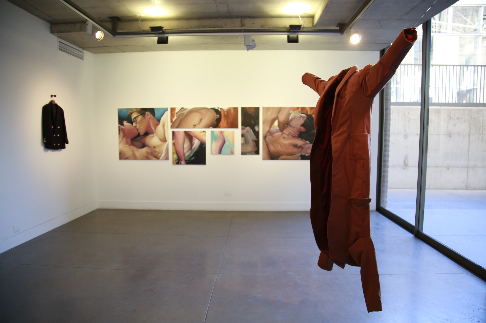

# Landing Extensión

## Extensión

Foto: 



La UC busca ser un actor relevante en el desarrollo del país a través de la generación conocimiento y de la oferta cultural. Te invitamos a conocer las distintas iniciativas con que las que aportamos a la agenda nacional y nos vinculamos con el país.

#### En esta sección:

* Eventos para todo público
* Cultura y arte
* Compromiso público
* Encuestas y estudios
* Servicios y asesorías

### Eventos para todo público

La Universidad ofrece actividades de excelencia para aportar a la formación de todas las personas.

\(_10 Eventos para todo público_\)

### Cultura y Arte

#### Cine

Foto: 



Enlace: [http://extension.uc.cl/cine/cartelera](http://extension.uc.cl/cine/cartelera)

#### Ediciones UC

Foto: 



Enlace: [https://ediciones.uc.cl/](https://ediciones.uc.cl/)

#### Teatro

#### Teatro UC

Fotos: 



Enlace: [http://teatrouc.uc.cl/](http://teatrouc.uc.cl/)

Teatro infantil

Fotos: 



Enlace: [http://extension.uc.cl/teatro-infantil/cartelera](http://extension.uc.cl/teatro-infantil/cartelera)

#### Creación e investigación

[Dirección de Artes y Cultura](http://artesycultura.uc.cl/es/)

Foto: 



[Catálogo de proyectos](http://artesycultura.uc.cl/es/creacion-investigacion/catalogo-de-proyectos)

Foto:



Enlace:

[http://artesycultura.uc.cl/es/creacion-investigacion/catalogo-de-proyectos/buscador](http://artesycultura.uc.cl/es/creacion-investigacion/catalogo-de-proyectos/buscador)

[Guía para las Artes UC](http://artesycultura.uc.cl/es/guia-para-las-artes)

Imagen \(propuesta\)

#### Artes visuales

Imagen \(propuesta\)

[Exposiciones](http://extension.uc.cl/artes-visuales/exhibicion)

Imagen \(propuesta\)

[Bazart](http://extension.uc.cl/bazart/acerca-de)

Imagen \(propuesta\)

[Galería Macchina](http://galeriamacchina.uc.cl/)

Imagen \(propuesta\)

[Espacio Vilches](http://galeriamacchina.uc.cl/Espacio-Vilches/)

Imagen \(propuesta\)

### **Compromiso público**

Conoce nuestras distintas iniciativas que aportan a la sociedad y a las problemáticas que enfrenta nuestro país, en que diferentes ámbitos de acción.

\*\*\*\*[**Ver como listado**](https://drive.google.com/open?id=1_kvAj3zIYuTKM5lg7IO87bvoL_nqTqHEwMR5FDGpBF4)\*\*\*\*

### Encuestas y Estudios

Encuesta 1

Encuesta 2

Encuesta 3

[Más encuestas y estudios](mas-encuestas-y-estudios.md) 

### Servicios y Asesorías

Desde consultorías profesionales hasta el arriendo de espacios, la Universidad Católica se vincula con la comunidad a través una amplia oferta.

#### **Servicios destacados**

**DICTUC**

Empresa de servicios de ingeniería multidisciplinarios, enfocada en resolver problemas específicos o desarrollar proyectos de gran envergadura, en diferentes sectores productivos y en áreas de interés para el país.

Conoce más del DICTUC: [https://www.dictuc.cl/](https://www.dictuc.cl/)

#### CITUC

El Centro de Información Toxicológica de la Universidad Católica \(CITUC\), es una organización sin fines de lucro, cuyo fin es servir a la comunidad cubriendo la necesidad de información científica actualizada en casos de emergencias toxicológicas y emergencias químicas en nuestro país. Cuenta con asistencia telefónica 24/7 para situaciones de emergencia.

Visita el sitio de CITUC: [http://cituc.uc.cl/](http://cituc.uc.cl/)

#### DESUC

La Dirección de Estudios Sociales UC desarrolla estudios de opinión pública, imagen, servicio, poíticas públicas y tendencias sociales para agencias públicas y medios de comunicación.

Conoce los servicios de DESUC: [http://sociologia.uc.cl/desuc/](http://sociologia.uc.cl/desuc/)

#### \(Botón\): [Revisa el listado completo de servicios profesionales de la UC](servicios-profesionales-uc.md)

### **Arriendo de espacios**

**Espacios destacados**

**Centro de Extensión Alameda**

Con más de 30 años de trayectoria, el Centro de Extensión Alameda es uno de los espacios multidisciplinarios más completos y emblemáticos de Santiago.

Foto: [https://drive.google.com/open?id=19XrnmkTs442lQLIPNIk-FhAzBUcubM0\_](https://drive.google.com/open?id=19XrnmkTs442lQLIPNIk-FhAzBUcubM0_)

#### Centro de Extensión Campus Oriente

Este tradicional edificio propiedad de la Universidad desde 1971, cuenta con tradicionales espacios para matrimonios y eventos. 

Foto: [https://drive.google.com/open?id=11TNG8S3cPq2IvlO4qNC6NqQmsLYX9V7s](https://drive.google.com/open?id=11TNG8S3cPq2IvlO4qNC6NqQmsLYX9V7s)

#### Centro de Extensión Pirque

Construcciones patrimoniales renovadas, en medio de varias hectáreas de parque, hoy están a disposición de la comunidad para la realización de todo tipo de eventos. 

Foto: [https://drive.google.com/open?id=16KxNiVTQ-5Cs3KMoeR\_lYVPDC3slfsGx](https://drive.google.com/open?id=16KxNiVTQ-5Cs3KMoeR_lYVPDC3slfsGx)

\(Botón\): [**Organiza tu evento con nosotros**](http://centroeventos.uc.cl/)\*\*\*\*

### **Sigue explorando**

Noticia 1

Noticia 2

Noticia 3

Noticia 4

### Footer 

Imágenes que pueden servir en esta  carpeta

[https://www.flickr.com/photos/universidadcatolica/albums/72157673991625700](https://www.flickr.com/photos/universidadcatolica/albums/72157673991625700)

