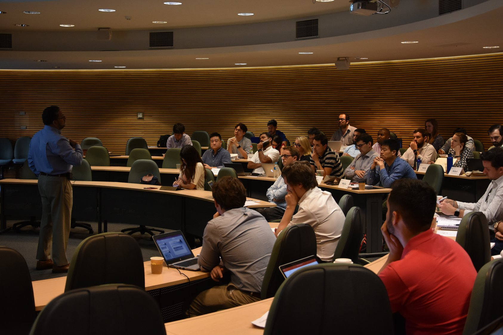
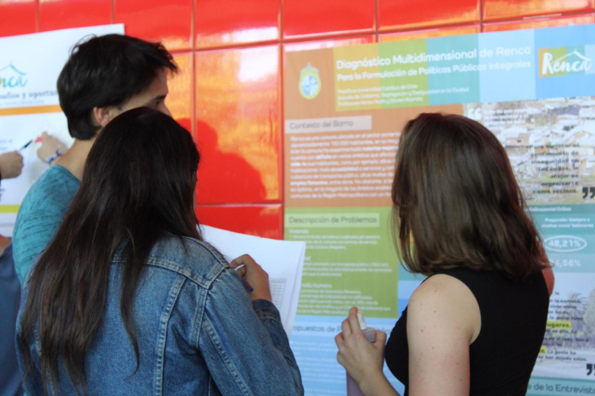
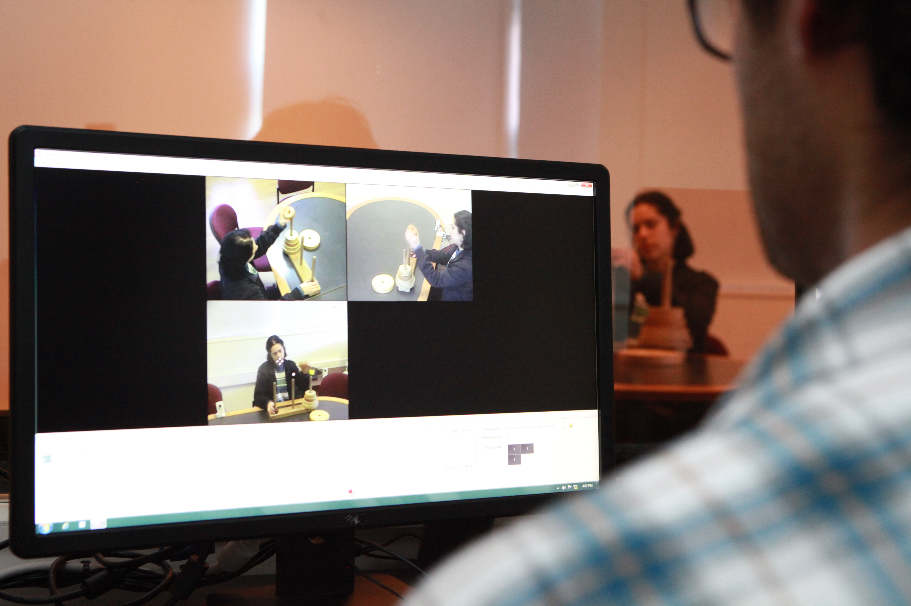
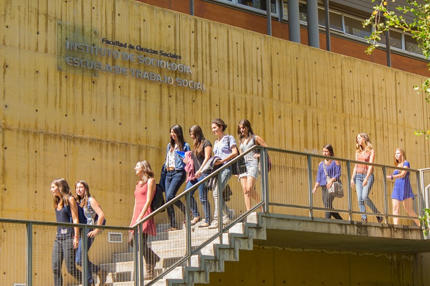
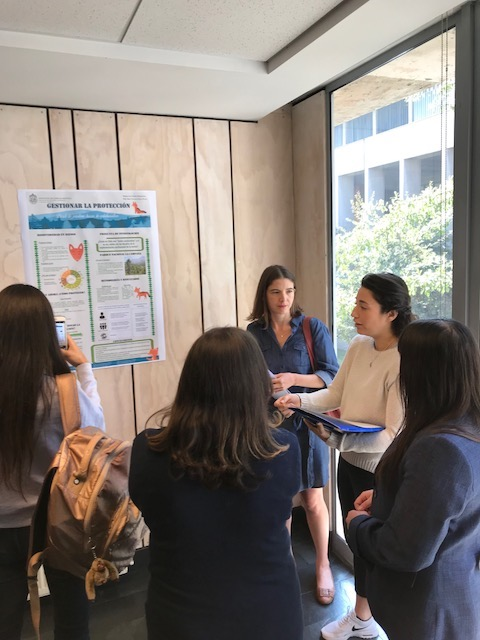
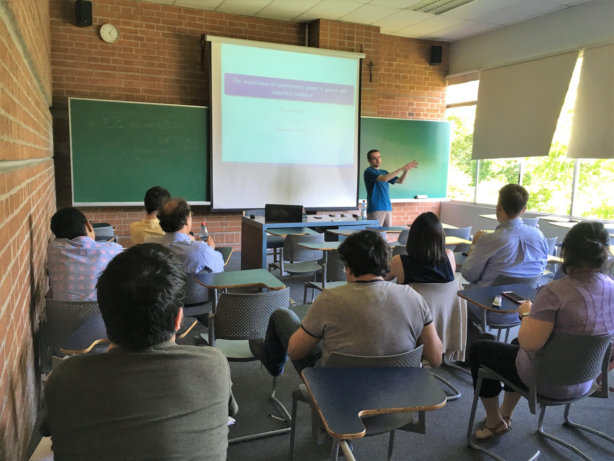
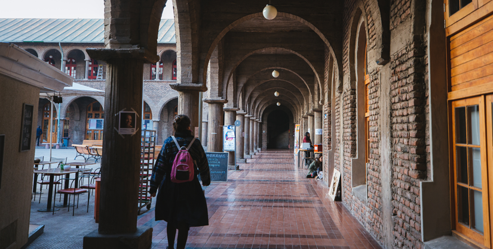
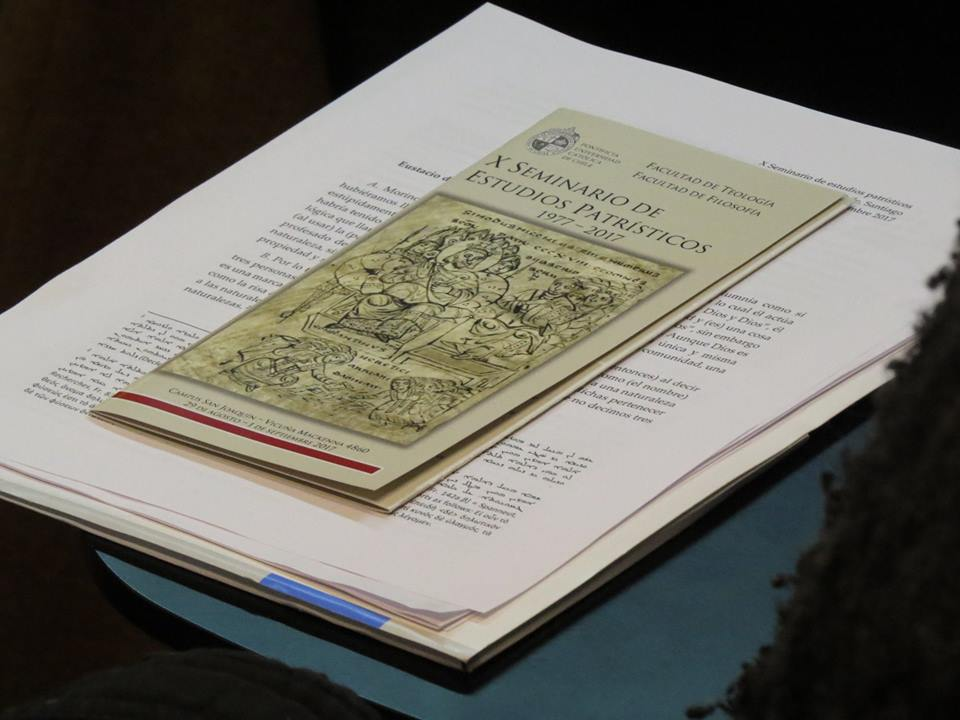
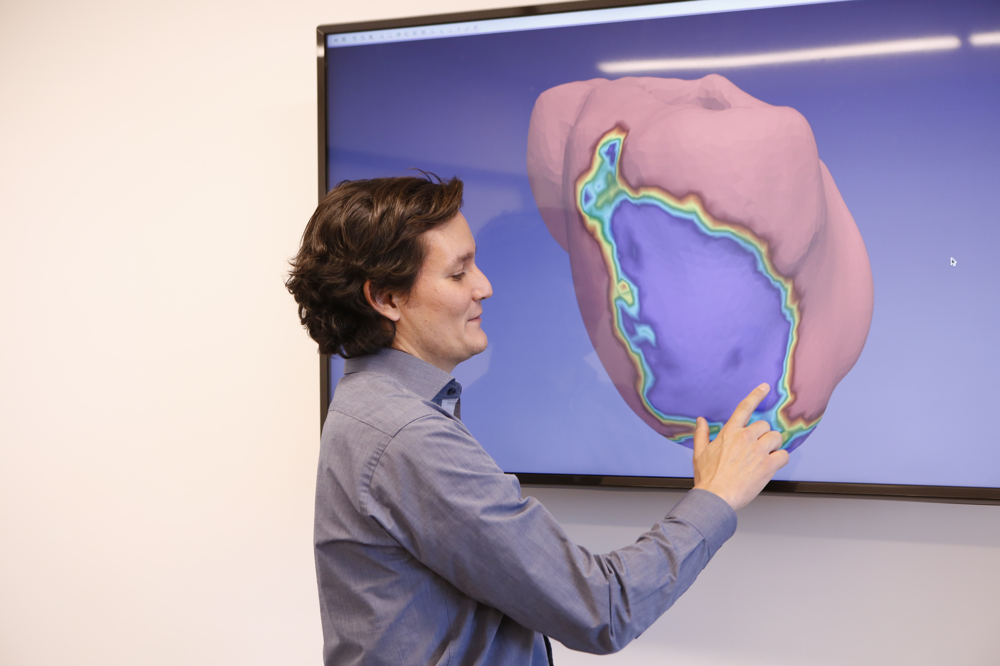

# Listado por escuelas e institutos

### Escuelas e Institutos

Imagen cabecera:

  

**Escuelas**

\*\*\*\*[**Escuela de Administración**](https://escueladeadministracion.uc.cl/)\*\*\*\*

  
****  
Pertenece a: Facultad de Ciencias Económicas y Administrativas.  
Campus San Joaquín \(falta enlace a mapa\)

\*\*\*\*[**Escuela de Arquitectura**](http://arquitectura.uc.cl/)

  
Pertenece a: Facultad de Arquitectura, Diseño y Estudios Urbanos.  
Campus Lo Contador \(falta enlace a mapa\)  
  
[**Escuela de Arte**](http://escuelaarte.uc.cl/)

  
Pertenece a: Facultad de Artes.  
Campus Oriente \(falta enlace a mapa\)  
  
[**Escuela de Construcción Civil**](http://construccioncivil.uc.cl/)

  
Pertenece a: Facultad de Ingeniería  
Campus San Joaquín \(falta enlace a mapa\)  
  
[**Escuela de Diseño**](http://diseno.uc.cl/)

  
Pertenece a: Facultad de Arquitectura, Diseño y Estudios Urbanos  
Campus Lo Contador \(falta enlace a mapa\)  
  
[**Escuela de Enfermería**](http://enfermeria.uc.cl/)

  
Pertenece a: Facultad de Medicina  
Campus San Joaquín \(falta enlace a mapa\)  
  
[**Escuela de Gobierno**](http://gobierno.uc.cl/es/)

  
Pertenece a Facultades de: Ciencias Económicas y Administrativas; Ciencias Sociales; Derecho; Historia, Geografía y Ciencia Política; e Ingeniería.  
Campus San Joaquín \(falta enlace a mapa\)  
  
[**Escuela de Ingeniería**](https://www.ing.uc.cl/)

  
Pertenece a: Facultad de Ingeniería  
Campus San Joaquín \(falta enlace a mapa\)  
  
[**Escuela de Medicina**](https://medicina.uc.cl/)

  
Pertenece a: Facultad de Medicina.  
Casa Central \(falta enlace a mapa\)  
  
[**Escuela de Odontología**](http://odontologia.uc.cl/)

  
Pertenece a: Facultad de Medicina.  
Campus San Joaquín \(falta enlace a mapa\)  
  
[**Escuela de Psicología**](http://www.psicologia.uc.cl/)

  
Pertenece a: Facultad de Ciencias Sociales.  
Campus San Joaquín \(falta enlace a mapa\)  
  
[**Escuela de Teatro**](http://teatrouc.uc.cl/)

  
Pertenece a: Facultad de Artes.  
Campus Oriente \(falta enlace a mapa\)  
  
[**Escuela de Trabajo Social**](http://trabajosocial.uc.cl/)

  
Pertenece a: Facultad de Ciencias Sociales.  
Campus San Joaquín \(falta enlace a mapa\)

**Institutos**

\*\*\*\*[**Instituto de Astrofísica**](http://astro.uc.cl/)

  
Pertenece a: Facultad de Física.  
Campus San Joaquín \(falta enlace a mapa\)  
  
[**Instituto de Ciencia Política**](http://www.cienciapolitica.uc.cl/)

  
Pertenece a: Facultad de Historia, Geografía y Ciencia Política  
Campus San Joaquín \(falta enlace a mapa\)  
  
[**Instituto de Economía**](http://economia.uc.cl/)

  
Pertenece a: Facultad de Ciencias Económicas y Administrativas  
Campus San Joaquín \(falta enlace a mapa\)  
  
[**Instituto de Estética**](http://estetica.uc.cl/)

  
Pertenece a: Facultad de Filosofía.  
Campus Oriente \(falta enlace a mapa\)  
  
[**Instituto de Estudios Urbanos**](http://estudiosurbanos.uc.cl/)

  
Pertenece a: Facultad de Arquitectura, Diseño y Estudios Urbanos.  
Campus Lo Contador \(falta enlace a mapa\)  
  
[**Instituto de Filosofía**](http://filosofia.uc.cl/)

  
Pertenece a: Facultad de Filosofía.  
Campus San Joaquín \(falta enlace a mapa\)  
  
[**Instituto de Física**](http://fisica.uc.cl/)

  
Pertenece a: Facultad de Física.  
Campus San Joaquín \(falta enlace a mapa\)  
  
[**Instituto de Geografía**](http://geografia.uc.cl/?server=1)

  
Pertenece a: Facultad de Historia, Geografía y Ciencia Política.  
Campus San Joaquín \(falta enlace a mapa\)  
  
[**Instituto de Historia**](http://historia.uc.cl/)

  
Pertenece a: Facultad de Historia, Geografía y Ciencia Política.  
Campus San Joaquín \(falta enlace a mapa\)  
  
[**Instituto de Ingeniería Biológica y Médica**](http://ingenieriabiologicaymedica.uc.cl/es/)

  
Pertenece a Facultades de: Ingeniería, Medicina y Ciencias Biológicas.  
Campus San Joaquín \(falta enlace a mapa\)  
  
[**Instituto de Ingeniería Matemática y Computacional**](http://imc.uc.cl/)

  
Pertenece a Facultades de: Matemáticas e Ingeniería  
Campus San Joaquín \(falta enlace a mapa\)  
  
[**Instituto de Música**](http://musica.uc.cl/)

  
Pertenece a: Facultad de Artes.  
Campus Oriente \(falta enlace a mapa\)  
  
[**Instituto de Sociología**](http://sociologia.uc.cl/)

  
Pertenece a: Facultad de Ciencias Sociales.  
Campus San Joaquín \(falta enlace a mapa\)

### Sigue explorando

Caja 1  
Campus UC  
Conoce el campus Casa Central

Caja 2  
Investigación  
Tour Virtual Observatorio Santa Martina

Caja 3  
Investigación  
¿Sabías que la UC tiene una Estación Costera de Investigaciones Marinas?

Caja 4  
Exposición  
Visita la muestra "Serie Autorretratos Sur", en Casa Central

