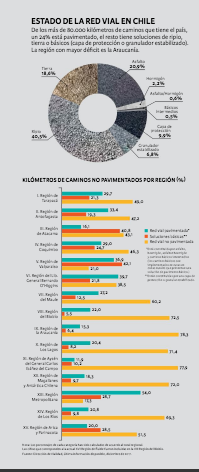

# Mirar el suelo para construir el desarrollo

#### Urbanismo

### Mirar el suelo para construir el desarrollo

#### En Chile, el MOP es la principal entidad encargada de decidir e implementar los proyectos de infraestructura. ¿Qué factores pesan a la hora de optar por uno u otro proyecto? ¿Cómo incorporar tecnología? ¿Cómo involucrar a las comunidades? Son preguntas que responden académicos y autoridades en la materia, a la luz de fenómenos diversos que van desde el cambio climático hasta las relicitaciones obtenidas por empresas sancionadas.

Por Violeta Bustos

**El recurso más importante de una ciudad es el suelo. ¿Quiénes viven en él y cómo les afectan los proyectos que sobre él se construyen?** Los actores vinculados al desarrollo de la infraestructura en Chile parten desde esta afirmación y articulan sus argumentos sobre la pregunta que se despliega. 

Los puntos de vista se ramifican en opiniones sobre:

* los países a los que debiera mirar el nuestro
* la importancia de estimular las alternativas frente a la movilidad automotriz
* ampliar la mirada a la rentabilidad ambiental,

entre otros desafíos que abordan exautoridades -todos miembros del Consejo de Políticas de Infraestructura \(CPI\)- y académicos de Ingeniería, Arquitectura y Geografía.

A la hora de definir los proyectos, frente a la conocida realidad de recursos escasos y necesidades ilimitadas, la exministra del Ministerio de Obras Públicas, MOP, \(2010\), Loreto Silva -quien hoy trabaja en el estudio Bofill, Escobar y Silva-, manifiesta que **lo más importante es establecer los criterios de necesidad de la obra, los recursos y el soporte**. Esto se realiza en función de la **"evaluación social, base que permite determinar qué proyecto es más importante".** Al mismo tiempo, **"ya no se pueden desarrollar obras embelmáticas sin tener un acuerdo previo con la comunidades"**. Pero no existen organismos de la sociedad civil o instituciones públicas que velen por la participación permanente de forma vinculante.

Ha sido quizás la evaluación de impacto ambiental, uno de los instrumentos más utilizados para medir el efecto de los proyectos en algún nivel de sintonía con las comunidades. Al respecto el exministro de la misma cartera \(2006\), **Alberto Undurraga**, nombra además al **Consejo de la Sociedad Civil** \(Cosoc\). Este **organismo existe en cada ministerio** y enfatiza en la necesidad de **extender como buena práctica la planificación a largo plazo.**

Por su parte el extitular del MOP \(2000\), **Carlos Cruz**, afirma que vale la pena pensar en todos los actores involucrados en este tema. **"El desarrollo del país no sólo es responsabilidad de los que gobiernan, sino de todos"**. Para ello, asegura, es necesario diseñar sistemas de participación ciudadana temprana pues **"no hay nada más invasivo y que cambie con mayor radicalidad la geografía de una localidad que un proyecto de infraestructura vial."**


"La evaluación social es la base que permite determinar qué proyecto es más importante. Ya no se pueden desarrollar obras emblemáticas sin tener un acuerdo previo con las comunidades", explica Loreto Silva, ex titular de Obras Públicas.


#### GEOGRAFÍA VIAL

**La infraestructura afecta la geografía, pero quienes se dedican a esta disciplina no suelen estar involucrados en comisiones y menos en la toma de decisiones al respecto.** Así, el académico del Instituto de Geografía UC, Rafael Sánchez, señala que falta considerar las diferencias regionales al decidir por parte del MOP. Y, a la vez, determinar a qué necesidades se les dará prioridad, en un contexto donde rentabilidad social y económica pueden estar desbalanceado.

Muchas veces, asegura, "**se les da prioridad a los criterios productivos** y, por ejemplo, en vez de proporcionar las condiciones para dotar de agua potable a una comunidad, se opta por regadío agrícola". 

#### SOBRE ELEFANTES BLANCOS Y AUTOMÓVILES

