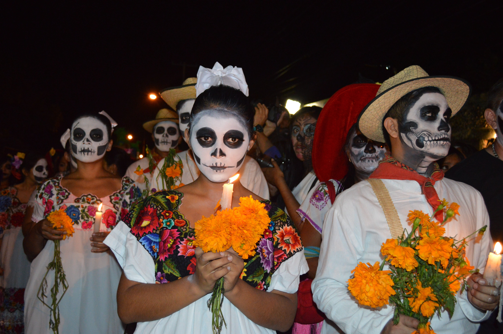
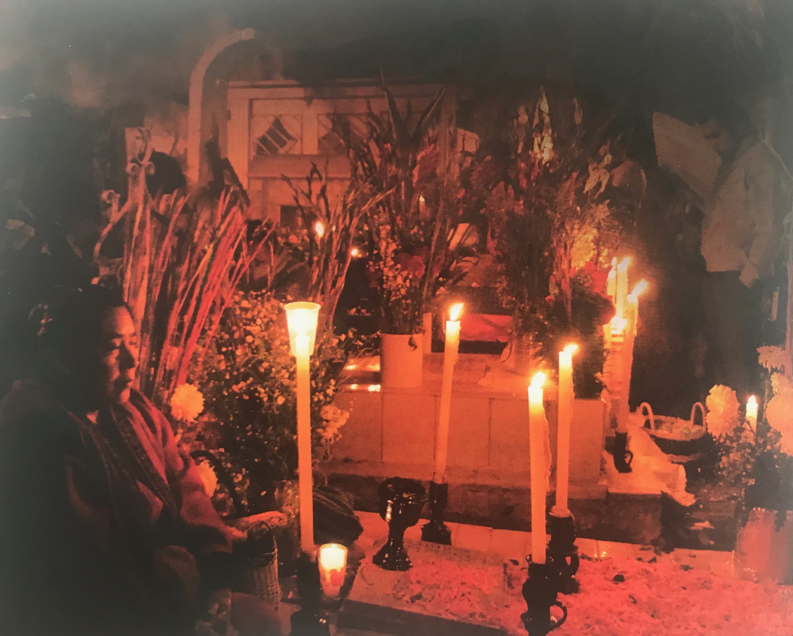

# La Muerte, ese capítulo de la vida

Viernes, 15 de Marzo de 2019

### La muerte, ese capítulo de la vida

#### Un mejor proceso de fin de vida no supone solo el alivio del sufrimiento, sino también aceptar que existe la posibilidad de una muerte pronta. Y vivir esta etapa es ir dejando de lado lo accesorio, para llegar a lo medular. Los médicos Pedro Pérez y Alfredo Rodríguez; y la enfermera Paula Medeiros, todos del Programa de Medicina Paliativa y Cuidados Continuos de la Red de Salud UC-CHRISTUS; y Doris García, jefa de la línea del adulto mayor del Hogar de Cristo, abordan en este artículo de la profesora Eliana Rozas, publicado en la última edición de [Revista Universitaria](https://www.uc.cl/es/revista-universitaria), la etapa del final de la vida. Desde la profunda experiencia de aquellos que están a diario con quienes la enfrentan. 

#### Autor: 

**Eliana Rozas:** Periodistas y egresada de Derecho de la Pontificia Universidad Católica de Chile. Además es académica de la Facultad de Comunicaciones de la misma institución.

_"Porque el tiempo es escaso y precioso/ los días son un tesoro merecido,/ las horas instantes de la eternidad,/ los minutos efímeros cordeles/ volando en pleno día, los segundos/ cenizas de diamante"._

El poeta Gonzalo Millán escribió esos versos en su último 2 de junio, el de 2006. Apenas unos días antes, “como un asteroide caído en Yucatán”, se le había diagnosticado un cáncer de pulmón. 

**Mientras conscientemente caminaba hacia ese segundo día de la vida que tiene menos de 24 horas \(el primero es el nacimiento\), fue construyendo un diario que se publicó bajo el título de Veneno de escorpión azul**. Es el relato minucioso de una nueva cotidianeidad, donde los exámenes y las terapias conviven con los almuerzos, los viajes a la playa y con los nimios-gigantescos descubrimientos: las araucarias, el ombligo que mantenía a una naranja colgada al árbol, el revuelo de las tórtolas en su barrio. Es también **un recorrido en verso por la hondura del que se sabe haciendo el más radical de todos los tránsitos,** desde ese “me interno en el ensimismamiento porque veo con alarma que el barquero aborda su nave”, hasta esas bellísimas líneas de unas semanas antes de la partida: “Me voy, me abandono, me entrego a las aguas que a ratos pierden su indiferencia \(…\) No sé a dónde me dirijo, floto con la confianza de la semilla en manos del viento”.

**Morir se ha vuelto un gerundio, que coexiste con el vivir.** Y entonces, el alivio y el acompañamiento exigen que se les abra un espacio junto al que hasta ahora se ha mostrado como epítome médico, el de la curación. 

> “Para una persona es muy dramático pasar de ‘me voy a morir en algún momento’ a ‘me voy a morir de esta enfermedad que tengo ahora, dentro de unos meses o unos años’. Son dos paradigmas muy distintos”, explica el doctor Pedro Pérez.

En momentos en que en Chile comienza a plantearse una discusión sobre el tema, los **médicos Pedro Pérez y Alfredo Rodríguez**; y la **enfermera Paula Medeiros**, todos del Programa de Medicina Paliativa y Cuidados Continuos de la Red de Salud UC-CHRISTUS; y **Doris García, jefa de la línea del adulto mayor del Hogar de Cristo**, abordan la etapa del final de la vida, desde la profunda experiencia de aquellos que están a diario con quienes la enfrentan.

Sus reflexiones están acompañadas por algunas de las que plasmó la psicóloga Carla Vidal en un texto titulado Sin paréntesis. En 2007 se le detectó un cáncer de páncreas, producto del cual murió cinco años después.

#### **VIVIR, NO LUCHAR**

_Sentí un alivio tremendo de poder enfrentar el cáncer de esta manera, conectada con la vida y el placer, y no como soldado de una batalla cruenta y agotadora, con un ejército contrario muy poderoso. \(…\) Soltar la lucha es aceptar lo que tengo y preguntarme cómo quiero vivir esta nueva realidad, cómo vivir mi vida integrando la enfermedad de la mejor forma posible. Una idea se iba haciendo cada vez más clara: **esto se trata de vivir, no de durar**._ \(Carla Vidal\) __

El doctor Pérez, jefe del mencionado programa de la UC, se rebela frente a lo que llama el “discurso público” del triunfo o fracaso frente a la enfermedad. “La muerte no es una derrota tras una pelea –afirma–. **En vez de hablar de dar batallas, tendríamos que decir ‘esta persona vivió bien hasta el final y murió en paz con su vida’”**. Ese es, precisamente, el objetivo que persigue el equipo que lidera: “Ayudar a que la vida sea significativa hasta el final”.

Es el cambio en las causas de muerte y su transformación en un camino largo, que más bien se entiende como un “proceso de fin de vida”, lo que explica ese objetivo. También la relevancia que va adquiriendo la medicina paliativa y, sobre todo, la necesidad de **considerar la experiencia del cierre de la vida como una parte de ella misma**. Aunque parezca contracultural. 

La muerte puede sobrevenir súbitamente. Por ejemplo:

* en el caso de un accidente vascular encefálico o un infarto al miocardio, donde hay poco tiempo para iniciar terapias; 
* a causa de una enfermedad aguda que es secundaria a un daño de uno o más sistemas del organismo, que habitualmente supone la internación en unidades de cuidados intensivos \(infecciones importantes\); 
* a causa de una enfermedad crónica, como el cáncer o las insuficiencias graves. 

Sin embargo, el doctor Pérez explica que **en Chile ya no morimos mayoritariamente de infecciones que generan una muerte rápida, sino de estas enfermedades que pueden extenderse por meses o años**, con sufrimiento asociado para el paciente y su entorno. Identificar y evitar las causas de ese padecimiento es básico para lograr el objetivo de una vida significativa hasta el final y, por eso mismo, el jefe del programa resiente que **en Chile los cuidados paliativos estén solo garantizados vía AUGE, en el caso del cáncer.**

Su colega el doctor Alfredo Rodríguez, especialista en medicina familiar y cuidados paliativos, señala que está descrito que **este tipo de pacientes reporta entre ocho y diez síntomas, tanto de índole física**, que no necesariamente corresponden a dolor sino a náuseas, sensación de ahogo, cansancio, pérdida de apetito, insomnio o somnolencia; **como psicológica**, que pueden manifestarse en depresión, ansiedad o angustia; **o espiritual**, relacionados con la pérdida de sentido o con la sensación de abandono.

Detectarlos y aliviarlos es el objetivo del equipo del cual forma parte, que también incluye psiquiatras, psicólogos, enfermeras, fonoaudiólogos y agentes pastorales.

> “Nuestro trabajo es ayudar a que el paciente pueda, por una parte, ir reconociendo la posibilidad de la muerte y, al mismo tiempo, mantenerse esperanzado en la recuperación. Además, ser capaz de vivir lo mejor posible con esa ambivalencia”, explica el doctor Pérez.

#### VIVIR LA AMBIVALENCIA

_Puedo cuidarme, implementar acciones que protejan el terreno en que me habito \(...\). Pero, finalmente, admitiendo que todo ello es muy importante, que seguramente va a darme una mejor calidad de vida y tal vez una mayor sobrevida, como ha sido mi caso, debo aceptar que eso no me asegura la curación. El cáncer está relacionado con el misterio, y parte de enfrentar plenamente la vida es reconocer y convivir con el misterio, abriéndole un espacio a la incertidumbre y al no control._ 

**Un mejor proceso de fin de vida no supone solo el alivio del sufrimiento, sino también el desarrollo en el paciente de lo que Pedro Pérez llama “conciencia pronóstica”, es decir, aceptar que existe la posibilidad de una muerte pronta**. 

“Nosotros –afirma– vamos ayudando a los pacientes a ser capaces de integrar esa opción con realismo. Lamentablemente, en la medicina tenemos mucha incertidumbre. **No sabemos qué va a ocurrir con cada paciente concreto.** Tenemos información epidemiológica de lo que le pasa a una población y decimos, por ejemplo, una persona con tal enfermedad tiene 50% de posibilidades de sobrevida a tal plazo. Pero **para un paciente específico no tiene sentido el porcentaje, sino la dicotomía: va a estar vivo o muerto**. Entonces, nuestro trabajo es ayudar a que pueda, por una parte, ir reconociendo la posibilidad de la muerte y, al mismo tiempo, mantenerse esperanzado en la recuperación. Además, ser capaz de vivir lo mejor posible con esa ambivalencia”. 

El concepto de “conciencia pronóstica” también implica un **cambio de visión en los equipos de salud, de modo que no atienda exclusivamente a la opción de sobrevida** y se centre, por lo tanto, solo en la curación; sino **que también considere la posibilidad de la muerte e incorpore el alivio.** 

Para ello se hace indispensable que los grupos de cuidados paliativos trabajen paralelamente con los tratantes de las enfermedades, desde el diagnóstico: **“La visión antigua es curar, curar, curar y, cuando el tratamiento no surte efecto, derivar a cuidados paliativos** **–explica el doctor Pérez–. Lo que proponemos es la integración desde el principio.** Por ejemplo, frente a un paciente con cáncer, ayudamos a que la terapia sea lo menos pesada posible. Y aunque trabajamos de manera paralela con los oncólogos, nuestro rol es más bien secundario, pero si la enfermedad se vuelve refractaria, vamos tomando una función cada vez más importante”.

El médico señala que **la comprensión intelectual del inexorable fin de la vida humana no es lo mismo que contactarse con lo que ello implica en términos personales,** justamente lo que significa la idea de la “conciencia pronóstica”: “Para una persona es muy dramático pasar de ‘me voy a morir en algún momento’ a ‘me voy a morir de esta enfermedad que tengo ahora, dentro de unos meses o unos años’. Son dos paradigmas muy distintos. Los pacientes se demoran en pasar de uno a otro. Y a veces el equipo médico también necesita hacer la transición”. 

Con la experiencia que le da el haber trabajado una década como voluntaria y ahora ser jefa técnica nacional de la **Línea de Adulto Mayor del Hogar de Cristo, que atiende a 600 ancianos en 13 residencias** a lo largo del país, Doris García habla de que ellos van paulatinamente desarrollando una conciencia de que están en la última etapa del ciclo vital, lo que hace que frente a un deterioro de la salud manifiesten con naturalidad “parece que me llegó la hora”. Y piensa que **su aceptación de la muerte se relaciona con su contexto**: “Allí viven personas que están en la etapa final de la vida, en ocasiones muy enfermas. Y lo más habitual es que mueran también allí. Entonces, **la muerte se ve con cierta cercanía y eso ayuda a que sea aceptada y comprendida**”.

#### VIVIR LO MEDULAR

_Surge entonces la cercanía de la muerte como una posibilidad \(...\) que me permite conectarme de verdad con lo que quiero hacer: **¿qué haría yo si me fuera a morir en un año? Esa pregunta trae libertad y nuevas posibilidades.** De nosotros depende vivirla con susto o con entusiasmo \(...\). El futuro, los deseos, los planes surgen como posibilidades a las cuales los enfermos también tenemos derecho, porque estamos totalmente vivos._

Aunque ese “conectarse” con la posibilidad de la muerte no consiste en la información, la supone. **Todos los entrevistados coinciden en la conveniencia de que los pacientes sepan lo que les ocurre, en que es su derecho** que sus preguntas sean respondidas con la verdad y en que, en la medida en que las hacen, están preparados para recibir las respuestas.

En la experiencia de Doris García, la mayor parte de los ancianos que atiende el Hogar de Cristo quieren **conocer la información “para cerrar cosas”**. Según explica, se trata de adultos mayores que tienen rotos los vínculos porque han vivido en condiciones de vulnerabilidad mucho tiempo, lo que los ha llevado a conductas que los han alejado de las familias, frente a lo cual “surge la necesidad de perdonarse, de perdonar y de ser perdonado”. Entonces, precozmente, el Hogar de Cristo busca ir identificando los vínculos más significativos de sus residentes: el vecino, el amigo, el compañero de pieza, determinada persona a su cuidado.

Cuando los lazos se mantienen, son fundamentales en el proceso de fin de vida, porque **son los miembros de la familia quienes cuidan y acompañan**. Por eso, los profesionales del Programa de Medicina Paliativa de la UC consideran indispensable la comunicación y coordinación permanente con ellos y no solo con los pacientes. A tal punto, que el doctor Rodríguez plantea que en estos casos las familias pueden “modular síntomas”, sobre todo en el área psicológica y espiritual. **“Si una familia está con demasiada angustia o dificultad para aceptar el proceso –dice–, puede incidir en que el paciente empiece a no expresar lo que le está pasando para protegerla”.** 

Sin embargo, sostiene que esas son situaciones excepcionales y que las familias son mayoritariamente colaboradoras. Concuerda con él Paula Medeiros, enfermera coordinadora del programa, que atiende tanto a pacientes hospitalarios como a domicilio y ambulatorios: “**Los familiares son una gran ayuda. Habitualmente son muy preocupados y dedicados y llegan a hacer cosas que jamás se imaginaron que podrían”.**

No niegan, eso sí, que **acerca del tema de la información sobre la enfermedad y la posibilidad de la muerte, las familias generan a veces lo que llaman una “conspiración del silencio”**. Cuando eso ocurre, explica el doctor Pérez, empieza a haber una especie de desequilibrio emocional que suele producir división y separación en vez de mutuo apoyo en la vivencia de la pena, porque “cuando la familia tiene la información, ya está haciendo un duelo y el paciente, no”.

También ocurre lo contrario. Es decir, pacientes que buscan ocultarle la información a sus familiares para ahorrarles la tristeza, pero, aunque respetan esa voluntad, afirman que es rarísimo que no se enteren. Además, **el esfuerzo por ocultar información suele ser muy desgastante y consume la energía emocional que debiera orientarse a acompañar.**

Con todo, el gran motivo para que los equipos de salud busquen evitar la “conspiración”, haciendo intervenciones con los miembros del grupo familiar, es el tiempo del paciente. **“Si no tiene información –dice el doctor Pérez– no se puede preparar y hacer las cosas que considera importantes.** Si uno lo dice demasiado al final, no va a tener tiempo. Cuando se entrega una información de este tipo, se sabe que las personas van a sufrir, pero se necesita pasar por ahí para poder hacer el proceso”. 

El conocimiento del diagnóstico y de la expectativa no solo ayuda al enfermo a despedirse o hacer cosas que desea, según explica el doctor Rodríguez, sino también a entender lo que le está pasando. “Es angustiante verse todos los días más flaco o estar tomando remedios que no se sabe para qué son”, dice. Además, en su experiencia, “la mayoría de las veces los pacientes intuyen perfectamente lo que tienen”. 

“A veces quebrando ese silencio de las familias y de los pacientes en donde mutuamente no quieren hacerse sufrir –siempre en diálogo y con mucha prudencia, aclara–, la comunicación se facilita mucho y es como si todos se sacaran una mochila de encima. El silencio, estar callado junto a otro, puede ser una herramienta terapéutica muy buena. Pero **cuando ese silencio está tensionado por el ocultamiento, es muy perjudicial**”.

No existe un único modo de hacer ese tránsito hacia la conciencia de la última etapa de la vida y de sus implicancias, sino que es muy personal, pero los entrevistados concuerdan en que es común el temor a la etapa previa a la muerte. 

La excepción la plantea Doris García, respecto de los adultos mayores del Hogar de Cristo: “Es gente que vive feliz, que quiere hacer de todo, que baila cuando se puede bailar, pero que no se cuestiona ni muestra temor cuando se enferma y puede morir”.

“**Agonía** –señala en tanto el doctor Rodríguez– **es una palabra que tiene la carga negativa de sufrimiento y de lucha. Nosotros hablamos del período de fin de vida o de muerte activa**, cuando empieza a haber una falla a nivel orgánico, lo que nos permite decir que dentro de los próximos días u horas la persona puede fallecer. Ese proceso no tiene por qué ser negativo. Con los debidos controles de síntomas y preparación, ella y su familia logran pasar muy tranquilos esa etapa”. 

Por eso, dice la enfermera coordinadora del programa, “es muy importante hablar de esos fantasmas con los pacientes y para eso es clave el acompañamiento previo. **Uno puede ayudar mucho al explicar cómo será el proceso, aclarar cuáles serán las ayudas e implementarlas”**.

**Acompañamiento** es una palabra que los entrevistados utilizan constantemente y a la que atribuyen una importancia clave en la última etapa de la vida. Es, de hecho, **uno de los aspectos que busca relevar el Hogar de Cristo a través de la elaboración de un manual sobre el tema**, que recoge la experiencia de su antigua sala de enfermos terminales, así como la que se ha generado en las residencias para adultos mayores. “La idea fundante es el **respeto a la autonomía de la persona hasta el último minuto** –dice Doris García–, aunque haya dependencia. Tenemos que instalar la capacidad de es- cucha en nuestros equipos, que es lo clave”.

Paula Medeiros coincide y explica que en el programa de la UC, pese a que trabajan con personas que han recibido formación sistemática para el acompañamiento, las enfermeras desarrollan también mucho de esa labor: 

“Cuando una persona está viviendo un proceso tan íntimo como este, donde a veces puede haber inquietudes, **suele ser más fácil hablar con una persona ajena a la familia.** Por eso, y porque hemos desarrollado el vínculo, nosotros hacemos mucha escucha. No se trata de la enfermera que pone un suero, toma la presión y se va, sino que el paciente nos espera para contarnos lo que está viviendo”. 

Y vivir esta etapa, dicen, es ir dejando de lado lo accesorio, para llegar a lo medular, algo que todos los entrevistados reconocen los interpela. **“Es muy bonito poder facilitar que las personas tengan vidas significativas hasta el final**; es ser testigo de la experiencia esencialmente humana de cada persona, que al final se queda con lo central –sintetiza el doctor Pedro Pérez–. **En este período ocurren cosas maravillosas; encuentros sorprendentes y grandes declaraciones.** Es el papá que tuvo la posibilidad de conversar con su hijo; la compañía de toda la familia reunida; un chico que logra hacer su sueño de tocar acordeón el día antes de fallecer”.

Esos, que el doctor Pérez define como los logros íntimos y anónimos que distinguen a esta especialidad médica de otras, son para la enfermera Paula Medeiros “un verdadero regalo”.

#### Etiquetas

Unidad: Medicina

Eje estratégico: Interdisciplina para grandes desafíos

Temas: Salud, Muerte, Cuidados Paliativos, Medicina, 

Autoría foto principal: Pixabay

