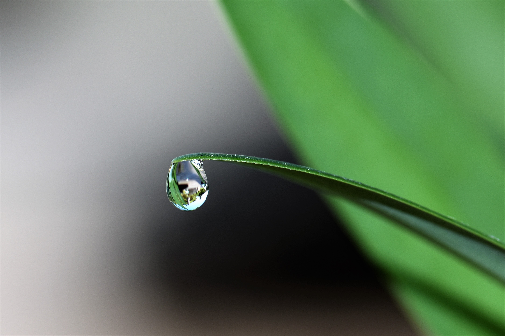

# Investigación

#### Ciencias de la Tierra y del Medio Ambiente

### Los dramáticos cambios en las lluvias para 2040, afectarán los cultivos de soya, trigo, maíz y arroz

**Artículo Timing of precipitation pattern change**, publicado en la revista Proceedings of the National Academy of Sciences

**Para 2040, las lluvias disponibles para los cultivos de trigo, soya, arroz y maíz habrán cambiado en todo el mundo. Esto, aunque se cumplan los objetivos de reducción de emisiones de los Acuerdos de París. Las proyecciones muestran que partes de Europa, África, América y Australia serán más secos, mientras que los trópicos y las latitudes más altas serán más húmedas. Esto, de acuerdo a un estudio internacional, en el que participa el académico de Geografía UC Fabrice Lambert, publicado en la prestigiosa revista PNAS.**

Aunque las personas reduzcamos drásticamente las emisiones de gases de efecto invernadero en el corto plazo, los patrones de lluvia en los distintos continentes cambiarán en las próximas decenas.de aquí al año 2040. De hecho, **algunas regiones ya experimentan nuevos regímenes climáticos en comparación a tan solo una generación atrás. Es más, para 2040 el 14% de la tierra dedicada al cultivo de trigo, soya, arroz y maíz serán más secas, mientras que el 31% serán más húmedas.**

Esto, de acuerdo a una investigación internacional publicada en la revista [_Proceedings of the National Academy of Sciences_](https://www.pnas.org/content/116/14/6507#sec-5), [PNAS](https://www.pnas.org/), de Estados Unidos. En el estudio participan expertos del [Centro Internacional para la Agricultura Tropical](https://ciat.cgiar.org/) \(CIAT, en sus siglas en inglés\); el [Programa de Investigación para el Cambio Climático, Agricultura y Seguridad Alimentaria](https://ccafs.cgiar.org/) \(CCAFS\) de la red CGIAR; el[ Centro para la Investigación del Clima y Resiliencia](http://www.cr2.cl/) \(CR2\) de [CONICYT](https://www.conicyt.cl/) Chile; y la [Universidad de Leeds](https://environment.leeds.ac.uk/see), de Gran Bretaña.

> **Para 2040 el 14% de la tierra dedicada al cultivo de trigo, soya, arroz y maíz serán más secas, mientras que el 31% serán más húmedas.**

El estudio utiliza cuatro escenarios de emisiones, desde el más bajo al más alto, para predecir el tiempo de emergencia \(TOE, en su sigla inglés\) de los cambios de precipitación permanentes, es decir, el año en que los cambios de precipitación se encuentran fuera de su variación natural histórica en una ubicación específica. 

La investigación muestra que una acción rápida sobre las emisiones, en línea con [el Acuerdo de París de 2015](https://unfccc.int/sites/default/files/spanish_paris_agreement.pdf), empujaría las proyecciones de TOE más profundamente en el futuro o reduciría el tamaño de las áreas afectadas.

**“Por supuesto, los cambios en las precipitaciones detectables no solo son importantes para la agricultura, sino también para la gestión de los recursos hídricos en general, por lo que nuestros resultados también son relevantes para otros sectores”, dice** [**Maisa Rojas, académica de la Universidad de Chile**](http://dgf.uchile.cl/~maisa/Maisa_Rojas.html) **y autora principal del artículo.**

De acuerdo a la investigación, las regiones que serán más secas son el sudoeste de Australia, el sudeste de África, el sudoeste de América del sur y el Mediterráneo. Mientras que las zonas que serán más húmedas son Canadá, Rusia, India y el este de Estados Unidos.

**Los cuatro cultivos afectados representan cerca del 40% del consumo calórico mundial.** Es por esto que los autores recalcan la necesidad urgente de que las distintas regiones, tanto las que se volverán más secas como más húmedas, adopten los cambios necesarios para adaptarse a los efectos del cambio en las lluvias en las próximas dos décadas.

**Se espera que las condiciones más secas afecten a los principales productores mundiales de trigo:** 

* **en Australia, las menores precipitaciones afectarán a cerca del 27% de la tierra donde crece este cultivo, bajo un escenario de emisiones medio;** 
* **en Algeria, el 100%,** 
* **en Marruecos el 91%,** 
* **en Sudáfrica el 79%,** 
* **en México el 74%,** 
* **en España el 55%,** 
* **en Chile el 40%,** 
* **en Turquía el 28%,** 
* **en Italia el 20%** 
* **en Egipto el 15%**

#### La rapidez del cambio

Uno de los hallazgos del estudio es la rapidez con que se producirán los cambios en las precipitaciones globales. Con respecto a un periodo de 30 años -entre 1986 y 2005-, varias regiones ya han cruzado su promedio variabilidad histórica o de precipitaciones, mostrando un régimen de lluvias completamente nuevo; entre estos están Rusia, Noruega, Canadá y la costa este de Estados Unidos.

**“Otros estudios han examinado el tiempo de emergencia en la temperatura global y la precipitación. Lo interesante de esta investigación es que nosotros superpusimos los resultados climáticos con la distribución espacial de las tierras de cultivo y las estaciones de crecimiento, para mostrar qué regiones de producción agrícola se verán afectadas por los cambios de precipitación y cuánto tiempo tienen para prepararse”, explica** [**Fabrice Lambert, académico del Instituto de Geografía UC**](http://geografia.uc.cl/Departamento-de-Geografia-Fisica/lambert-fabrice.html) **y coautor del artículo.**

“Los agricultores que cultivan en esas áreas experimentarán condiciones significativamente diferentes a las que están acostumbrados”, dice [**Julián Ramírez-Villegas**](https://ccafs.cgiar.org/es/about/who-we-are/our-staff/researchers/research-assistant/julian-ramirez-villegas)**, investigador de CIAT y CCAFS. “Ellos van a estar completamente fuera de sus entornos históricos normales y de hecho, muchos agricultores ya están luchando contra la variabilidad histórica"**, agrega.

Los países más poblados del mundo, China e India, están precisamente entre aquellos que tendrán mayores precipitaciones para los cultivos incluidos en el estudio, cualquiera sea el escenario de emisiones. El porcentaje de tierra cultivable se extenderá en más de dos dígitos. Los otros grandes productores de arroz de Asia, incluidos Japón, Corea y Filipinas tendrán tiempos de emergencia que aumentarán las precipitaciones.

Los campos de trigo del norte de Europa, Estados Unidos, Canadá y Rusia tendrán precipitaciones más alta. Más lluvias puede significar mayor producción, pero cuando se combinan con el aumento del nivel del mar, temperaturas más altas y un mayor potencial de inundación, no se puede asegurar una mayor producción, afirman los autores.

**Como concluye** [**Andy Challinor,**](https://environment.leeds.ac.uk/see/staff/1200/professor-andy-challinor) **coautor y académico de** [**Priestley International Centre for Climate**](http://climate.leeds.ac.uk/)**, de la Universidad de Leeds, “es imposible predecir con precisión la naturaleza de estos cambios. Lo que nos dice este estudio es que la adaptación debe ser ágil. Por primera vez, podemos decir qué cambio se esperan y para cuándo, en nuestras principales regiones productoras de cultivos”.**

