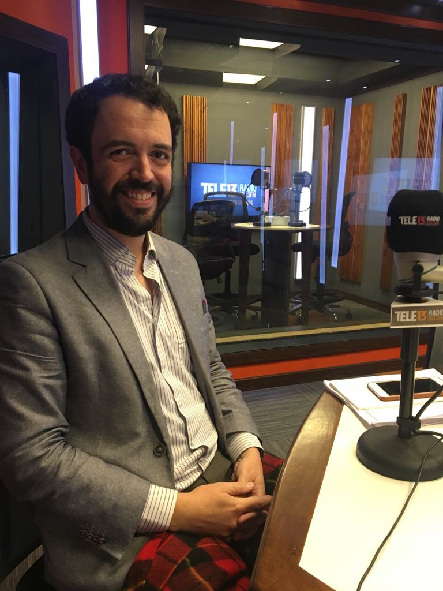
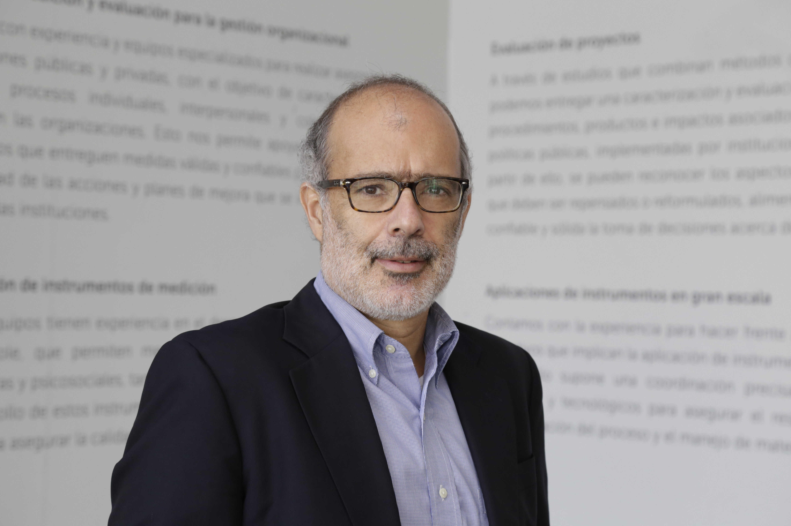
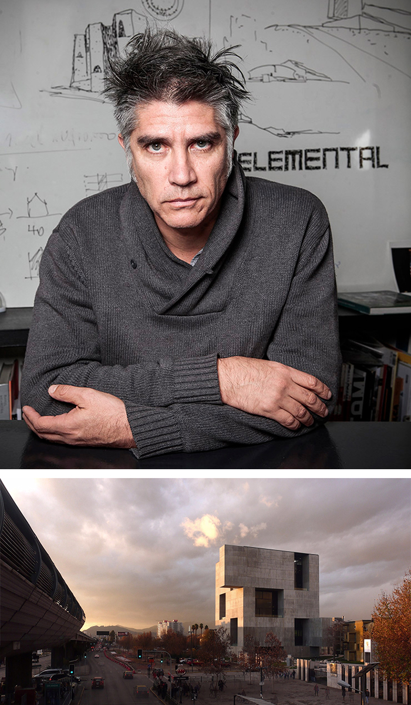
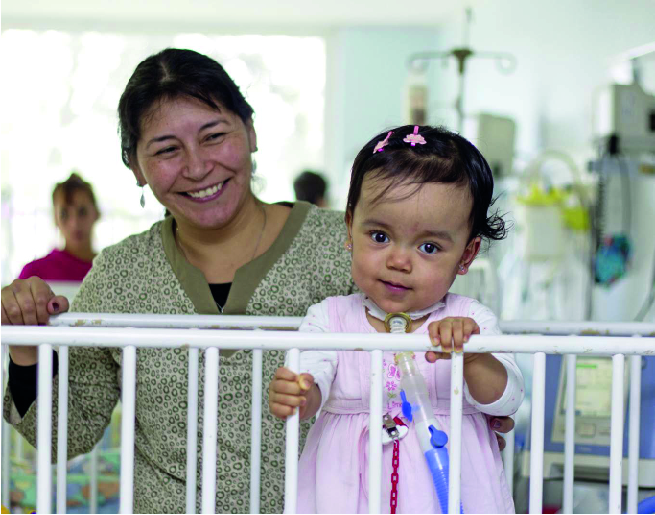

# Landing home

### \*\*\*\*[**Destacados header**](destacados-header/)\*\*\*\*

\*\*\*\*[**Destacado 1**](destacados-header/destacado-1.md)  
Robot submarino de bajo costo investigará el 95% del océano aún desconocido.  
Foto:  
****[  
**Link de la foto \(Google Drive\)**](https://drive.google.com/open?id=1MzuO7s_p5tCaErfUs1bAZ4vUmXXoOGZN)  

\*\*\*\*[**Destacado 2**](destacados-header/destacado-2.md)  
Nuevo asfalto reciclado podrá autorreparar sus grietas.  
Foto:  
****[  
**Link de la foto \(Google Drive\)**](https://drive.google.com/open?id=1geAH0nL3Ikpi0SYSXAV1D20LYuLvQfW_)  
****  
  
[**Destacado 3**](destacados-header/destacado-3.md)  
Küwü: el lápiz para ciegos que les permite escribir y leer en tiempo real.  
Foto:  
[  
**Link de la foto \(Google Drive\)**](https://drive.google.com/open?id=1uyiW80uZxLSr_8T-9DTmHh5L0mIfFqpN)  

### [Te contamos](te-contamos/)

Noticia 1  
"Sol Serrano: la primera mujer galardonada con el Premio Nacional de Historia."  
****  
[**Link a la foto**](https://drive.google.com/open?id=1ald3OXxvt8ueg8n0xiUCqlMPJ5K1znsI)  

Noticia 2  
¿Sabías que la UC tiene estaciones de investigación de norte a sur?  
****  
[**Link a la foto**  
](https://drive.google.com/open?id=1X9Bj76lGT8TUQKU2szUrG15U3ljNJUjw)  
Noticia 3  
Adiós al músico Víctor Alarcón: su huella en los coros chilenos será inolvidable.  
****  
[**Link a la foto**](https://drive.google.com/open?id=1hPIPiP-SZKAHG9fNk1lNrKByStIJTDcw)  

###  **Mantente conectado con la UC**

Módulo Twitter  
Módulo Instagram  
Módulo Facebook  

###  [**Te invitamos \(armar según componentes\)**](te-invitamos/)\*\*\*\*

* Fecha: rango o fecha fija
* Etiqueta de tipo de evento
* Título linkeado, máximo 80 caracteres.
* Rango de fecha \(duración en el tiempo\)
* Horario \(hora fija o rango\)
* Lugar linkeado a mapa de ubicación por campus

### Estudia con nosotros

Carreras de pregrado \(linkear a contenido interno\)  
Imagen: https://drive.google.com/open?id=1sKhGrodZzJoFOvChcX83u3bBbSCtDh6Z  
  
Magísteres Especialidades Médicas \(linkear a contenido interno\)  
Doctorados \(linkear a contenido interno\)  
Postítulos \(linkear a contenido interno\)  
Programas Interdisciplinarios \(linkear a contenido interno\)  
Especialidades Odontológicas \(linkear a contenido interno\)  
UC Online \(linkear a contenido interno\)  
Educación Continua \(linkear a contenido interno\)  
Capacitación y Desarrollo \(linkear a contenido interno\)  

###  Investigación

\(Caja 1\)  
Biotecnología Médica   
[https://drive.google.com/file/d/1ePDP4lLaLZg352B6YzcGZCNZZZ8pMF-m/view](https://drive.google.com/file/d/1ePDP4lLaLZg352B6YzcGZCNZZZ8pMF-m/view)

  
“Nuestra vacuna contra el virus sincicial pretende una protección que dure toda la vida”  
  
Alexis Kalergis, Director Instituto Milenio en Inmunología e Inmunoterapia  
  
[Ir a la sección](../investigacion/untitled-1.md)  
  

### Academia

Los académicos UC son líderes nacionales en sus respectivas áreas y muchos son reconocidos año a año tanto por sus aportes locales como internacionales.

**Caja 1**  
Salud

  
COLUMNA SOBRE PROYECTO DE ISAPRES  
Preexistencias y reforma al sistema de isapres.  
  
Felipe Bravo  
Académico de la [Escuela de Derecho](http://derecho.uc.cl/es/)  
  
Imagen: [https://drive.google.com/file/d/1iuc4GpxtcmVXZ062JTkbfRhzsd9rYbOs/view](https://drive.google.com/file/d/1iuc4GpxtcmVXZ062JTkbfRhzsd9rYbOs/view)

  
**Caja 2**  
Reforma de Pensiones

ENTREVISTA SOBRE REFORMA DE PENSIONES  
“Lo más difícil será conjugar la urgencia de los cambios con la negociación política”  
  
Rodrigo Valdés  
Académico de la [Escuela de Gobierno](http://gobierno.uc.cl/es/)

Imagen:  
[https://drive.google.com/file/d/0B7llPuxsZcFBWU1pQmlKSXoyLWFWSFNoN3Q1MjB5ZWRWRFkw/view?usp=sharing](https://drive.google.com/file/d/0B7llPuxsZcFBWU1pQmlKSXoyLWFWSFNoN3Q1MjB5ZWRWRFkw/view?usp=sharing)

**Caja 3**  
Profesores destacados  

NUEVO PREMIO DE ARQUITECTURA  
Alejandro Aravena recibió el premio RIBA Charles Jencks 2018.

Alejandro Aravena  
Académico de la Escuela de Arquitectura.

Imagen  
[https://drive.google.com/file/d/1E6IMp49tTRBnRMBocYA9TbGpGvMr7V7a/view?usp=sharing](https://drive.google.com/file/d/1E6IMp49tTRBnRMBocYA9TbGpGvMr7V7a/view?usp=sharing)

### Compromiso Público

PROGRAMA DE ENFERMEDADES RESPIRATORIAS  
“Recuerdo que llegué al Hospital Josefina Martínez con mucho miedo, lloraba en la puerta mientras veía como instalaban a mi hija en la que sería su cuna \(...\). Aquí pude conocer y conectarme con mi hija, desde un principio me apoyaron para que me acercara a ella y aprendiera a cuidarla en conjunto con el equipo de salud”  
  
Yinia Vega  
Mamá de Francisca, paciente del Hospital Josefina Martínez.  
  
Ir al sitio del programa  
  

###  [Vida Universitaria](vida-universitara/)

Fotos para usar:

[https://drive.google.com/open?id=169\_toizDtm6EGHxYYjuonXLbo30reag8](https://drive.google.com/open?id=169_toizDtm6EGHxYYjuonXLbo30reag8)  
  
Galería de fotos:

1. Selección UC de Fútbol Damas logró el subcampeonato en el torneo Nacional Universitario de la rama. \([https://www.facebook.com/pg/vivelauc/photos/?tab=album&album\_id=2324279030934054](https://www.facebook.com/pg/vivelauc/photos/?tab=album&album_id=2324279030934054)\)

Videos:

1. Elecciones Feuc: candidatos a Consejería Superior: [https://www.youtube.com/watch?v=0FiYa5DgS1o](https://www.youtube.com/watch?v=0FiYa5DgS1o)
2. Elecciones Feuc: candidatos a Presidente [https://www.youtube.com/watch?v=P1im\_yN9dns](https://www.youtube.com/watch?v=P1im_yN9dns)

### Sitios de interés

* Acreditación Institucional: [http://acreditacion.uc.cl](http://acreditacion.uc.cl)
* Donaciones UC / Proyecto Endowment UC: [https://donaciones.uc.cl/](https://donaciones.uc.cl/)
* Plan de Desarrollo: Enlace interno
* Protocolos violencia sexual: [https://www.uc.cl/prevencion-y-apoyo-a-victimas-de-violencia-sexual-en-contextos-universitarios](https://www.uc.cl/prevencion-y-apoyo-a-victimas-de-violencia-sexual-en-contextos-universitarios)
* La UC Dialoga: https://www.uc.cl/es/la-uc-dialoga/ItemId=15459

