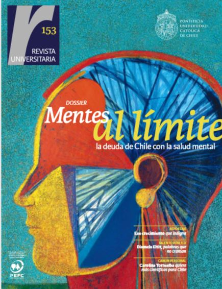
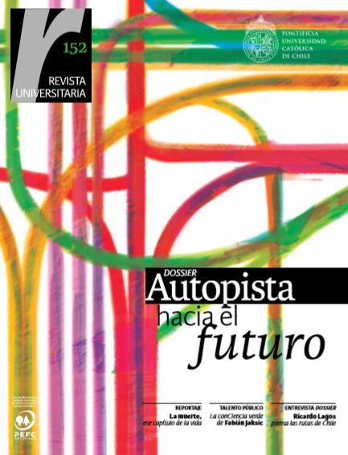

# Revista Universitaria

## Revista Universitaria

Revista Universitaria es una revista desarrollada por la Dirección de Comunicaciones, pensada como un espacio de difusión e intercambio entre las facultades, bajo la iniciativa de fortalecer el espíritu universitario y hacer público lo que realiza la UC en beneficio del conocimiento y desarrollo del país. Su publicación es bimensual.

#### En esta sección:

* En esta edición
* Ediciones anteriores

### En esta edición

Edición n° 154

Imagen enlazada a [https://issuu.com/visionuniversitaria/docs/ru154](https://issuu.com/visionuniversitaria/docs/ru154)

En esta edición:

* Edición especial Eclipse 2019

### Ediciones anteriores

Edición n°153

Enlazado a [https://issuu.com/visionuniversitaria/docs/ru153](https://issuu.com/visionuniversitaria/docs/ru153)

Edición n° 152

Imagen enlazada a [https://issuu.com/visionuniversitaria/docs/ru152](https://issuu.com/visionuniversitaria/docs/ru152)

Edición n° 151

Edición n°150

Edición n°149

