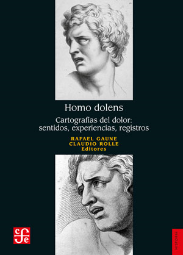
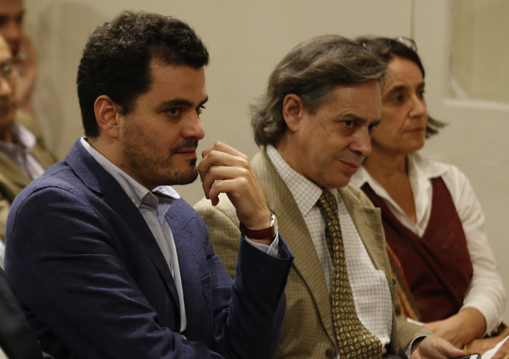

# “Homo Dolens”, el libro que explora interpretaciones y dimensiones del dolor

26 de marzo de 2019

### “Homo Dolens”, el libro que explora interpretaciones y dimensiones del dolor

#### "Homo Dolens. Cartografías del dolor: sentidos, experiencias, registros", editado por los académicos del Instituto de Historia UC, Claudio Rolle y Rafael Gaune, se enmarca en un proyecto financiado por la Universidad de Oxford. Ensayos desde múltiples miradas disciplinarias, donde 24 autores conforman un acercamiento inédito a esta temática. Será presentado el 3 de abril por Sol Serrano, Premio Nacional de Historia 2018.

Recientemente se publicó el libro **"Homo Dolens. Cartografías del dolor: sentidos, experiencias, registros"** \(Fondo de Cultura Económica\), editado por los académicos del [Instituto de Historia](http://historia.uc.cl/) Claudio Rolle y Rafael Gaune, quienes obtuvieron fondos del [Ian Ramsey Centre for Science and Religion de la Universidad de Oxford](https://www.ianramseycentre.info/). Previo a la publicación realizaron seminarios que abordaron perspectivas del dolor desde ámbitos como la historia, psicología, psiquiatría y teología.

Rolle y Gaune emprendieron el proyecto del libro con expectativas ensayísticas, lejos de una publicación meramente académica y con miradas diversas que se concretaron en textos de 24 investigadores, entre los que también participan los propios académicos. **“Un cartógrafo representa une espacio y situaciones. Eso era clave para nosotros en esta publicación”**, relató Rolle.

Así se configuró una publicación que no pretende retratar la historia del dolor, sino cómo este concepto se ha interpretado y conjurado, cómo se percibe y se transmite su memoria a través de disciplinas humanísticas y diferentes saberes. 

**“En Homo Dolens hay un abanico de dolores, del cuerpo, del alma. También se analiza el reverso de los dolores y el vínculo del placer y del dolor en la filosofía”**, señaló Gaune.

En la publicación transitan autores que dan cuenta de esa amplitud mencionada por Gaune. Por ejemplo, el investigador Javier Moscoso, escribe desde la perspectiva de la historia cultural del dolor; la premio Nacional de Humanidades y Ciencias Sociales 2017, Elizabeth Lira, sobre traumas y dolores de torturados; mientras que Solène Bergot, directora de la [Licenciatura en Historia de la UNAB](https://www.unab.cl/admision/carreras/licenciatura-en-historia/), aborda tópicos femeninos y religiosos.

* **¿Qué criterios primaron al seleccionar a los autores? ¿Consideraron alguna perspectiva cronológica?**

CR: El libro se enriqueció con un trabajo que fue más allá de los seminarios. Buscamos títulos que nos interesaban. Tuvo una lógica programática. Es muy inabordable el tema y sigue siendo un momento de aprendizaje. La beca que nos dio Oxford buscaba una reflexión sobre el sentido del dolor, sobre dimensiones múltiples de esta parte de la existencia y cumple esa promesa. 

Tuvimos suerte de convocar a gente que escribió textos atractivos, algo que no siempre pasa. Es un libro que tiene relieves temáticos y morfológicos. Hay investigación amplia y también dura y pura, lo que tiene una relación estrecha con las fuentes. Fue una gran oportunidad para pensar juntos. Fueron contribuciones con un mundo propio. Es un libro con muchas combinatorias, se puede leer desordenadamente. Me gusta que sea caballo sin domar porque cuando te pones una etiqueta te limitas. 

RG: Hay textos que podrían ser publicados en una revista científica, pero pedimos una narrativa más ensayística. Hubo libertad de escritura. Alguien podría clasificar el libro como historia de las emociones, pero tratamos de salir de códigos historiográficos

* **¿Qué reflexiones podrían compartir sobre la necesidad de escribir del dolor, algo que ocurre, por ejemplo, tras las guerras mundiales?**

CR: Es un tema que tiene que ver con percepciones. Hay momentos donde se percibe que hay fenómenos a los que poner atención. En el caso de esos momentos ocurre un cambio en el paisaje humano donde hay menos hombres y mutilados. Personas que quedan con traumas, enfermedades mentales. Eso hace percibir el mundo de una manera distinta, algunos generan una respuesta tardía. Por ejemplo, el escritor belga, Blaise Cendrars,  escribe “La Mano Cortada” hablando de su experiencia de la primera guerra. Depende de las circunstancias del referente que nos haga percibir el dolor.

RG: Creo que el dolor es parte intrínseca de la vida, es inexorable, lo puedes ocultar, develar y convertir. En ese sentido, la pérdida es una fuente de dolor para los dolores psíquicos, corporales y emocionales. 

* **¿Qué conceptos presentes en los textos podrían conformar un glosario asociado o ejes articuladores?**

RG: Ocultar y develar el dolor. Eso me parece articulador. Tratamos de enunciarlo en el libro. No existe una sola forma de aproximarse al dolor. En los primeros autores que citamos en el texto con Claudio, Gabriela Mistral, Stefan Zweig, Giuseppe Ungaretti, esto se expresa a través del sufrimiento a partir del suicidio o la muerte de un cercano. En el epílogo trabajamos el dolor de Tomás Moro que, condenado a muerte, reflexiona sobre los dolores del alma y del mundo

Develar qué es el dolor es también vincularlo al contexto histórico. Ahora bien, el dolor se conjura bastante desde otras perspectivas como las psiquiátricas y psicológicas que se complementan con la religión y la teología. 

\*El libro será presentado por Sol Serrano, Premio Nacional de Historia 2018 y académica UC y José Egaña, científico de la Universidad de Chile, el 3 de abril, a las 18:30 horas, en el [Museo Histórico Nacional](http://mhn.gob.cl/sitio/).

\*Actualmente, Rolle y Gaune preparan un segundo libro, junto a la posdoctoranda del Instituto de Historia, Camila Gatica, que abordará el dolor desde un diálogo con las ciencias médicas como, por ejemplo, la neurociencia, neurología, investigadores en biología, anestesiólogos, entre otros. 

**INFORMACIÓN PERIODÍSTICA**

Violeta Bustos, Dirección de Comunicaciones, vsbustos@uc.cl

