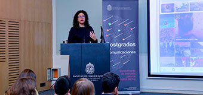
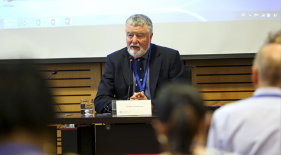
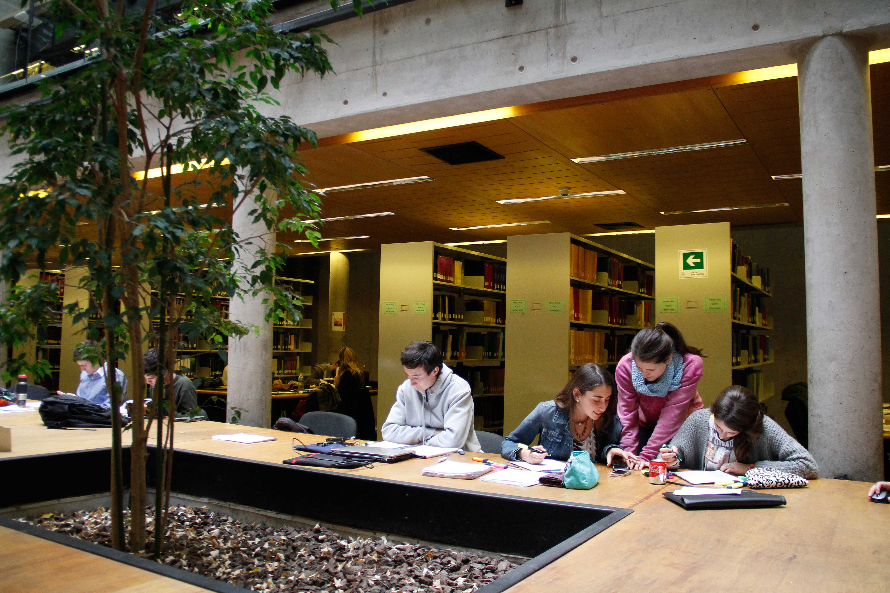

# Ver más noticias

Estás en: Inicio &gt; Más Noticias

Ordenar por: Más Recientes / Más vistas

Filtro:

* Área: 
  * Administración
  * Antropología 
  * Arquitectura 
  * Arte 
  * Astrofísica 
  * Biología 
  * Biología Marina 
  * Bioquímica 
  * Ciencia Política 
  * Construcción Civil 
  * Dirección Audiovisual 
  * Diseño 
  * Economía 
  * Educación 
  * Enfermería 
  * Estudios Urbanos 
  * Filosofía y Estética
  * Física 
  * Geografía 
  * Gobierno 
  * Historia 
  * Ingeniería 
  * Ingeniería Forestal 
  * Letras 
  * Matemáticas y Estadística
  * Medicina 
  * Música 
  * Odontología 
  * Periodismo 
  * Psicología 
  * Publicidad 
  * Química y Farmacia
  * Sociología 
  * Teatro 
  * Teología 
  * Trabajo Social
* Perfil:
  * Académico extranjero 
  * Académico UC 
  * Académico visitante 
  * Alumno de diplomado 
  * Alumno de doctorado 
  * Alumno de magíster 
  * Alumno de postítulo 
  * Alumno de pregrado 
  * Alumno extranjero 
  * Comunidad UC 
  * Funcionario 
  * Futuro alumno de diplomado 
  * Futuro alumno extranjero 
  * Futuros alumnos de doctorado 
  * Futuros alumnos de magíster 
  * Futuros alumnos de postítulo 
  * Futuros Alumnos de pregrado 
  * Investigadores 
  * Novato 
  * Padres y familia 
  * Postdoctorado 
  * Público general 
  * Vecinos

Buscar

#### Inclusión

21 de Marzo de 2019

### Directora del Centro del Síndrome de Down UC es reconocida mundialmente

#### Deportes

21 de Marzo de 2019

### Setenta deportistas destacados llegan a la UC para reforzar las distintas selecciones

#### Ciencia

21 de Marzo de 2019

### Centro UC de Desarrollo Local del Campus Villarrica se adjudica PAR Explora Araucanía

#### Redes sociales

21 de  marzo de 2019

### Instagram hoy: Nuevo ciclo de programas de magíster en Comunicaciones inició con charla sobre redes sociales

#### Premio Abdón Cifuentes

21 de marzo de 2019

### Comienza convocatoria al Premio Abdón Cifuentes 2019 por el aporte al desarrollo del país

#### Rector UC

20 de marzo de 2019

### Rector sostiene reuniones con autoridades eclesiásticas y diplomáticas durante viaje a Roma

#### Derecho

20 de marzo de 2019

### Expertos internacionales se reunieron en coloquio sobre legalidad, no arbitrariedad y discrecionalidad en la aplicación judicial y ejecución de las penas

#### Investigación

19 de marzo de 2019

#### Filosofía UC participa en investigación que obtuvo 1,3 millones de dólares

#### Colección Gandarillas

19 de marzo de 2019

### Terremotos y Cristos milagrosos: testimonios de arte y devoción de los habitantes de los siglos XVII y XVIII

[Información para medios](../informacion-para-medios/landing-info-para-medios/)

[Contactos de prensa](../informacion-para-medios/contacos-de-prensa.md)

