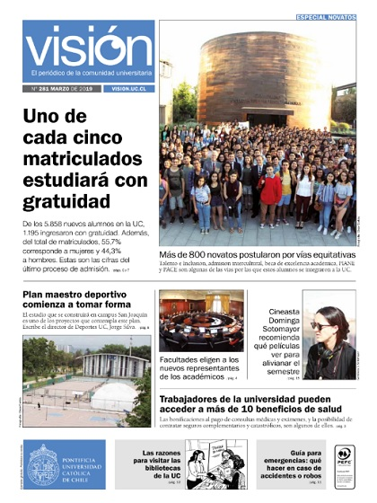

# Visión UC

## Visión UC

Visión UC es un periódico desarrollado por la Dirección de Comunicaciones, que informa a la comunidad universitaria de las novedades de la UC. Su publicación es mensual.

#### En esta sección:

* En esta edición
* Ediciones anteriores

### En esta edición

Imagen enlazada a [https://issuu.com/visionuniversitaria/docs/vu281](https://issuu.com/visionuniversitaria/docs/vu281)

* Uno de cada cinco matriculados estudiará con gratuidad. 
* Plan maestro deportivo comienza a tomar forma. 
* Facultades eligen a los nuevos representantes de los académicos. 
* Cineasta Dominga Sotomayor recomienda qué películas ver para alivianar el semestre. 
* Trabajadores de la universidad pueden acceder a más de 10 beneficios de salud.
* Las razones para visitar las Bibliotecas de la UC.
* Guía para emergencias: qué hacer en caso de accidentes o robos.

### Ediciones anteriores

