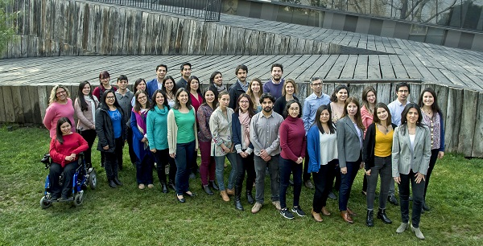

# Nosotros

### Nosotros

La Dirección de Inclusión, que pertenece a la Vicerrectoría Académica, busca fortalecer y articular los diversos esfuerzos por promover la equidad y valorar la diversidad de la comunidad UC, así como liderar la creación y ejecución de nuevas iniciativas que refuercen el quehacer universitario.

Aquí podrás encontrar formas alternativas de ingreso a la UC, apoyos y acompañamiento en tu experiencia universitaria, y nivelaciones académicas.

### Servicios a estudiantes

Si eres un estudiante transgénero puedes solicitar el reconocimiento de tu nombre social en una TUC complementaria, y el cambio de login en tu correo electrónico. Además podrás solicitar hacer uso de baños universales. Para ello, debes acercarte a la Dirección de Inclusión, donde tendrás que llenar una ficha con algunos datos.

### Servicios a profesores

Talleres de introducción a la Lengua de Señas Chilena \(LSCh\), capacitaciones para la comunicación con estudiantes trans, cursos de apoyo para buenas prácticas en el aula de clases universitarias, son algunos de los servicios disponibles para el cuerpo académico.

