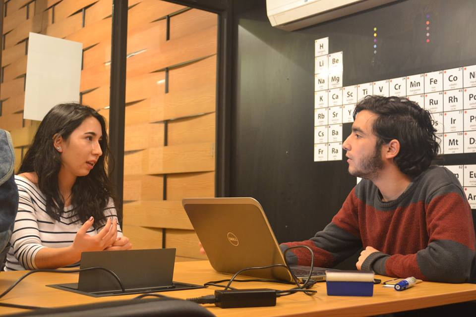

# Graduación efectiva

### ¡Te apoyamos desde tu ingreso!

El área de Graduación Efectiva busca promover que una vez que los estudiantes ingresen a la UC, éstos logren graduarse de la Universidad Católica, participando de la vida universitaria y del proceso académico en condiciones de equidad. Su acción está en la implementación de soportes de diagnóstico, nivelación académica, adecuaciones curriculares y acompañamiento a estudiantes, trabajando de forma articulada con las unidades académicas y unidades de apoyo de la UC.

### Nivelación Académica

Con el objetivo de apoyar tempranamente a los estudiantes que ingresan a la UC, y en conjunto con las Unidades Académicas de Matemática, Letras y Química junto al Centro de Apoyo al Rendimiento Académico y la exploración vocacional \(CARA\); durante los meses de enero y febrero se realizan diagnósticos y nivelaciones:

·         Diagnósticos de Pre-cálculo, Razonamiento Cuantitativo e Introducción a la Matemática

·         Programa Introducción a la Matemática Universitaria \(PIMU\)

·         Taller de Química

·         Curso de Introducción a la lectura y escritura académica

·         Taller CARA: Preparándonos para rendir mejor en la UC

·         Actividades 1er y 2do Semestre

Para mayor información escríbenos a  **nivelacion@uc.cl**

#### **Tutorías académicas de Matemáticas y Química**

Los estudiantes pueden participar en actividades grupales de apoyo a los cursos de primer año en el área de matemáticas y química. Cada grupo está liderado por un tutor que apoya semanalmente la nivelación de contenidos y la adquisición de habilidades en estas áreas.

¡Síguenos en nuestro [Facebook/nivelacionacademicaUC](http://facebook.com/nivelacionacademicaUC)

**Programa de Apoyo a la Comunicación Académica PRAC**

Iniciativa que busca apoyar a los estudiantes en la adquisición y el desarrollo de habilidades comunicativas, de inglés y español, necesarias para enfrentar de mejor forma los cursos en el contexto universitario.

El programa cuenta con tutorías individuales, que se realizan en las Bibliotecas de Campus San Joaquín y Biomédica; y recursos auto-instruccionales para el desarrollo de habilidades comunicativas. Se puede agendar hora de tutoría o acceder a los recursos en línea desde la página web [comunicacionacademica.uc.cl](http://comunicacionacademica.uc.cl)

**Salas de consulta**  
Las salas de consulta son espacios de estudio semanal, donde un tutor de años superiores resuelve en conjunto con los/as estudiantes dudas acerca de un curso en particular. Estos grupos están conformados entre 8 a 10 estudiantes máximo. Más de 200 estudiantes han participado de estas instancias, que emergieron a partir de solicitud de los/as estudiantes que ingresaron a la UC por vías de equidad, mediante el acompañamiento que se realiza desde la Dirección de Inclusión y por demanda espontánea.

Si requieres de algún apoyo en un curso escríbenos a: nivelacion@uc.cl o al Facebook: Nivelación Académica UC.

### Inserción y acompañamiento

#### Apoyos específicos para vías de admisión equidad

Los estudiantes que ingresan por las vías de admisión de equidad Talento e Inclusión, cupo supernumerario Beca de Excelencia Académica y vías interculturales, tendrán una jornada de inserción a la UC durante el mes de enero, además de la bienvenida institucional.

Durante el año, los estudiantes contarán con un tutor profesional que los acompañará a lo largo de su primer año, con el fin de favorecer el desarrollo de habilidades que contribuyan a su progreso personal.

Contacto: tutoresinclusion@uc.cl

Para el caso de aquellos estudiantes que ingresaron a la Universidad Católica por medio del Programa de Acompañamiento y Acceso Efectivo a la Educación Superior – PACE, durante el mes de enero, junto al proceso de matrícula, tendrán actividades de inserción tales como: Actividades de integración y deportivas; diagnósticos académicos de Matemáticas, Lenguaje, Química, Física y Biología; Talleres disciplinares y de habilidades académicas.

Además, los estudiantes que ingresan mediante el cupo PACE contarán con un tutor profesional que los acompañará durante su primer año, con el fin de favorecer competencias personales que contribuyan al aprendizaje y la autogestión.

Contacto: paceuc@uc.cl

**Programa de apoyo a la inserción universitaria \(PAI\)**

Este programa busca facilitar el proceso de adaptación a la vida universitaria a través de un tutor de acompañamiento par, que orientará al novato en diferentes estrategias y servicios que tiene la UC. El tutor es un estudiante de años superiores de la misma carrera que el estudiante novato, que actúa como puente que incentiva, apoya y promueve el logro de sus metas en primer año.

Carreras: Actuación, Enfermería, Letras Hispánicas, Letras Inglesas, Geografía, Matemática, Estadística, Medicina, Odontología y Trabajo Social.

Contacto: pai@uc.cl

**Programa para la Inclusión de Alumnos con Necesidades Especiales \(PIANE\)** / mail: piane@uc.cl

El PIANE busca promover la inclusión de alumnos con necesidades educativas especiales asociadas a discapacidad visual, auditiva, motora, y de quienes presentan trastornos del espectro autista y trastornos del aprendizaje \(específicamente aquellos relativos a dislexia, discalculia, déficit atencional\), en todos los ámbitos del qué hacer académico y la vida estudiantil, a fin de que puedan participar en condiciones de equidad e igualdad de oportunidades respecto a sus pares.

Para conocer más detalles del programa ingresa a [piane.uc.cl](http://piane.uc.cl/) 

