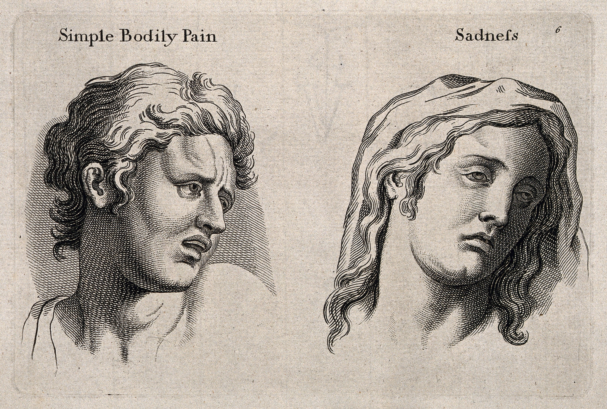
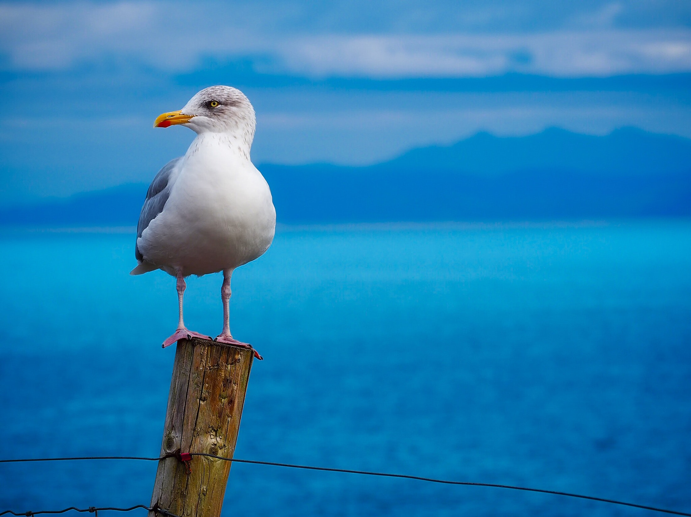
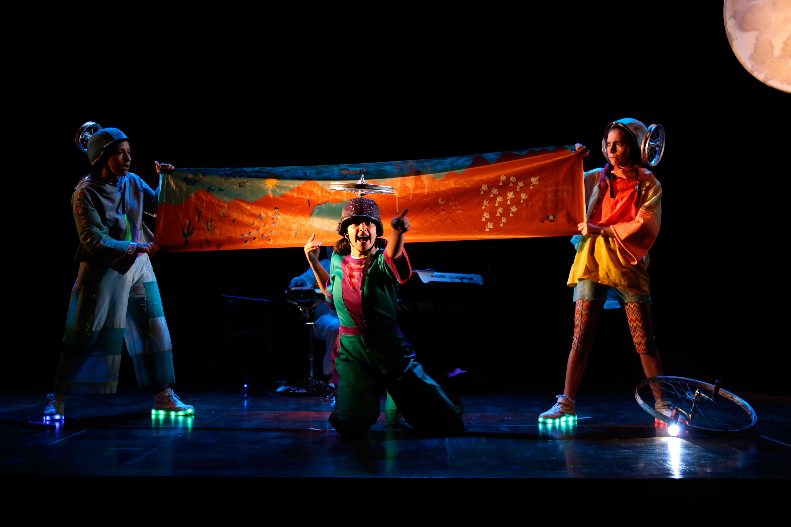

# Landing Info Para Medios

\(Ver opciones de Slack\)

A través de esta página queremos responder al interés de los medios en los contenidos que produce la Universidad. A través de la Dirección de Comunicaciones los medios pueden contactar a los expertos y líderes de opinión de cada una de las facultades y centros. La Dirección de Comunicaciones es la encargada de la [Revista Universitaria](https://www.uc.cl/es/revista-universitaria), la revista [Visión UC](https://www.uc.cl/es/vision-uc), la [Radio UC](http://www.radiouc.cl/) y el portal de [Extensión Cultural](http://extension.uc.cl/).

#### En esta sección:

* Lo más consultado
* Toma nota de estas fechas
* Temas para cubrir
* Más información para ti
* ¿Aún no encuentras lo que buscas?
* ¿Tienes dudas? Contáctanos

### Lo más consultado

* Noticias de la UC \(enlace a [noticias UC](../../home/ver-mas-noticias.md)\)
* [Contactos de prensa](../contacos-de-prensa.md)
* Pauta de prensa \(enlace a drive Pauta de prensa, por definir\)
* [Suscríbete a la UC en los medios](../../home/uc-en-los-medios.md)

### Toma nota de estas fechas

#### Medios

29 marzo  / 9:00 hrs.

### [Ceremonia de inauguración del año académico 2019](http://agenda.uc.cl/2019/03/29/ceremonia-de-inauguracion-del-anio-academico-2019/)

Casa Central, Aula Magna Manuel José Irarrázaval

#### Medios

26 abril - 30 abril  / 15:30 - 21:00 hrs

### [Festival Inedit](http://agenda.uc.cl/2019/04/26/festival-inedit/)

Centro de Extensión UC, Sala de Cine

#### Medios

9 de marzo al 28 de abril / 16:00 - 12:00 hrs

### [Teatro infantil: Estela estelar](http://agenda.uc.cl/2019/03/09/teatro-infantil-estela-estelar/)

Centro de Extensión UC, Sala de Cine

#### Medios

17 de abril al 31 de mayo

### [Exposición: Arte textil de China](http://agenda.uc.cl/2019/04/17/exposicion-arte-textil-de-china/)

Centro de Extensión UC, Galería de Arte

Más actividades:

* [Descarga el calendario completo](http://admisionyregistros.uc.cl/images/pdf/calendarioUC/calendario_academico_2019.pdf)
* Accede a la Pauta de prensa \(enlace a Pauta de prensa\)
* [Revisa la agenda de la UC](http://agenda.uc.cl)

### Preguntas frecuentes \[Ver más\]

#### Gestión de medios:

Quiero entrevistar a un profesor de la UC. ¿Cuáles son los pasos a seguir? 

Quiero hacer una invitación a integrantes de la universidad. ¿Cómo lo puedo hacer? 

Quiero acreditarme para un evento. ¿Qué debo hacer?

#### Pauta:

¿Dónde consigo el documento de la pauta a la que asistí? 

¿En qué campus queda el lugar de mi pauta? 

¿Dónde puedo descargar los últimos discursos del rector Ignacio Sánchez? 

¿Dónde puedo revisar los medios UC?

#### Contactos de prensa:

¿Dónde consigo el contacto del periodista que cubre el área en la que trabajo? 

¿Dónde puedo enviar un comunicado? 

¿Cuáles son las redes sociales oficiales de la UC?

#### Actividades:

¿Cómo puedo enterarme de las últimas novedades que ocurren en la UC?

¿Dónde puedo revisar las actividades del día en la Universidad?

### Temas para cubrir:

#### Humanidades

### “Homo Dolens”, el libro que explora interpretaciones y dimensiones del dolor

#### Ciencias Naturales 

### Nuevo Núcleo Milenio buscará generar alternativas al petróleo a partir de biomasa 

#### Ornitología 

25 de marzo de 2019

### “Aves de las costas y mares de Chile”: nueva edición de la guía incluye aves oceánicas 

#### Teatro familiar UC

### [Estela Estelar: la aventura futurista de una niña que busca a su mamá en una estrella](https://www.uc.cl/es/la-universidad/noticias/33373-estela-estelar-la-aventura-futurista-de-una-nina-que-busca-a-su-mama-en-una-estrella)

#### Inclusión

### Directora del Centro del Síndrome de Down UC es reconocida mundialmente 

#### Innovación en docencia

### [Estudiantes talentosos en matemática pueden postular a clases gratis en la UC](https://www.uc.cl/es/la-universidad/noticias/33323-estudiantes-talentosos-en-matematica-pueden-postular-a-clases-gratis-en-la-uc)

#### Medicina

### [Se inauguró el primer museo dedicado a la evolución de las vacunas en el mundo](https://www.uc.cl/es/la-universidad/noticias/33361-se-inauguro-el-primer-museo-dedicado-a-la-evolucion-de-las-vacunas-en-el-mundo)

### Temas noticiosos

\#RectorUC \#PremioEspírituUC \#UCSustentable \#Inclusión \#CampusOriente \#Vacunas \#AñoAcadémico \#Agua \#SíndromeDeDown \#SistemaÚnicoDeAdmisón

### Medios de prensa

### Más información para ti

### ¿Aún no encuentras lo que buscas?

Ir al Directorio de Sitios

### ¿Tienes dudas? Contáctanos

* Dirección de Comunicaciones: dcomunicaciones@uc.cl \(Ícono correo\)
* Prensa UC: prensa@uc.cl \(Ícono correo\)
* Redes Sociales: careyes4@uc.cl \(Ícono correo\)
* Dirección: Casa Central. Av. Libertador Bernardo O'Higgins 340, piso 3. \(Ícono mapa\)
* [Ícono Facebook](http://facebook.com/ucatolica)
* [Ícono Twitter](http://twitter.com/ucatolica)
* [Ícono Instagram](http://instagram.com/ucatolicaoficial)
* [Ícono Linkedin](https://linkedin.com/school/pontificia-universidad-cat-lica-de-chile/)
* [Ícono YouTube](http://youtube.com/pucatolica)

