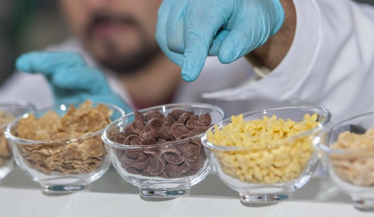

# Noticia 1 info para medios

Etiqueta: Investigación

Imagen: 

Título: Investigadores de la Facultad de Ingeniería analizan los niveles de acrilamida en los cereales de desayuno.

[Enlace](https://www.ing.uc.cl/noticias/investigadores-determinan-contenido-de-acrilamida-en-cereales-de-desayuno/)

