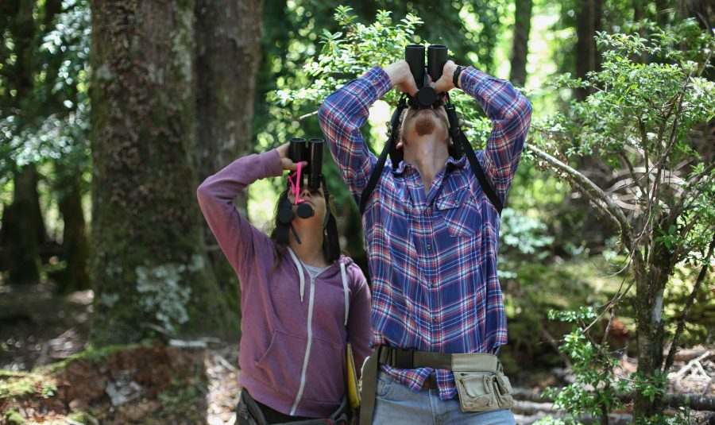

# Noticia 4 info para medios

Etiqueta: Compromiso público

Título: Conoce el programa Innova Turismo Araucanía, que busca incubar y acelerar modelos de emprendimientos turísticos que aporten al desarrollo del sector en la región.

[Enlace](https://www.uc.cl/es/la-universidad/noticias/33207-uc-impulsa-programa-para-desarrollar-emprendimientos-turisticos-en-la-araucania)

