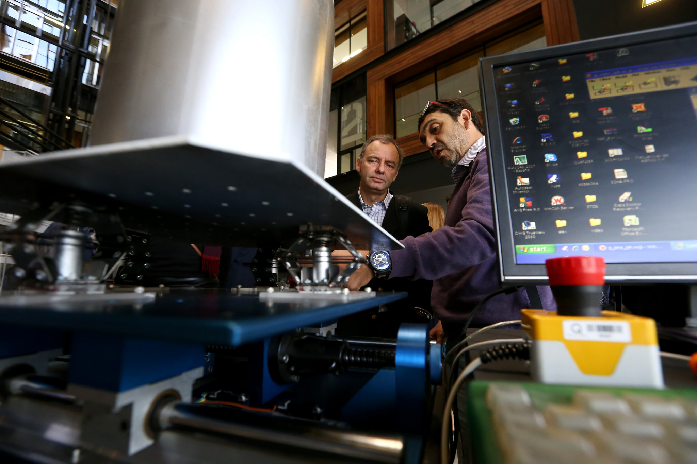
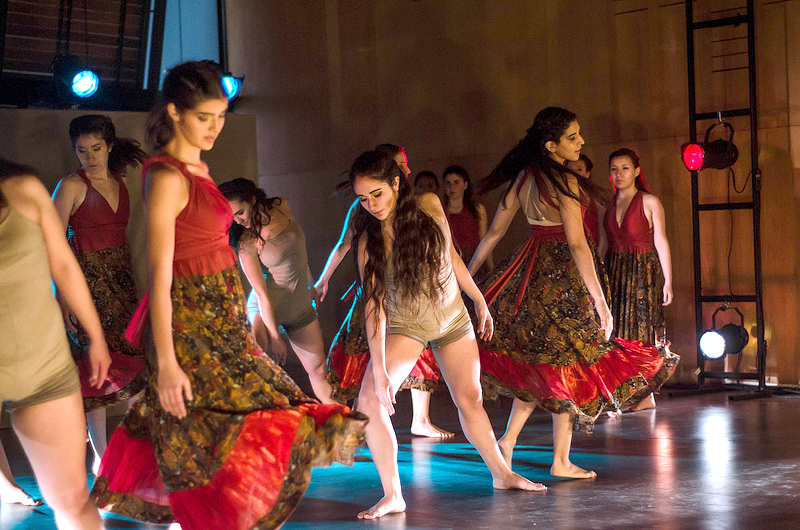

# Landing Investigación

## Investigación

Propuesta de imagen:

Opción 2

Nuestra pasión es crear conocimiento y compartirlo entre académicos, alumnos y profesionales, para luego traspasarlo a la sociedad a través de proyectos que atiendan las necesidades prioritarias del país en lo social, económico, político y cultural.

[Explora la investigación en la UC](http://investigacion.uc.cl)

### Nuestra Investigación

**Caja 1**  
1.220 Publicaciones  
  
**Caja 2**  
2.510 Publicaciones Scopus  
  
**Caja 3**  
Proyectos ingresados en la plataforma de visibilización académica VIVO  
\(falta enlace\)  
  
**Caja 4**  
26 Proyectos de Creación Artística  
  
**Caja 5**  
37 Centros de Investigación  
  
**Destacado**  
INGENIERÍA BIOLOGÍA Y MÉDICA  
"Uno puede hacer cien cirugías sin tocar al paciente, y tratar de ver cuál es la mejor."  
  
Daniel Hurtado  
Creador del primer modelamiento matemático de un corazón virtual en Chile.  
Foto: [https://drive.google.com/file/d/1\_\_4TAraewbpDJF4Gy6SU3yWKJcm230lE/view?usp=sharing](https://drive.google.com/file/d/1__4TAraewbpDJF4Gy6SU3yWKJcm230lE/view?usp=sharing)  
  
**Caja 1**   
Innovación

Impulsamos iniciativas multidisciplinarias de innovación a través de proyectos y programas de emprendimiento de alto impacto.  
[Ir al sitio](http://centrodeinnovacion.uc.cl/)  
  
**Caja 2**  
Transferencia y Desarrollo

La transferencia tecnológica permite a las invenciones salir del espacio académico para poder ser utilizadas por quienes se encuentren interesados en ellas.  
[Ir al sitio](http://transferenciaydesarrollo.uc.cl)  
  
**Caja 3**  
Artes y Cultura

Potenciamos la creación artística y la investigación de la creación con sello artístico en la UC.  
[Ir al sitio](http://artesycultura.uc.cl)

### Solicitudes de patentes UC activas en el mundo

\(mapa\)  
[Oportunidades de patentes para la industria](http://transferenciaydesarrollo.uc.cl/es/empresas)

### Yo investigo en la UC

**Caja 1**  
TECNOLOGÍAS DE INCLUSIÓN  
“La tecnología puede hacer la diferencia entre estar y no estar en el mundo”.   
Ricardo Rosas  
Académico de la [Escuela de Psicología](https://www.psicologia.uc.cl/)  
Foto: [https://drive.google.com/file/d/1LLN99cZ\_ot3qNrIZ6kypD6OqfSAQLslE/view?usp=sharing](https://drive.google.com/file/d/1LLN99cZ_ot3qNrIZ6kypD6OqfSAQLslE/view?usp=sharing)

**Caja 2**  
TEXTILES ANDINOS  
"Las tejedoras aimaras piensan en él como un cuerpo; como un ser vivo”.   
Soledad Hoces de la Guardia   
Académica de la [Escuela de Diseño](http://diseno.uc.cl/)  
Foto: [https://drive.google.com/file/d/1d\_x5zA7hnkdy0GK3fMzs2aTkMUzTJS2b/view?usp=sharing](https://drive.google.com/file/d/1d_x5zA7hnkdy0GK3fMzs2aTkMUzTJS2b/view?usp=sharing)

**Caja 3**  
CAMBIO GLOBAL  
"Se trata de anticipar la naturaleza de los impactos más que predecirlos".   
Francisco Meza  
Académico de la [Facultad de Agronomía e Ingeniería Forestal](http://agronomia.uc.cl/)  
Foto: [https://drive.google.com/file/d/1ZgO2wSOWuMXbjTNEgm59-fDUGzWD1kcB/view?usp=sharing](https://drive.google.com/file/d/1ZgO2wSOWuMXbjTNEgm59-fDUGzWD1kcB/view?usp=sharing)

### Centros de Investigación 

\(filtro\)

[Botón Centros de investigación](http://investigacion.uc.cl/Investigacion-menu-superior/centros-de-investigacion.html)

### Financiamiento

[Concursos VRI](http://investigacion.uc.cl/Fondos-concursables/fondos-concursables.html)  
[Concursos doctorados](http://doctorados.uc.cl/es/becas-y-apoyos/calendario-de-becas-y-concursos)  
[Concursos externos](http://investigacion.uc.cl/Fondos-concursables/concursos-externos.html)  
[Fondos internacionales](http://investigacion.uc.cl/Enlaces-de-Interes/enlaces-de-interes.html)

### Footer

  
  
  

