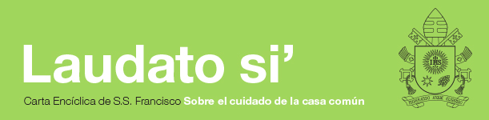

# Inicio

### Actualidad

#### Café Mundial: La UC a la luz de Laudato Si'

Estudiantes, docentes, administrativos y autoridades se reunieron para dialogar respecto a la última carta Encíclica, sobre el cuidado de la casa común, del Papa Francisco, y su influencia en la labor de la Universidad.

[Foto](https://drive.google.com/open?id=1E2hT54Sm4jo04yfSuPZeVfs63VH5z5qZ)

#### [Participa del concurso Enfoca la Sustentabilidad](https://www.uc.cl/enciclica-laudato-si/concurso)

Envía tu imagen al primer concurso de fotografía sobre la sustentabilidad. Participa por una Canon G16 y por ser parte de la exposición itinerante de las 30 mejores fotografías.

[Foto](https://drive.google.com/open?id=1zNb0FnPIeQHpXv4VSfoSgRbIsE01yOQ1)

#### ¡Bienvenidos al huerto San Francisco!

Te presentamos el nuevo espacio en la Universidad, enfocado a promover los huertos urbanos, educar en sustentabilidad y propiciar el encuentro de la comunidad en el campus San Joaquín.

[Foto](https://drive.google.com/open?id=1mV1ekEdXyreXeo9Oe2CzJmtOouTEEmOf)

### Actividades

\(no hay contenido\)

### Descargas

[Foto](https://drive.google.com/open?id=1VcskeBBgWFw0-Xy9yow9ghkauH94yAkO)

[**Enlace de descarga**](conoce-la-enciclica.md)\*\*\*\*

