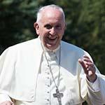
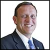
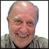
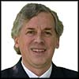
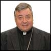

# Inicio

### Presentación

El desafío urgente de proteger nuestra casa común incluye la preocupación de unir a toda la familia humana en la búsqueda de un desarrollo sostenible e integral, pues sabemos que las cosas pueden cambiar \(…\) Hago una invitación urgente a un nuevo diálogo sobre el modo como estamos construyendo el futuro del planeta. Necesitamos una conversación que nos una a todos, porque el desafío ambiental que vivimos, y sus raíces humanas, nos interesan y nos impactan a todos.

S.S. Papa Francisco  
  
Descarga la Encíclica Laudato

### Discursos

Los siguientes cinco discursos fueron pronunciados en el marco del lanzamiento de la carta encíclica Laudato si', en la Casa Central de la UC. En el encuentro, organizado en conjunto por la Conferencia Episcopal y la Pastoral UC, se ahondó en los desafíos que presenta la encíclica desde los distintos saberes.​​​​​​​

Ignacio Sanchez  
Rector  
[https://www.uc.cl/images/stories/laudato/pdf/discursos/presentacion\_rector\_ignacio\_sanchez.pdf](https://www.uc.cl/images/stories/laudato/pdf/discursos/presentacion_rector_ignacio_sanchez.pdf)  
\(Link para descargar discurso\)

Fredy Parra  
Decano Facultad de Teología UC  
[https://www.uc.cl/images/stories/laudato/pdf/discursos/presentacion\_fredy\_parra.pdf](https://www.uc.cl/images/stories/laudato/pdf/discursos/presentacion_fredy_parra.pdf)  
\(Link para descargar discurso\)

Juan Carlos Castilla  
Académico Facultad Ciencias Biológicas UC  
[https://www.uc.cl/images/stories/laudato/pdf/discursos/presentacion\_juan\_carlos\_castilla.pdf](https://www.uc.cl/images/stories/laudato/pdf/discursos/presentacion_juan_carlos_castilla.pdf)  
\(Link para descargar discurso\)

José Miguel Sánchez  
Decano Facultad de Ciencias Económicas y Administrativas  
[https://www.uc.cl/images/stories/laudato/pdf/discursos/presentacion\_jose\_miguel\_sanchez.pdf](https://www.uc.cl/images/stories/laudato/pdf/discursos/presentacion_jose_miguel_sanchez.pdf)  
\(Link para descargar discurso\)

Monseñor Cristián Contreras  
Obispo de Melipilla  
[https://www.uc.cl/images/stories/laudato/pdf/discursos/Discurso\_Contreras.pdf](https://www.uc.cl/images/stories/laudato/pdf/discursos/Discurso_Contreras.pdf)  
\(Link para descargar discurso\)

### Capítulos de la Encíclica Laudato si'

**Introducción**

Carta encíclica Laudato si´  
Sobre el cuidado de la casa común  
Santo Padre Francisco

**Capítulo 1**

Lo que está pasando a nuestra casa.  
[https://www.uc.cl/images/stories/laudato/pdf/capitulos\_enciclica/capitulo\_1.pdf](https://www.uc.cl/images/stories/laudato/pdf/capitulos_enciclica/capitulo_1.pdf)

Se detallan aspectos que están incidiendo negativamente en el planeta, incluido el cambio climático, la problemática del acceso al agua potable, la pérdida de la biodiversidad y la deuda ecológica, entre otros.

**Capítulo 2**

Evangelio de la Creación.  
[https://www.uc.cl/images/stories/laudato/pdf/capitulos\_enciclica/capitulo\_2.pdf](https://www.uc.cl/images/stories/laudato/pdf/capitulos_enciclica/capitulo_2.pdf)

El Papa repasa los relatos de la Biblia, sobre todo, los referidos a la Creación y desarrolla la idea de que la existencia humana está fundamentada en la relación con Dios, con el prójimo y con la tierra.

**Capítulo 3**

Raíz humana de la crisis ecológica.  
[https://www.uc.cl/images/stories/laudato/pdf/capitulos\_enciclica/capitulo\_3.pdf](https://www.uc.cl/images/stories/laudato/pdf/capitulos_enciclica/capitulo_3.pdf)

Se abordan las causas que llevaron a esta crisis ecológica, entre otras, nombra el mal uso de la tecnología, el exceso de antropocentrismo, el progreso científico sin límites y aborda la necesidad de darle valor al trabajo.

**Capítulo 4**

Una ecología integral.  
[https://www.uc.cl/images/stories/laudato/pdf/capitulos\_enciclica/capitulo\_4.pdf](https://www.uc.cl/images/stories/laudato/pdf/capitulos_enciclica/capitulo_4.pdf)

Se esgrime y se explica el concepto de “ecología integral”, es decir, una ecología que incorpore el lugar del ser humano en el mundo y sus relaciones con la realidad que lo rodea.

**Capítulo 5**

Algunas líneas de orientación y acción.  
[https://www.uc.cl/images/stories/laudato/pdf/capitulos\_enciclica/capitulo\_5.pdf](https://www.uc.cl/images/stories/laudato/pdf/capitulos_enciclica/capitulo_5.pdf)

Lejos de una mirada pesimista sobre la crisis ecológica, el Papa propone algunas líneas de acción, priorizando el diálogo y acuerdos entre regímenes de gobernanza global, orientadas al bien común.

**Capítulo 6**

Educación y espiritualidad ecológica.  
[https://www.uc.cl/images/stories/laudato/pdf/capitulos\_enciclica/capitulo\_6.pdf](https://www.uc.cl/images/stories/laudato/pdf/capitulos_enciclica/capitulo_6.pdf)

Se explica que para lograr un cambio, es necesario apostar por un nuevo estilo de vida, que incluya una educación ambiental.

### Campañas: Contamos con tu compromiso

Te invitamos a compartir los contenidos que hemos preparado en tus redes. Hazte parte del mensaje de la encíclica y contribuye a transmitir esta profunda reflexión.

| Campaña 1 |
| :--- |
| [https://drive.google.com/open?id=1yq4QpPe7hsI4raajrOok8JdAPvgArItM](https://drive.google.com/open?id=1yq4QpPe7hsI4raajrOok8JdAPvgArItM) |

| Campaña 2 |
| :--- |
| [https://drive.google.com/file/d/1gr84D0EBIpaNEDwu10yl--lWyDchKLBo/view?usp=sharing](https://drive.google.com/file/d/1gr84D0EBIpaNEDwu10yl--lWyDchKLBo/view?usp=sharing) |

| Campaña 3 |  |
| :--- | :--- |
| [https://drive.google.com/file/d/1IBPKnPv8hvNNpcKs7xk93ioQD9bhpWDx/view?usp=sharing](https://drive.google.com/file/d/1IBPKnPv8hvNNpcKs7xk93ioQD9bhpWDx/view?usp=sharing) |  |

| Campaña 4 |  |
| :--- | :--- |
| [https://drive.google.com/file/d/1N93LR5KSH5jZ1olEdpK8him6V7fDcuBi/view?usp=sharing](https://drive.google.com/file/d/1N93LR5KSH5jZ1olEdpK8him6V7fDcuBi/view?usp=sharing) |  |

| Campaña 5 |
| :--- |
| [https://drive.google.com/file/d/1M\_rKPkrkqvDFtDqAwJDY9ETh4kTyda5r/view?usp=sharing](https://drive.google.com/file/d/1M_rKPkrkqvDFtDqAwJDY9ETh4kTyda5r/view?usp=sharing)  |

| Campaña 6 |
| :--- |
| [https://drive.google.com/file/d/1KuvgWzOC2WvS-0k-KSY4kaIlQE-04fPM/view?usp=sharing](https://drive.google.com/file/d/1KuvgWzOC2WvS-0k-KSY4kaIlQE-04fPM/view?usp=sharing) |

| Campaña 7 |
| :--- |
| [https://drive.google.com/file/d/1dY0Q3pSk-qMoMBXl1Rgpyr2mj4HVjS\_c/view?usp=sharing](https://drive.google.com/file/d/1dY0Q3pSk-qMoMBXl1Rgpyr2mj4HVjS_c/view?usp=sharing) |

| Campaña 8 |
| :--- |
| [https://drive.google.com/file/d/1GZGPBQfBYApAxFotdVTavLwM6xosycFf/view?usp=sharing](https://drive.google.com/file/d/1GZGPBQfBYApAxFotdVTavLwM6xosycFf/view?usp=sharing) |

| Campaña 9 |
| :--- |
| [https://drive.google.com/open?id=1PplZOTl7UVgy2I1GfVyHBlEw0Pl9Vh5T](https://drive.google.com/open?id=1PplZOTl7UVgy2I1GfVyHBlEw0Pl9Vh5T) |

| Campaña 10 |
| :--- |
| [https://drive.google.com/file/d/1AOVmqd3gqzQsoAoiw1wvDJ2jqAFX-R6P/view?usp=sharing](https://drive.google.com/file/d/1AOVmqd3gqzQsoAoiw1wvDJ2jqAFX-R6P/view?usp=sharing) |

