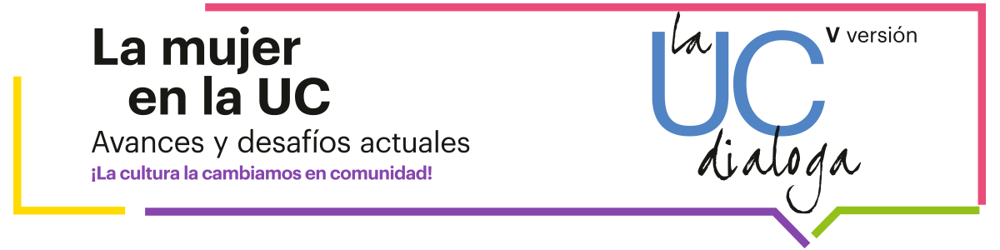

# Landing

## UC Dialoga

La UC Dialoga es una iniciativa de la Universidad Católica, creada en el año 2014, y que busca **desarrollar la capacidad de que estudiantes, académicos, profesionales, administrativos y exalumnos conversen** con argumentos en torno a **distintos temas al interior de nuestra comunidad.**

* Inscripciones y contacto
* Objetivos y metodología
* Versiones anteriores

### Presentación



**“La mujer en la UC: avances y desafíos actuales”**, es el tema que reunió a la comunidad universitaria en la **quinta versión de La UC Dialoga**. Los participantes reflexionaron en torno a las siguientes mesas: **Cómo avanzar en equidad; Chile: el cambio cultural que queremos; Formación y preparación para el liderazgo; Perspectivas de desarrollo de la Mujer en la UC y Mujeres, abusos y violencia sexual.**

El proyecto La UC Dialoga **nació en 2014** a partir de una idea tan simple como inusual: reunir a **académicos, estudiantes, administrativos, profesionales y exalumnos** en torno a una mesa con el objetivo de **compartir distintos puntos de vista**. La primera versión tuvo más de 600 participantes, quienes reflexionaron respecto de tres temas: sustentabilidad, ética profesional y docencia universitaria.

En 2015 se usó la metodología para tratar los ejes del Plan Estratégico 2015-2020 de la UC, los cuales fueron: Inclusión, Creación de conocimiento, Innovación en docencia, Interdisciplina y Compromiso Público. Más de 800 personas participaron en total.

Al año siguiente, el tema fue la Reforma de la Educación Superior. Junto a las “Mesas al patio” y encuentros focalizados, se creó un nuevo espacio, “Debate público”, donde representantes de distintas universidades ampliaron la discusión con cada una de sus miradas. En total, el ciclo contó con más de 2.200 participaciones.

En 2017, un total de 816 estudiantes, académicos, administrativos, profesionales y exalumnos UC, reunidos en 92 mesas, aportaron con sus ideas y propuestas en el proceso de Acreditación Instituciona. Cinco fueron los temas abordados: Formación integral, Docencia de pre y postgrado, Proyección de la investigación en la docencia, Vinculación con el medio e Impacto país.

Toda la reflexión realizada en La UC Dialoga es recogida en un informe, que es entregado a la Dirección Superior, convirtiéndose en un importante insumo para la toma de decisiones.

### Inscríbete

Pronto se publicarán las fechas de la versión 2019 de La UC Dialoga.

### Contacto

* Dirección de Comunicaciones
* Vicerrectoría de Comunicaciones
* Tel: \(+56\) 2 23542777
* dcomunicaciones@uc.cl

### Objetivos y metodología

#### Objetivos

• Incentivar la participación, reflexión y diálogo de la Comunidad UC en torno a temas relevantes para la gestión de la universidad.

• Levantar propuestas concretas como insumo para el trabajo del Consejo Superior de la universidad.

• Promover la cultura de diálogo y encuentro, como base para la discusión de los diversos temas de la agenda universitaria y la generación de propuestas.

• Fortalecer el espíritu de comunidad en la UC.

#### Metodología: Mesas al patio

**PARTE I: Mesas al patio**

Diálogos que se realizan en espacios abiertos y centrales de los cinco campus de nuestra universidad. Están convocados de manera abierta todos los miembros de la comunidad UC y se procura tener representación de cada grupo \(estudiantes, funcionarios, académicos y exalumnos\) y de todas las unidades académicas. La organización asigna un tutor y los miembros escogen un secretario que elabora un acta con las principales conclusiones de la mesa, las que se envían a la coordinación para la elaboración de un informe final con todos los aportes de los diálogos, los que serán luego entregados como resultados del proceso a la Dirección Superior. Los encuentros se desarrollan entre las 13:00 y 14:00 horas e incluye un snack.

**PARTE II: Encuentros focalizados**

Diálogos realizados para obtener visiones y aportes desde diversos grupos internos y externos. En sesiones de una hora y media se realizan mesas de discusión en encuentros con representantes estudiantiles, autoridades internas, amigos y ex alumnos de la universidad. Al igual que en la etapa I, cada mesa cuenta con un moderador/facilitador y un secretario de actas. Las conclusiones de esta etapa también son incorporadas a los aportes finales del proceso.

### **Versiones anteriores**

#### **Versión 2018**

* [Informe final La UC Dialoga](https://www.uc.cl/images/informe_final_laucdialoga_2018.pdf)
* [Video La UC Dialoga 2018](https://www.youtube.com/watch?v=zRDv5SMLZ98)

#### Versión 2017

* [Informe final La UC Dialoga 2017 – Acreditación Institucional](https://www.uc.cl/images/INFORME_FINAL_La_UC_Dialoga_2017.pdf)
* [Concluye la primera parte de La UC Dialoga con cerca de 600 participantes](https://www.uc.cl/es/la-universidad/noticias/28568-concluye-la-primera-parte-de-la-uc-dialoga-con-cerca-de-600-participantes)
* [Una profunda reflexión sobre el futuro de la universidad se realizó en la segunda etapa de La UC Dialoga 2017](https://www.uc.cl/es/la-universidad/noticias/29106-una-profunda-reflexion-sobre-el-futuro-de-la-uc-se-realizo-en-la-segunda-etapa-de-la-uc-dialoga-2017)
* [Video síntesis Encuentro de Exalumnos y Amigos UC 2017](http://multimedia.uc.cl/videos/vod/comunicaciones/ucdialoga_exalumnos.mp4)
* [Artículo Visión UC: Los frutos del diálogo. Septiembre 2017](https://www.uc.cl/images/Los_frutos_del_dialogo_VisionUC_sept_2017.pdf)
* [Video síntesis Mesas al Patio 2017](https://youtu.be/1GP9z7IpSF4)
* [Registro audiovisual Mesas al Patio 2017 - Casa Central](https://youtu.be/TarKhFvXd2g)
* [Registro audiovisual Mesas al Patio 2017 - Campus Lo Contador](https://youtu.be/fPl7P4uNlsA)
* [Registro audiovisual Mesas al Patio 2017 - Campus San Joaquín](https://youtu.be/fPl7P4uNlsA)
* [Registro audiovisual Mesas al Patio 2017 - Campus Oriente](https://youtu.be/Sz0grRS0Wzc)
* [Registro fotográfico Mesas al Patio 2017](https://flic.kr/s/aHsm2BhsBT)
* [Informe de Evaluación Interna - Acreditación, 2011](https://www.uc.cl/images/stories/La_UC_dialoga/2017/informe-de-evaluacion-interna-UC-2011.pdf)

