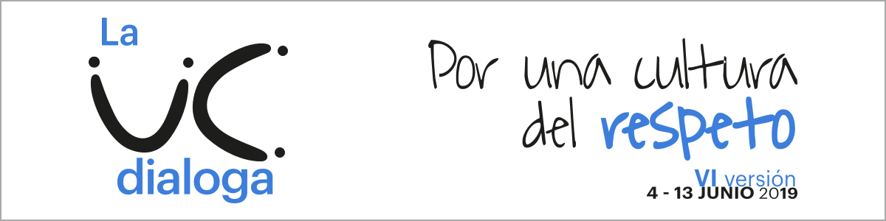

# Landing

## UC Dialoga

## Inicio



Educar y aprender suponen convivir, vincularse, discutir y alcanzar acuerdos con otras personas, en un marco de respeto, diálogo, escucha genuina, tolerancia y buen trato. Es en tales circunstancias que los prejuicios se reducen, las relaciones humanas pueden volverse mutuamente nutritivas, se fomenta el bienestar del conjunto y la diversidad interindividual alcanza en mayor medida su potencial promotor del aprendizaje para todos.

La convivencia social en contextos educativos “no es algo estable, sino que es una construcción colectiva y dinámica, sujeta a modificaciones conforme varían las interrelaciones de los actores en el tiempo” \(Banz, 2008, p.2\). En educación superior, la comunidad construye la convivencia universitaria en que se generan las condiciones para alcanzar los aprendizajes esperados, tanto de contenidos como de interacción humana.

Este año queremos incorporarnos como Comunidad UC a la reflexión que nos compete como comunidad universitaria y que debiese movilizarnos en nuestra relación con nuestro entorno más cercano, nuestras comunidades vecinas, la ciudad y el país. Se trata de la convivencia universitaria, con sus distintos ámbitos de acción y con las discusiones que se requieren abordar en nuestros escenarios actuales.

### Participa en La UC Dialoga

* Campus Lo Contador – martes 4 de junio
* Casa Central – jueves 6 de junio
* Campus Oriente – martes 11 de junio
* Campus Villarrica – martes 11 de junio
* Campus San Joaquín – jueves 13 de junio

[Inscríbete aquí ](https://docs.google.com/forms/d/e/1FAIpQLScSb3HWLXdMGKhKUScQC4J0bU5Rl-czZuUqOUoBSn99OiY62A/viewform)

### Contacto

Magdalena Cobo V.  
Coordinadora de Gestión y Producción  
Vicerrectoría de Comunicaciones  
Tel: \(+56\) 22354 2777   
magdalena.cobo@uc.cl

## Qué es

#### Objetivos

• Incentivar la participación, reflexión y diálogo de la Comunidad UC en torno a temas relevantes para la gestión de la universidad.

• Levantar propuestas concretas como insumo para el trabajo del Consejo Superior de la universidad.

• Promover la cultura de diálogo y encuentro, como base para la discusión de los diversos temas de la agenda universitaria y la generación de propuestas.

• Fortalecer el espíritu de comunidad en la UC.

#### Metodología: Mesas al patio

**PARTE I: Mesas al patio**

Diálogos que se realizan en espacios abiertos y centrales de los cinco campus de nuestra universidad. Están convocados de manera abierta todos los miembros de la comunidad UC y se procura tener representación de cada grupo \(estudiantes, funcionarios, académicos y exalumnos\) y de todas las unidades académicas. La organización asigna un tutor y los miembros escogen un secretario que elabora un acta con las principales conclusiones de la mesa, las que se envían a la coordinación para la elaboración de un informe final con todos los aportes de los diálogos, los que serán luego entregados como resultados del proceso a la Dirección Superior. Los encuentros se desarrollan entre las 13:00 y 14:00 horas e incluye un snack.

**PARTE II: Encuentros focalizados**

Diálogos realizados para obtener visiones y aportes desde diversos grupos internos y externos. En sesiones de una hora y media se realizan mesas de discusión en encuentros con representantes estudiantiles, autoridades internas, amigos y ex alumnos de la universidad. Al igual que en la etapa I, cada mesa cuenta con un moderador/facilitador y un secretario de actas. Las conclusiones de esta etapa también son incorporadas a los aportes finales del proceso.

[Inscríbete en las Mesas al Patio en el campus que más te acomode aquí](https://forms.gle/reMX18ZhYb2vWmr38)

### Contacto

Magdalena Cobo V.  
Coordinadora de Gestión y Producción  
Vicerrectoría de Comunicaciones  
Tel: \(+56\) 22354 2777   
magdalena.cobo@uc.cl

## **Inscripciones**

[Inscríbete en las Mesas al Patio en el campus que más te acomode aquí](https://forms.gle/reMX18ZhYb2vWmr38)

### Contacto

Magdalena Cobo V.  
Coordinadora de Gestión y Producción  
Vicerrectoría de Comunicaciones  
Tel: \(+56\) 22354 2777   
magdalena.cobo@uc.cl

## **Antecedentes**

#### Versión 2019

* [Temas de reflexión para las Mesas, La UC Dialoga 2019](https://www.uc.cl/images/stories/La_UC_dialoga/2019/la-uc-dialoga-2019.pdf)

#### **Versión 2018**

* [Informe final La UC Dialoga](https://www.uc.cl/images/informe_final_laucdialoga_2018.pdf)
* [Video La UC Dialoga 2018](https://www.youtube.com/watch?v=zRDv5SMLZ98)

#### Versión 2017

* [Informe final La UC Dialoga 2017 – Acreditación Institucional](https://www.uc.cl/images/INFORME_FINAL_La_UC_Dialoga_2017.pdf)
* [Concluye la primera parte de La UC Dialoga con cerca de 600 participantes](https://www.uc.cl/es/la-universidad/noticias/28568-concluye-la-primera-parte-de-la-uc-dialoga-con-cerca-de-600-participantes)
* [Una profunda reflexión sobre el futuro de la universidad se realizó en la segunda etapa de La UC Dialoga 2017](https://www.uc.cl/es/la-universidad/noticias/29106-una-profunda-reflexion-sobre-el-futuro-de-la-uc-se-realizo-en-la-segunda-etapa-de-la-uc-dialoga-2017)
* [Video síntesis Encuentro de Exalumnos y Amigos UC 2017](http://multimedia.uc.cl/videos/vod/comunicaciones/ucdialoga_exalumnos.mp4)
* [Artículo Visión UC: Los frutos del diálogo. Septiembre 2017](https://www.uc.cl/images/Los_frutos_del_dialogo_VisionUC_sept_2017.pdf)
* [Video síntesis Mesas al Patio 2017](https://youtu.be/1GP9z7IpSF4)
* [Registro audiovisual Mesas al Patio 2017 - Casa Central](https://youtu.be/TarKhFvXd2g)
* [Registro audiovisual Mesas al Patio 2017 - Campus Lo Contador](https://youtu.be/fPl7P4uNlsA)
* [Registro audiovisual Mesas al Patio 2017 - Campus San Joaquín](https://youtu.be/fPl7P4uNlsA)
* [Registro audiovisual Mesas al Patio 2017 - Campus Oriente](https://youtu.be/Sz0grRS0Wzc)
* [Registro fotográfico Mesas al Patio 2017](https://flic.kr/s/aHsm2BhsBT)
* [Informe de Evaluación Interna - Acreditación, 2011](https://www.uc.cl/images/stories/La_UC_dialoga/2017/informe-de-evaluacion-interna-UC-2011.pdf)

#### Versión 2016

Registro audiovisual de la tercera etapa de La UC Dialoga 2016, Debate Público:

* [Tema: Sentido y compromiso público ](http://multimedia.uc.cl/videos/vod/ucdialoga/UCD_CapII.mp4)
* [Tema: Financiamiento ](http://multimedia.uc.cl/videos/vod/ucdialoga/UCD_CapI.mp4)
* [Tema: Calidad ](http://multimedia.uc.cl/videos/vod/ucdialoga/UCD_CapIII.mp4)
* [Tema: Institucionalidad](http://multimedia.uc.cl/videos/vod/ucdialoga/UCD_CapIV.mp4)

* [Documento resumen de aportes de la UC Dialoga 2016 sobre la Reforma a la Educación Superior. 21.09.2016 ](https://www.uc.cl/images/pdf/ucdialoga/sintesis_uc_dialoga_2016.pdf)
* [Visión UC. Edición con agradecimiento UC Dialoga, octubre de 2016](https://issuu.com/visionuniversitaria/docs/vu258/16) 
* [Siete ejes para entender la Reforma de la Educación Superior. Visión UC, agosto de 2016 ](https://www.uc.cl/images/pdf/ucdialoga/siete-ejes-reforma-educacion-ucdialoga.pdf)
* [Proyecto de Ley de Educación Superior 01.08.2016](https://www.uc.cl/images/pdf/ucdialoga/proyecto_de_ley_reforma_educacion_superior_4072016.pdf)
* [Síntesis interna del proyecto de Ley de Educación Superior, 04.07.2016](https://www.uc.cl/images/pdf/ucdialoga/vrc_sintesis_reforma_educacion_superior.pdf)
* [Comentarios de la Pontificia Universidad Católica de Chile a las Minutas del Ministerio de Educación sobre la Reforma a la Educación Superior, 11.04.2016 ](https://www.uc.cl/images/pdf/ucdialoga/aporte_de_la_uc_a_las_minutas_de_educacion_superior.pdf)
* [Registro audiovisual de encuentros 2016](https://www.youtube.com/playlist?list=PLo5_6NdIy8XFT8l476W1wEQruMAW53wKd)
* [Registro fotográfico jornadas 2016 ](https://www.flickr.com/photos/universidadcatolica/sets/72157670882823533)
* [Otros aportes de la UC sobre Educación Superior ](https://www.uc.cl/es/la-uc-dialoga/ItemId=24643)

#### Versión 2015

* [Documento resumen de la UC Dialoga 2015 de aporte para el Plan de Desarrollo 2015-2020 ](https://www.uc.cl/es/component/docman/doc_download/81-sintesis-la-uc-dialoga-2015)
* [Plan de desarrollo del periodo 2015-2020 donde se incorporan los aportes de la UC Dialoga 2015 ](https://www.uc.cl/es/plan-de-desarrollo)
* [Registro fotográfico General ](https://www.flickr.com/photos/universidadcatolica/sets/72157654602975833)
* [Registro fotográfico Campus San Joaquín](https://www.flickr.com/photos/universidadcatolica/sets/72157654937530195)
* [Registro fotográfico Campus Casa Central](https://www.flickr.com/photos/universidadcatolica/sets/72157654704083915)  
* [Registro fotográfico Campus Oriente ](https://www.flickr.com/photos/universidadcatolica/sets/72157654426119135)
* [Registro fotográfico Lo Contador ](https://www.flickr.com/photos/universidadcatolica/sets/72157653935847489)

#### Versión 2014

* [Documento resumen con los resultados de La UC Dialoga 2014, de los diálogos acerca de sustentabilidad, ética profesional y docencia universitaria](https://www.uc.cl/images/stories/La_UC_dialoga/UCDialoga_resultados_2014.pdf)
* [Registro fotográfico Campus Casa Central ](https://www.flickr.com/photos/universidadcatolica/sets/72157644714773007)
* [Registro fotográfico Campus San Joaquín ](https://www.flickr.com/photos/universidadcatolica/sets/72157644484090508)
* [Registro fotográfico Lo Contador ](https://www.flickr.com/photos/universidadcatolica/sets/72157644353476169)

### Footer

