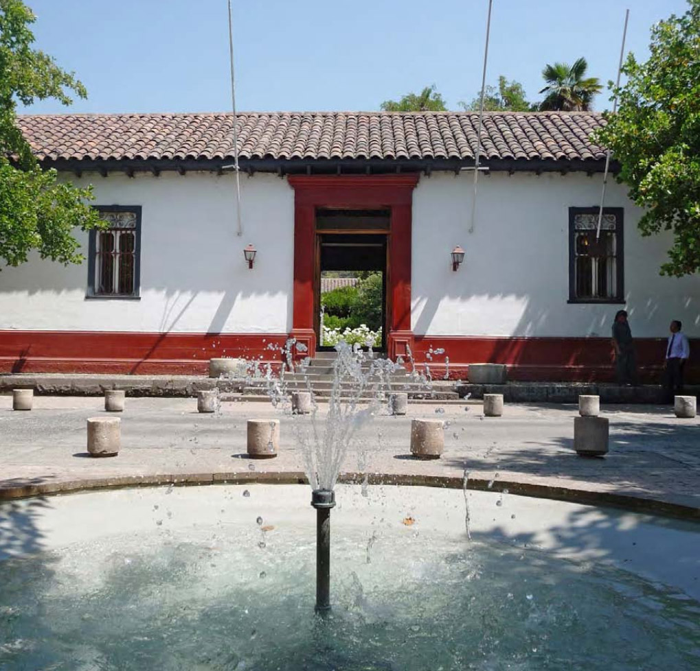

# Campus

## Campus

La Universidad Católica se despliega en cinco campus: cuatro en distintas comunas de Santiago y uno en la ciudad de Villarrica, ubicada en el sur de Chile. Nuestros campus no son solo consecuencia de necesidades académicas, sino construcciones con sentido cultural que la Universidad ha legado a la ciudad.

### [Casa Central](campus-casa-central.md)

Este imponente edificio de estilo neoclásico se terminó de construir en 1917. Conocido antiguamente como Palacio Universitario, hoy alberga a las principales autoridades de la Universidad y es sede de las facultades de Medicina, Derecho, Ciencias Biológicas y Comunicaciones.

\[Logo mapa\] [Av. Libertador Bernardo O'Higgins 340, Santiago](https://www.google.cl/maps/place/Av+Libertador+Bernardo+O'Higgins+340,+Santiago,+Regi%C3%B3n+Metropolitana/@-33.4408939,-70.6431538,17z/data=!3m1!4b1!4m5!3m4!1s0x9662c59eeca17e9d:0xeade5bbaf5953588!8m2!3d-33.4408984!4d-70.6409651). 

### [Lo Contador](campus-lo-contador.md)

### 

Antigua hacienda del siglo XVIII cuya casona es Monumento Nacional y parte del patrimonio arquitectónico de Santiago. Desde 1958 es sede de la Facultad de Arquitectura, Diseño y Estudios Urbanos.

\[Logo mapa\] [El Comendador 1916, Providencia, Santiago.](https://www.google.cl/maps/place/El+Comendador+1916,+Providencia,+Regi%C3%B3n+Metropolitana/@-33.4202473,-70.6202817,17z/data=!3m1!4b1!4m5!3m4!1s0x9662cf608d0f317b:0x844e3a8482d4800c!8m2!3d-33.4202518!4d-70.618093) 

### [Oriente](campus-oriente.md)

Construido en 1934 y adquirido por la Universidad a la Congregación de la religiosas de los Sagrados Corazones, en 1971. Acoge a las carreras de la Facultad de Artes y al Instituto de Estética.

\[Logo mapa\] [Av. Jaime Guzmán 3300, Providencia, Santiago.](https://www.google.cl/maps/place/Jaime+Guzm%C3%A1n+Err%C3%A1zuriz+3300,+%C3%91u%C3%B1oa,+Regi%C3%B3n+Metropolitana/@-33.4458333,-70.5956316,17z/data=!3m1!4b1!4m5!3m4!1s0x9662cfa321f5f359:0x44c64f9e56c6f01d!8m2!3d-33.4457885!4d-70.5937947)

### [San Joaquín](campus-san-joaquin.md)

Incorporado al patrimonio de la Universidad en 1891, legado por Honoria Gandarillas, el campus San Joaquín comenzó la implementación de sus 82 hectáreas universitaria en los años 60, convirtiéndose en una verdadera ciudad universitaria. Es el campus más grande de la Universidad y alberga a 12 Facultades.

\[Logo mapa\] [Av. Vicuña Mackenna 4860, Macul, Santiago. ](https://www.google.cl/maps/place/Av.+Vicu%C3%B1a+Mackenna+4860,+Macul,+La+Florida,+Regi%C3%B3n+Metropolitana/@-33.4996092,-70.6175415,17z/data=!4m5!3m4!1s0x9662d061059bdeef:0x748178e41aceefd3!8m2!3d-33.4995869!4d-70.6154386)

### [Villarrica](campus-villarrica.md)

Ubicada en una de las ciudades más lindas del sur de Chile, el Campus Villarrica alberga a las autoridades universitarias locales y ofrece las carreras de Educación General Básica y Educación Parvularia.

\[Logo mapa\] [Bernardo O'Higgins 501, Villarrica. ](https://www.google.cl/maps/place/Bernardo+O'Higgins+501,+Villarrica,+Regi%C3%B3n+de+la+Araucan%C3%ADa/@-39.2773735,-72.2275571,17z/data=!3m1!4b1!4m5!3m4!1s0x96146222c53527a9:0x55e9092e0fea025c!8m2!3d-39.2773735!4d-72.2253684)

### Footer

