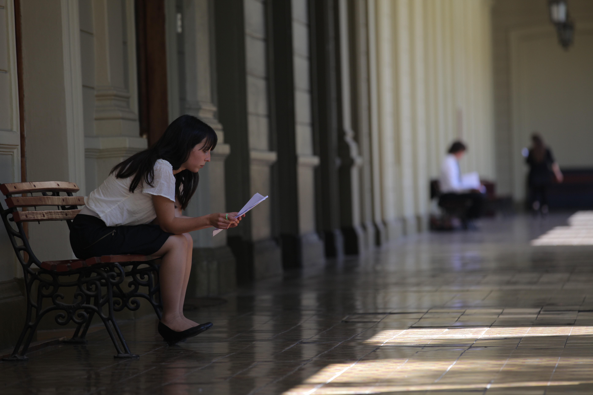
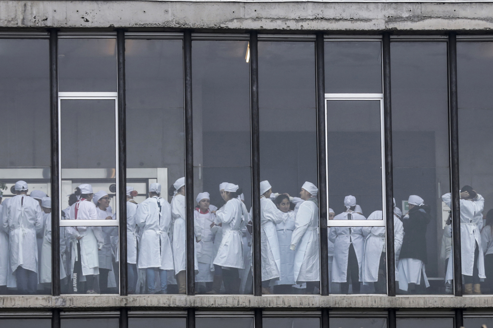
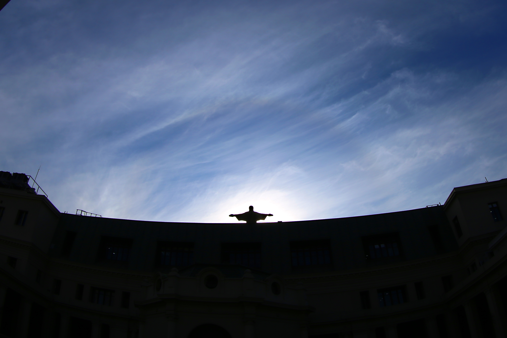
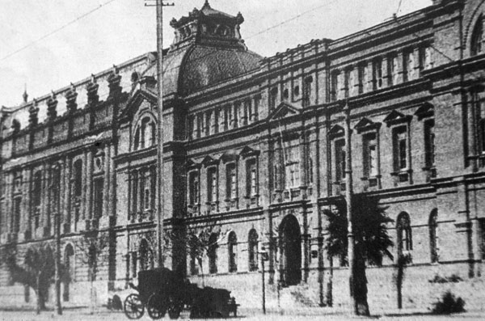

# Campus Casa Central

### Contáctanos

Avenida Libertador Bernardo O'Higgins 340

\(562\) 2354 4000

Cómo llegar:

Debes ir hasta la **Estación Universidad Católica** de la línea 1 del Metro. Luego debes **salir hacia la vereda sur** y caminar hacia el poniente. **Cruza Avenida Portugal** y habrás llegado.

### Estudia en Casa Central

#### [Facultad de Ciencias Biológicas](http://biologia.uc.cl/es/)

Esta facultad ofrece las carreras de [**Biología**](http://pregrado.bio.uc.cl/carreras-de-pregrado/biologia/)**,** [**Bioquímica**](http://pregrado.bio.uc.cl/carreras-de-pregrado/bioquimica/) ****y ****[**Biología Marina**](http://pregrado.bio.uc.cl/carreras-de-pregrado/biologia-marina/), además de **programas de** [**doctorado**](http://postgrado.bio.uc.cl/) y [**diplomados**](http://www.educacioncontinua.uc.cl/diplomados-por-facultad.php?csrf=02615af409562197da13bf91bbba366b&facultad=4583). Se caracteriza por realizar investigación científica original y enseñar la disciplina en niveles básicos y avanzados.

#### [Facultad de Comunicaciones](http://comunicaciones.uc.cl/)

Esta facultad ofrece las carreras de [**Periodismo**](http://comunicaciones.uc.cl/carreras-de-pregrado/periodista/)**,** [**Dirección Audiovisual** ](http://comunicaciones.uc.cl/carreras-de-pregrado/director-audiovisual/)y [**Publicidad**](http://comunicaciones.uc.cl/carreras-de-pregrado/publicista/), las que se complementan con [**diplomados**](http://www.educacioncontinua.uc.cl/diplomados-por-facultad.php?csrf=1885c2958792fcde100c77591d3ddb70&facultad=4587)**,** [**magísteres**](http://comunicaciones.uc.cl/magister/) y [**programas de doctorado** ](http://comunicaciones.uc.cl/doctorado/)que impulsan la investigación en las diferentes áreas de la comunicación.

#### [Facultad de Derecho](http://derecho.uc.cl/es/)

Esta facultad está comprometida con la formación de profesionales en el ámbito del derecho a través de sus programas de [**licenciatura**](http://derecho.uc.cl/es/licenciatura-en-derecho/bienvenida-decano)**,** [**magíster**](http://derecho.uc.cl/es/magister-en-derecho) y [**doctorado**](http://doctoradoderecho.uc.cl/). A eso se suman [**cursos, diplomados** y **actividades de extensión**](http://extensionderecho.uc.cl/).

#### [Facultad de Medicina](https://facultadmedicina.uc.cl/)

En Casa Central se encuentra la [**Escuela de Medicina** ](https://medicina.uc.cl)de esta facultad junto al Hospital Clínico UC. En ellos se forman los futuros médicos del país a través programas de [**pregrado**](https://medicina.uc.cl/pregrado/), [**especializaciones**](https://medicina.uc.cl/postgrado/especialidades-medicas/)**,** [**magísteres**](https://medicina.uc.cl/postgrado/magister/) **y** [**doctorados**](https://medicina.uc.cl/postgrado/doctorados/). 

### Vida de campus

#### Está pasando

Evento 1

Evento 2

Evento 3

#### Casa Central en imágenes

### Historia de Campus

Conocido como el Palacio Universitario, la Casa Central es el edificio más emblemático y más antiguo de la Universidad.

La primera piedra se puso en 1910 y su construcción concluyó en 1917.  El diseño original fue obra del arquitecto italiano Ignacio Cremonesi y fue concluido por el arquitecto Emile Jecquier. 

Las facultades se agrupaban en torno a un pato central rodeado de anchos pasillos. Además contaba con una capilla, una biblioteca para 60 mil libros y una sala para actos oficiales. Desde entonces y hasta el día de hoy, en el segundo piso se ubican las oficinas del Rector y Prorrector, así como otras autoridades.

En 1931 Casa Central sufrió un incendio que destruyó dos pisos completos. El proceso de reconstrucción demoró sólo seis años. Como agradecimiento a la rapidez en la obras, el rector de entonces, Monseñor Carlos Casanueva mandó a hacer una estatua del Sagrado Corazón para ponerla sobre la fachada, la que se convirtió en un símbolo hasta  hoy.

Con los años se agregaron nuevos edificios y facultades como Derecho, Ciencias Biológicas, Medicina y Comunicaciones. Además del Hospital Clínico y el Centro de Extensión.

