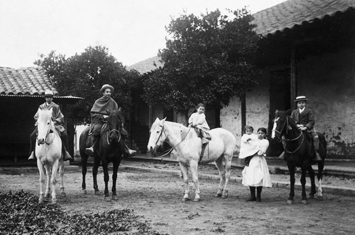

# Campus Lo Contador

## Campus Lo Contador

### Contáctanos

El Comendador 1916, Providencia.

 \(2\) 2354 4000

### Estudia en Lo Contador

#### [Facultad de Arquitectura, Diseño y Estudios Urbanos](http://fadeu.uc.cl/)

Esta facultad está compuesta por la [**Escuela de Arquitectura**](http://arquitectura.uc.cl/)**, la** [**Escuela de Diseño**](http://diseno.uc.cl/) **y el** [**Instituto de Estudios Urbano**](http://estudiosurbanos.uc.cl/)**s**, unidades que ofrecen una variada oferta de programas de postgrado, diplomados y cursos.

### Vida de Campus

#### Está pasando

_Evento 1_

_Evento 2_

_Evento 3_

#### Lo Contador en imágenes

### Historia de Lo Contador

La historia de la casa se remonta al siglo XVIII, cuando Francisco Antonio Avaria compró una serie de pequeñas propiedades entre el Cerro San Cristóbal y el río Mapocho, para su sobrina huérfana Mercedes Contador. Así nació la chacra de Lo Contador. 

En ese período se construyó una casa colonial de adobe y maderas nativas. Ella perdura hasta hoy como un valioso ejemplo de arquitectura rural de los alrededores de Santiago. Desde 1974 está protegida como monumento histórico por el Consejo de Monumentos Nacionales. 

Durante el siglo XIX, la casa se amplió para permitir la realización de ejercicios espirituales. Más tarde, durante la Guerra del Pacífico, la casa se usó hospital de convalecientes.

Hacia mediados del siglo XX, y debido al proceso de urbanización del barrio Pedro de Valdivia Norte, comenzó la venta de los terrenos de la chacra. En 1958 y a instancias del decano de la Facultad de Arquitectura, Sergio Larraín, la Universidad aprovechó de comprar el inmueble y construir en aquel lugar un nuevo campus para la universidad. 

La casa no ha sufrido transformaciones conservando su carácter original, pero en sus alrededores sí se han construido distintos edificios. Es uno de los lugares donde se articulan edificaciones históricas con propuestas contemporáneas de manera especialmente armónica. 

Desde hace más de 40 años el campus alberga a la Facultad de Arquitectura, Diseño y Estudios Urbanos, y ha sido testigo de la formación de algunos de los profesionales de la arquitectura, diseño y arte, más relevantes del país.

Recorrer los espacios del campus, como lo hacen cotidianamente estudiantes, docentes y visitantes, permite gozar de un espacio en el que se entretejen construcciones antiguas y contemporáneas, radicales y respetuosas a las vez.

  

