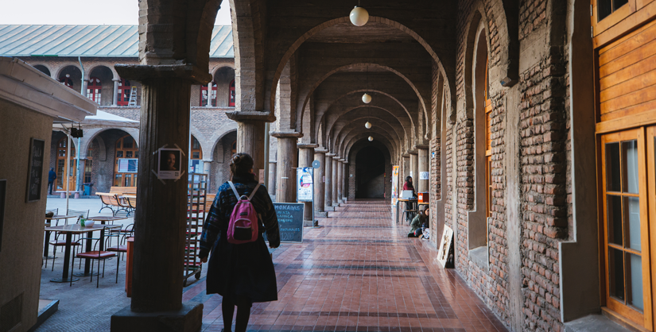
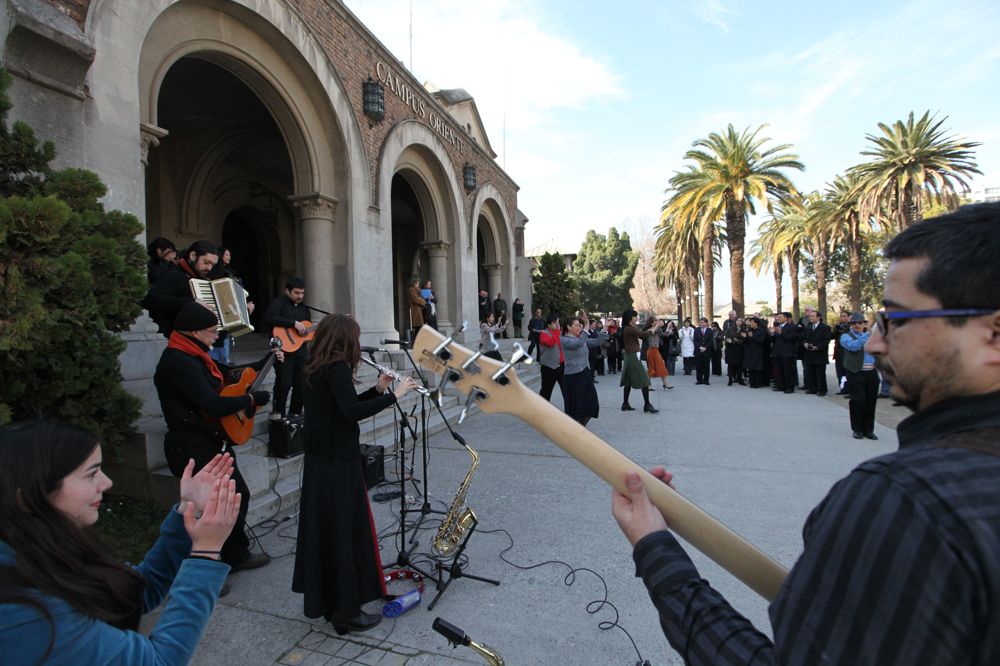
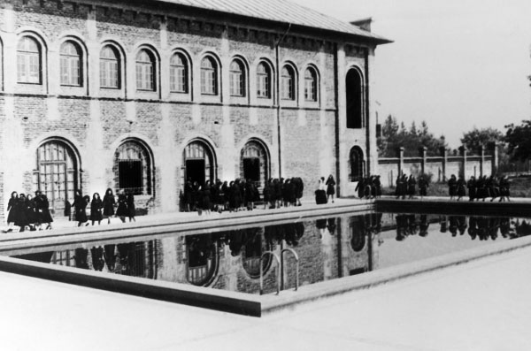

# Campus Oriente

### Contáctanos

Jaime Guzmán Errázuriz 3300, Providencia

\(562\) 2354 4000

Cómo llegar:

En metro y bus:

Desde **estación Santa Isabel** de la línea 5, camina hasta el paradero PC1003 ubicado en Santa Isabel con Avenida Seminario, y tomar el **bus D18** que te dejará frente al campus.

Desde **estación Los Leone**s de la línea 1, camina hasta el paradero PC87,Parada 12 y toma el **bus 212** hasta el paradero PD53 ubicado en General Artigas, esquina Hernán Cortés. Camina por calle Hernán cortés hacia el oriente hasta Avenida Jaime Guzmán y desde ahí camina hacia el sur, hasta el número 3300.

Desde estación la **estación Chile España** de la línea 3, puedes tomar el **bus 104** en dirección a Providencia y bajarte en el paradero PD 237 ubicado en Chile España esquina Avenida Simón Bolívar. Luego debes caminar hacia el oriente por Avenida Simón Bolívar y doblar por calle Regina Pacis, hasta llegar a Avenida Jaime Guzmán. Saldrás frente al campus.

### Estudia en Campus Oriente

#### [Facultad de Artes](http://artes.uc.cl/)

A esta facultad pertenecen la [Escuela de Teatro](http://escueladeteatro.uc.cl/) y la [Escuela de Arte](http://escuelaarte.uc.cl/), más el [Instituto de Música](http://musica.uc.cl/). 

También pertenecen a la facultad espacios artísticos como el [Teatro UC](http://teatrouc.uc.cl/), la [Galería Macchina](http://galeriamacchina.uc.cl/) y el [Espacio Vilches](http://galeriamacchina.uc.cl/Espacio-Vilches/).

#### [Instituto de Estética](http://estetica.uc.cl/)

Este instituto es parte de la [Facultad de Filosofía](http://filosofia.uc.cl/#) y su programa de [Licenciatura en Estética](http://estetica.uc.cl/licenciatura/descripcion-y-perfil-de-egreso#) es el único que existe tanto en Chile como en Iberoamérica.

### Vida de Campus

#### Está pasando

Evento 1

Evento 2

Evento 3

#### El campus en imágenes

### Historia del Campus

De muros sólidos, pasillos frescos y vegetación añosa, Campus Oriente, es uno de los espacios más nostálgicos de la universidad. Está ubicado en los límites de la comuna de Ñuñoa y Providencia. 

Comenzó siendo convento y colegio para señoritas a cargo de las religiosas de los Sagrados Corazones. Fue proyectado en estilo neo-románico por los arquitectos Juan Lyon y Luis Azócar, e inició su construcción en 1926 en medio de un amplio terreno de seis hectáreas. 

En 1971 fue adquirido por la Universidad y durante muchos años se dictaron carreras del área humanista, las que con el tiempo fueron migrando hacia otros campus de la universidad. 

Hoy es conocido como "Campus de las Artes" porque alberga a la [**Escuela de Arte**](http://escuelaarte.uc.cl/), el [**Instituto de Música**](http://musica.uc.cl/), la [**Escuela de Teatro**](http://escueladeteatro.uc.cl/) y el[ **Instituto de Estética**](http://estetica.uc.cl/). 

