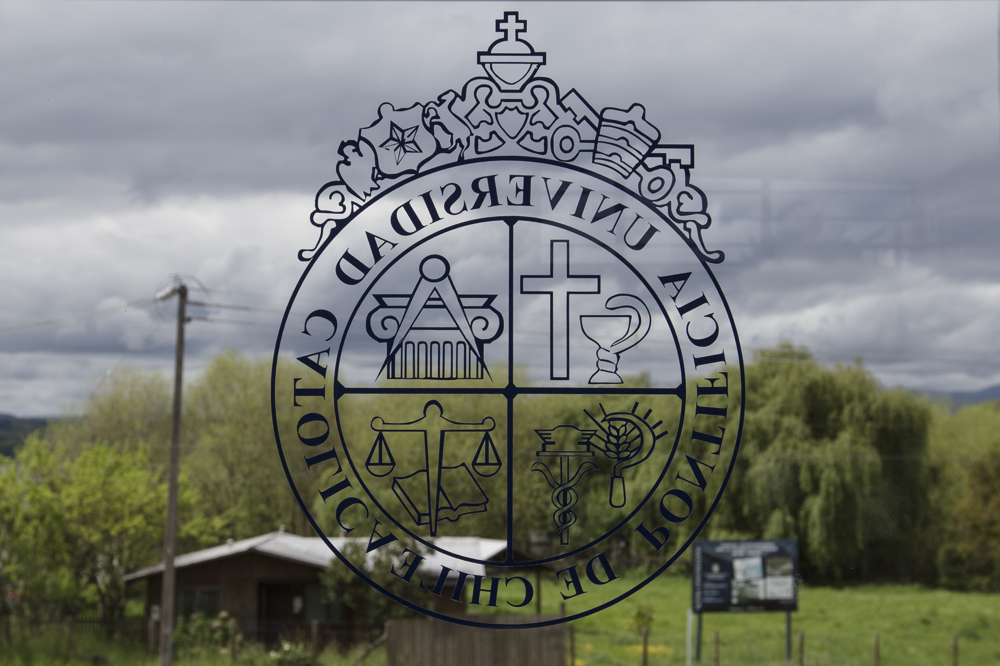
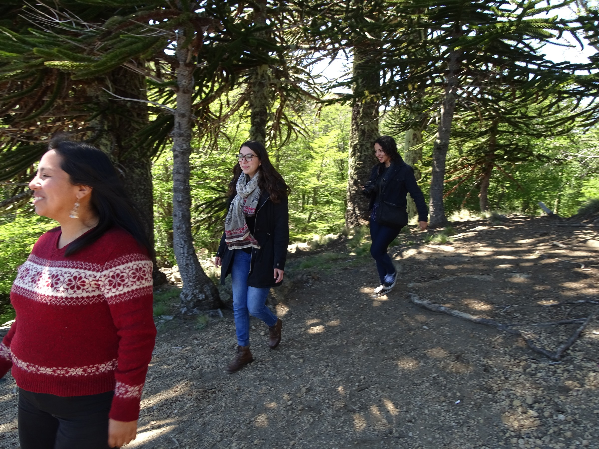

# Campus Villarrica

### Contáctanos

Bernardo O'Higgins 501, Villarrica

\(45\) 2411830

Cómo llegar:

Desde los terminales de buses: Caminar por calle Anfión Muñoz, hacia el lago y llegar hasta Bernardo O'Higgins. Girar a la izquierda  y caminar hasta el número 501.

### Estudia en Villarrica

### Pedagogía General Básica

Programa diseñado para capacitar a profesores en los proceso de aprendizaje de los cursos de primer y segundo ciclo de enseñanza. Dentro de su formación son claves la interculturalidad, el trabajo interdisciplinario y la investigación educativa. La carrera conduce a optar por cuatro menciones: Matemáticas, Lenguaje, Ciencias Naturales y Ciencias Sociales.

### Pedagogía en Educación Parvularia

Programa orientado a formar profesionales capaces de entregar una educación de calidad a niños y niñas en sus primeros 6 años de vida. Los estudiantes se integran a una comunidad diversa, en un ambiente universitario rodeado de un entorno natural de singular belleza.

### Vida de campus

#### Está pasando

Evento 1

Evento 2

Evento 3

#### El campus en imágenes

### Historia del Campus

La Sede Villarrica es el único campus regional de la UC. 

Fue fundado en el año 1936 como Escuela Normal en San José de la Mariquina para formar profesores en la zona. Sin embargo, sus títulos no eran reconocidos por el Ministerio de Educación. 

En 1953 se le pidió a la Universidad Católica entregar su patrocinio a dicha escuela y pasó a depender de la Facultad de Filosofía y Ciencias de la Educación. En 1959, tras un incendio ocurrido mientras la escuela funcionaba en Loncoche, se optó por Villarrica como localización. Reinició sus actividades en 1963 y 5 años después se transformó en la primera sede regional de la universidad.

Desde entonces  ha desarrollado diferentes líneas de investigación y ha logrado una importante vinculación con el medio a través de proyectos orientados a la diversidad cultural y al respeto del medio ambiente.

En 2000 se construyó un nuevo recinto para albergar las actividades universitarias. Las instalaciones se ubican en las cercanías del borde costero del lago Villarrica genrando una apertura hacia la naturaleza y el paisaje urbano. 

El año 2002 se incorporó al campus el museo Leandro Penchulef donde pueden estudiarse piezas arqueológicas y etnográficas de la historia local.

