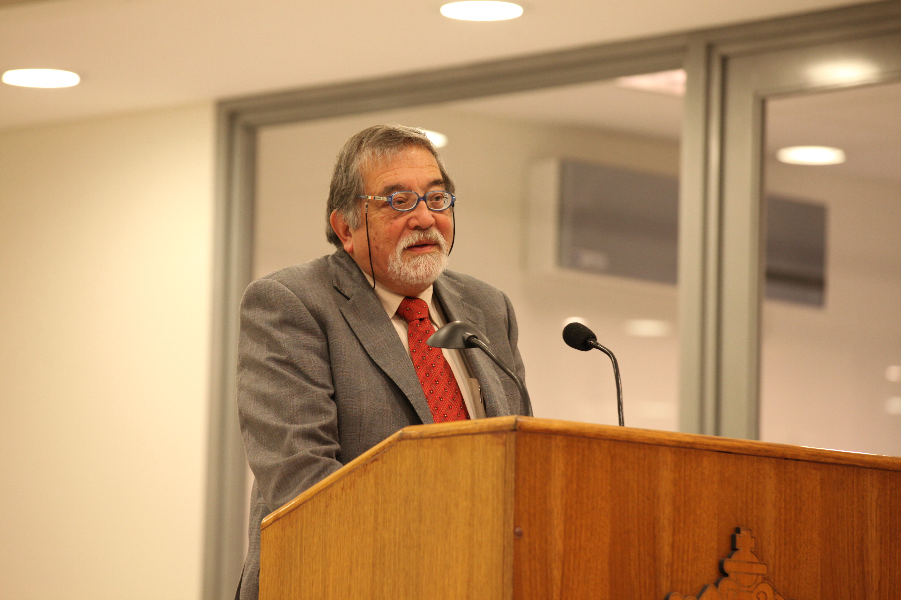

# Abraham Santibáñez Martínez

Nació en Santiago en 1938.

Estudió periodismo en la Universidad de Chile.

**Su trabajo en medios de comunicación**

Sus primeros pasos en el periodismo los dio a partir de 1959, en el semanario La Voz, del **Arzobispado de Santiago**, donde estuvo hasta 1965.

Ha formado parte del equipo editorial en algunas de las más prestigiosas revistas chilenas. Primero en la popular revista **VEA**. En 1968 formó parte el equipo que reformuló la revista **Ercilla**, donde llegó a ser editor de la sección internacional y subdirector. En 1977, junto a Emilio Filippi y la mayor parte del equipo de Ercilla, creó la revista **Hoy**, donde fue subdirector y director. Mismos cargos tuvo años después en el diario **La Nación**.

También pasó la redacción de importante periódicos. Fue subdirector y director de La Nación y columnista de **El Sur de Concepción**, La Prensa de Curicó, El Diario de Aysén y La **Prensa Austral de Punta Arenas**. Es colaborador permanente en diversos medios sobre temas periodísticos y relacionados con la aplicación de las nuevas tecnologías.

#### Docencia

Profesor universitario, **especializado en periodismo interpretativo y de opinión**.

Hizo clases de periodismo interpretativo en la Facultad de Comunicaciones de la **Universidad Católica**. También ha dictado esa cátedra en la **Universidad de Chile, Universidad de Santiago** y **Universidad de Concepción.**

E**ntre 1988 y 2009** impartió las cátedras de Introducción al Periodismo, Ética Periodística, Periodismo Interpretativo y Opinión en la Escuela de Periodismo de la Facultad de Comunicación y Letras de la **Universidad Diego Portales**.

#### Premios y membresías

En el año 2001, fue distinguido con el **premio Embotelladora Andina** - Coca Cola, por su actividad periodística.

Fue elegido **presidente del Colegio de Periodistas**, el 25 de Julio de 2008.

Desde 2009 es miembro de número de la **Academia Chilena de la Lengua** y miembro del **Consejo acreditador de la Sociedad Interamericana de Prensa \(CLAEP\)** con sede en Buenos Aires.

Hasta 2008 fue miembro del **Consejo de Ética de los Medios de Comunicación de Chile** y del **Tribunal Nacional de Ética y Disciplina del Colegio de Periodistas**.

Entre 2008 y 2010 fue **presidente del Colegio de Periodistas**.

Ha participado en evaluación de proyectos de **Fondecyt** y de proyectos de investigación de las Universidades de Concepción, de Santiago y Santo Tomás. **He integrado comisiones para la designación de directores** de las Escuelas de Periodismo de la Usach y de La Serena. Integrante del Comité de búsqueda del Rector de la Universidad Silva Henríquez \(2009\).

#### Premio Nacional

**En 2015 recibió el Premio Nacional de Periodismo** por su destacada trayectoria profesional, que incluye importantes aportes a la docencia universitaria y a la calidad del periodismo en Chile y su inclaudicable defensa de la libertad de expresión, de la responsabilidad profesional y de la ética periodística.

#### Fuentes

[Universidad de Chile](http://www.uchile.cl/portal/presentacion/historia/grandes-figuras/premios-nacionales/periodismo/114729/abraham-santibanez-martinez)

[Pensamiento, palabra, obra y opinión](http://www.abe.cl/datos.html)

[Universidad Católica](https://www.uc.cl/es/la-universidad/premios-nacionales/31446-abraham-santibanez-martinez)

