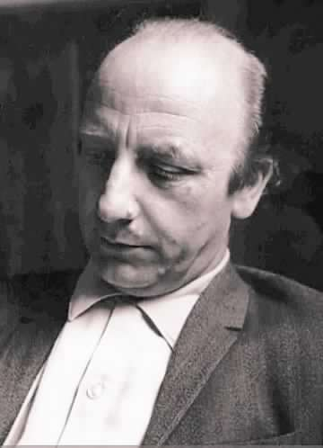

# Alfonso Calderón Squadritto

Nació el 21 de noviembre de 1930 en San Fernando. 

#### Sus inicios

Aprendió a leer a los tres años. Su abuela fue fundamental en su [acercamiento a las letras](http://www.patrimoniocultural.gob.cl/614/w3-article-5882.html?_noredirect=1). A los 10 años ya era lector de _Crimen y castigo_, de Dostoievski. Fue un precoz lector de revistas como _El Peneca_ y de historietas como _Tarzán_, _Dick Tracy_ y _Mandrake_.

A los nueve años empezó a escribir los que luego fueron sus célebres diarios de vida..

#### Trayectoria

Recibió su título en **Pedagogía en Castellano en la Universidad de Chile**, en 1952. Al año siguiente empezó a hacer clases en el Liceo de Hombres de La Serena.

Inició su trayectoria académica a los 33 años, como **profesor de literatura chilena e hispanoamericana e investigador en el Instituto de Literatura Chilena de la Universidad de Chile.**

Posteriormente hizo clases de redacción en la ****[**Escuela de Periodismo de la Universidad de Chile**](http://www.uchile.cl/portal/presentacion/historia/grandes-figuras/premios-nacionales/literatura/6540/alfonso-calderon-squadritto). Fue también director de la **Escuela de Periodismo de la Universidad Católica de Chile** y profesor de **expresión escrita en la Universidad Andrés Bello.**

En 1990 asumió como **director la revista** _**Mapocho**_, de la Dirección de Bibliotecas, Archivos y Museos.

Fue comentarista en diarios _El Serenense_, _El día_ de La Serena. El año 1965 publicó comentarios de libros en la revista _Ercilla_. En 1971 se integró al proyecto de la _Editora Nacional Quimantú_.

Activo miembro del **ambiente cultural y literario del país**, en 1969 participó del **Encuentro de Escritores Latinoamericanos**.

Es considerado uno de los **referentes de la Generación Literaria de 1950**.

En esta entrevista, [su hija, Lila Calderón,](http://mediorural.cl/alfonso-calderon-las-carnes-del-pasado/) entrega antecedentes desconocidos del autor.

#### Publicaciones

Permanente [explorador de los formatos](http://www.memoriachilena.gob.cl/602/w3-article-3283.html), incursionó en géneros como **poesía, memoria, novela, ensayo, y diario de vida.**

En el ámbito de su obra poética destacan _**El país jubiloso**_ \(1958\), _Isla de los bienaventurados_ \(1973\), _Poemas para clavecín_ \(1978\) -con el que obtuvo el Premio Municipal de Santiago en 1979- y _**Música de cámara**_ \(1981\), _Una bujía a pleno sol_ \(1998\). Tiene a su haber también múltiples antologías: _Antología de la fábula_ \(1964\), _Antología de leyendas y tradiciones_ \(1965\), _**Antología de la poesía chilena contemporánea**_ ****\(1971\), _Antología poética de Gabriela Mistral_ \(1974\), entre otras- se sumó un interesante trabajo memorialista -_**Memorial de Valparaíso**_ \(1968\), _Memorial del viejo Santiago, imágenes costumbristas_ \(1984\), _Cuando Chile cumplió 100 años_ \(1973\) y _Una invisible comparsa_ \(1988\). En 1995 publicó _**La Valija de Rimbaud**_, que es el primer tomo de una serie de volúmenes correspondientes a sus diarios de vida. En 1970, publicó su novela _Toca esa rumba don Azpiazu_, que refleja la sensibilidad de su generación.

En [este enlace](http://www.letras.mysite.com/archivoalfonsocalderon.htm) es posible revisar la transcripción de algunas de sus obras.

#### Premios

Recibió importantes distinciones, tales como el **Premio de Poesía Gabriela Mistral**, de la Municipalidad de Santiago en 1962, el Premio Alejandro Silva de la Fuente, de la Academia Chilena de la Lengua, en 1980, y en 1997, el **Premio Municipal de Poesía**, por _Testigos de nada_. En 1998, obtuvo el **Premio Nacional de Literatura**, el cual le fue otorgado por la lucidez, profundidad y variedad de sus escritos como ensayista, crítico y poeta.

