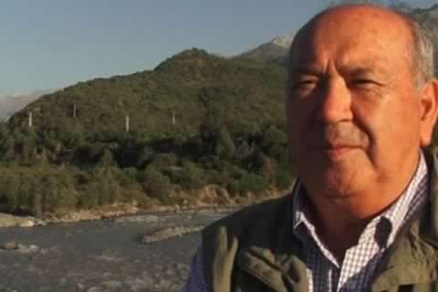

# Alipio Vera Guerrero

Nació en Puerto Montt el 25 de agosto de 1945.

#### Inicios

Al salir del colegio se trasladó a Santiago para estudiar **periodismo en la** [**Universidad de Chile**](http://www.uchile.cl/portal/presentacion/historia/grandes-figuras/premios-nacionales/periodismo/94747/alipio-vera-guerrero). Egresó a fines de los 60.

**Carrera**

Entró a la televisión en 1969, específicamente a **TVN, donde trabajó hasta fines de 1995.** Fue uno de los **periodistas fundadores de Informe Especial**, programa insigne de ese canal. Fue también **corresponsal de guerra** en países como Nicaragua, El Salvador, Ruanda y Rusia, entre otros.

Revisa aquí [uno de sus reportajes](https://www.youtube.com/watch?v=TfRpL6AVnB4) sobre la sordera emitido por Informe Especial en 1988.

Tras TVN partió a **Canal 13, donde trabajó cerca de 20 años**. Actualmente forma parte del [**Área de Prensa**](https://www.ahoranoticias.cl/noticias/nacional/alipio-vera-fue-reconocido-con-el-premio-nacional-de-periodismo-2013.html) **de Mega**.

En paralelo a su carrera televisiva desarrolló también el periodismo escrito. **Fue director del Diario Austral de Temuco** entre 1981 y 1983, y en 1994 **participó del libro** _**Vendedores de sol**_**,** junto con el también periodista y egresado de la Universidad de Chile, Alejandro Cabrera.

Fue **Consejero Nacional del Colegio de Periodistas**, entre los años 2004 y 2006.

#### Premios

En el año 1987 recibió el **premio Rubén Darío otorgado en Chile por los desplazados** nicaragüenses, salvadoreños y centroamericanos por su contribución a la paz en Centroamérica.

En 1989 ganó el **Premio Nacional de Periodismo Científico Hernán Olguín Maybeé**.

En 2008 recibió el **premio de Periodismo Carmen Puelma** que otorga la Asociación Chilena de Seguridad.

Junto a esto, y por su labor de divulgación de la ciencia, tecnología e innovación, en 2009 y 2011 fue elegido para recibir el **premio Clark Modet**, que se otorga en varios países de América y España por la divulgación de la ciencia, tecnología e innovación.

En 2017 fue distinguido con la **Medalla Universidad San Sebastián** por su aporte a la sociedad a través del ejercicio de su profesión.

Recibió el **Premio Nacional de Periodismo en 2015** por su dedicación y aporte al periodismo, por darle a su trabajo un sentido profundamente humano y por su aporte a la formación de nuevas generaciones de periodistas.

