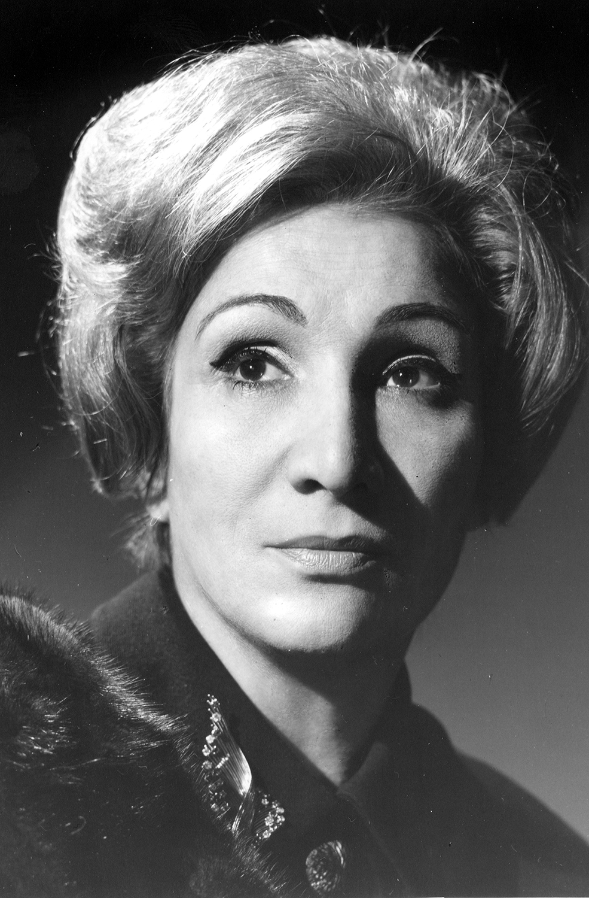

# Ana González Olea

Ana María Luisa Delicias Villela Francisca de Asís González Olea, nació el 4 de mayo de 1915. Más conocida como Ana González, es, a juicio de muchos, **la actriz chilena más famosa de todos los tiempos**.

#### Su familia

Fue hija de una **modesta costurera** que la crió con severidad y de un **acaudalado hombre de clase alta** que le dio su apellido a pesar de no estar casado con su madre.

#### Inicios en el teatro

Su primer acercamiento a la actuación la tuvo sin buscarla, a los 19 años, cuando fue **invitada a participar en una compañía de teatro obrero.** _En casa de herrero cuchillo de palo_, fue el primer montaje en el que participó. A partir de ese momento no se bajo más de los escenarios. Y a pesar de **no contar nunca con estudios formales de teatro**, construyó una sólida carrera que incluyó múltiples roles en radio, teatro, cine y televisión.

#### El reconocimiento

Curiosamente, a pesar de su enorme cantidad de papeles en pantalla, **se le conoció hasta el día de su muerte por La Desideria**, un personaje que se inició en la radio a mediados de los años 50. La Desideria fue un **personaje completamente creado por ella**: una empleada doméstica humilde y excéntrica, de lenguaje florido, que luchaba con simpatía, pero también muy enérgica, por sus derechos laborales y la de los trabajadores en general. Fue ese el personaje que la instaló para siempre en la **memoria colectiva nacional**. Uno de los tantos que interpretó en su carrera.

#### Carrera profesional

Su gran versatilidad la hizo triunfar en **todos los géneros y formatos** en los que incursionó. En el **teatro destacó** en obras como Contigo en la soledad, Pigmalión, Los zorros no duermen, La loca de Chaillot, María Stuardo y por cierto el musical La pérgola de las flores. **En el cine tuvo roles importantes** en películas como Entre gallos y medianoche, La dama de las camelias y Julio comienza en julio, solo por nombrar algunas. **Compartió escena con destacados actores y actrices chilenos**, como Silvia Piñeiro, Delfina Guzmán, Héctor Noguera, Jaime Celedón y Nelly Meruane. Un perfil más detallado de su trabajo en cine y televisión, se puede apreciar en [el perfil que tiene en el portal de cine IMDB](https://www.imdb.com/name/nm0328039/).

#### Su vida personal y afilicación política

Gran parte de su vida, estuvo casada con el publicista José Pepe Estefanía, con quien no tuvo hijos y de quien enviudó. **Activa militante comunista**, llegó incluso a arriesgar su vida al ocultar compañeros en su propia casa, durante la época más álgida de la dictadura de Pinochet. **Se alejó del Partido Comunista algunos años antes de su muerte**, debido a su profundo catolicismo.

#### Sobre el Premio Nacional de Teatro

En 1969 se convirtió en la **primera mujer ligada a la Universidad,** en ser galardonada con el Premio Nacional de Arte. En su discurso de aceptación declaró: «**La Desideria es auténticamente una mujer chilena**, con su típica reacción, con su fuerza de matriarcado y su capacidad inmensa y de cariño. Este modesto personaje que yo creé me trajo el sostén espiritual en mi vida. **Me ha hecho ser amiga querida, madre e hija de todo Chile**». Poco después, aprovechando el impulso del premio, fundó la Sala El Ángel y la Compañía de Teatro del mismo nombre.

#### Su partida

Murió el 21 de **febrero de 2008, a los 92 años**. La causa de su muerte fue una descompensación generalizada, pero el **Alzheimer la había alejado hacía ya mucho tiempo de toda actividad social y cultural**. Hasta el día de su muerte estuvo junto a ella Luz María Sotomayor, su inseparable compañera en la última etapa de su vida.

#### Su relación con la Universidad Católica

Gran parte de su trayectoria teatral la hizo en el **Teatro de Ensayo de la Universidad Católica**. Desde el 2016 y como una forma de conmemorar los 100 años de su nacimiento, **el Teatro UC bautizó con su nombre a su sala principal**.

#### Fuentes:

#### [Portal UC](https://www.uc.cl/es/la-universidad/noticias/30547-ana-gonzalez-actriz-multifacetica-y-diva-popular)

[Sitio Memoria Chilena](http://www.memoriachilena.gob.cl/602/w3-article-91986.html)

[Facebook \(No oficial\)](https://www.facebook.com/ladesideriaanagonzalez/)

[Revista Caras](http://www.caras.cl/tag/ana-gonzalez/) 

[Revista Mujer ](http://www.revistamujer.cl/2011/09/11/01/contenido/20_2719_9.shtml/)

