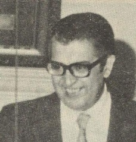

# Andrés Aburto Sotomayor

Estudió periodismo en la Universidad Católica de Chile.

Comenzó su carrera como **reportero de la United Press**, al mismo tiempo que estudiaba **Historia y Geografía** en el Instituto Pedagógico.

Fue sin duda el complemento entre estos conocimientos lo que le dio las herramientas para desarrollar un **periodismo de calidad, ligado al turismo.**

Fue fundador y por mucho tiempo presidente de la **Asociación de Periodistas de Turismo** en Chile. Entre 1976 y 1979 fue director de El Mercurio de Valparaíso. Se le concedió el **Premio Nacional de Periodismo, categoría crónica en 1977**.

#### Fuentes

[Universidad Católica](https://www.uc.cl/es/la-universidad/premios-nacionales/7441-andres-aburto-sotomayor)

[Universidad de Chile](http://www.uchile.cl/portal/presentacion/historia/grandes-figuras/premios-nacionales/periodismo/6660/andres-aburto-sotomayor)

