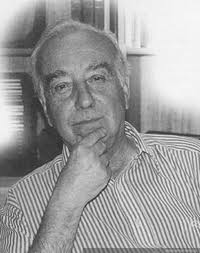

# Armando de Ramón Folch

Nació el 6 de febrero de 1927

Cursó su enseñanza primaria y secundaria en el Instituto Alonso de Ercilla.

Siendo muy joven, formó una biblioteca en la casa familiar, de la que enseñaba orgulloso sus títulos de Salgari y otros clásicos de la literatura juvenil.

Por esa misma época ya empezaba a tener sus primeros acercamientos a la literatura, con páginas pulcramente mecanografiadas con versos que publicaría más adelante.

**Estudios**

Estudió en la **Facultad de Derecho de la Universidad** de donde se licenció en Ciencias Jurídicas y Sociales en 1953.

Aunque alcanzó a ejercer el derecho, la práctica de la profesión no llenó sus aspiraciones intelectuales, por lo que decidió seguir su vocación y combinar el derecho con la investigación histórica.

Cursó estudios de postgrado en **Derecho en la Universidad de Madrid entre** 1955 y 1956 y en **Sociología en la Facultad Latinoamericana de Ciencias Sociales \(FLACSO\)** en 1963.

**Docencia**

A partir de 1956 ejerció la docencia en la **Facultad de Derecho de la Universidad Católica de Chile** y luego en la **Facultad de Filosofía y Educación** de esta misma universidad.

Desde 1980 y hasta su muerte se desempeñó como profesor titular del Instituto de Historia de la Pontificia Universidad Católica de Chile.

#### Temas de investigación

Creó su propia metodología de trabajo e investigación al cruzar la mirada descriptiva de la historiografía, con corrientes de las ciencias sociales hasta ese entonces subexplotadas por investigadores locales. Con esto, a fines de los 50 **sentó las bases de nuevas áreas temáticas como la historia urbana, el género biográfico y la historia económica**, reconfigurando la interpretación del derecho positivo, acercándolo a la historia social. Se constituyó como pionero en el desarrollo de estos temas.

#### Publicaciones

Tiene a su haber una vasta producción historiográfica. Entre sus publicaciones, está _**Descubrimiento de Chile y compañeros de Almagro**_ **\(1953\), uno de los más acabados estudios sobre lo urbano y lo económico.** Un obra que publicó a los 26 años.

Sus trabajos sobre la ciudad de Santiago fueron compendiadas en dos obras significativas: _**Historia urbana: una metodología aplicada**_ **\(1978\) e** _**Introducción al estudio de la paleografía chilena**_ **\(1981\),** ambas obras consideradas manuales de consulta indispensables para quienes se inician en la disciplina histórica, en los ámbitos urbano y colonial.

Más recientemente, en los cinco volúmenes de _**Biografías de Chilenos: miembros Poderes Ejecutivo Legislativo**_, De Ramón abordó referencias familiares, formación académica y aspectos ligados a la carrera política de gran parte de los miembros de los poderes de Estado, entre 1876 y 1973.

Cabe resaltar también su aporte en ****_**Historia de América**_ **\(con Ricardo Couyoumdjian y Samuel Vial\) y su** _**Historia de Chile: desde la invasión incaica hasta nuestros días \(1500-2000**\)_, estudios generales donde optó por sintetizar con claridad la historicidad de los grupos de poder.

#### Premios

Fue miembro de la **Academia Chilena de la Historia y de la Real Academia Española de la Historia**.

En 1994 recibió el **premio Archibald C. Gerlach, del Instituto Panamericano de Historia y Geografía**.

En 1998, obtuvo el **Premio Nacional de Historia por su importante contribución al estudio de la historia urbana y social**, así como también de la historia económica y biográfica, especialmente la republicana del siglo XX.

Murió el 29 de febrero de 2004.

#### Fuentes 

[Obituario El Mercurio](http://www.memoriachilena.gob.cl/602/w3-article-81537.html)

[Memoria Chilena](http://www.memoriachilena.gob.cl/602/w3-article-3303.html)

[Universidad Católica](https://www.uc.cl/es/la-universidad/premios-nacionales/7411-jose-armando-de-ramon-folch-1927--2004)

[Universidad de Chile](http://www.uchile.cl/portal/presentacion/historia/grandes-figuras/premios-nacionales/historia/6541/jose-armando-de-ramon-folch)

