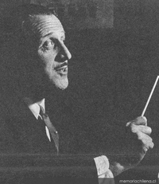

# Arturo Aldunate Phillips

Ingeniero, estudioso de la ciencia, ensayista, poeta, profesor, deportista, conocedor de varios idiomas, buscador incansable de conocimiento. **Ciencias, matemáticas y literatura** fueron específicamente los campos en los que se movió con especial lucidez y abundancia.

#### Estudios y primeros poemas

Nació el 9 de febrero de 1902 en Santiago. Estudió en el Instituto Nacional, donde tuvo su primer acercamiento a los clásicos de la literatura española, lo que derivó naturalmente en la búsqueda de su propia voz literaria. A **pesar de su amor por las letras, optó por estudiar Ingeniería Civil**, en la Universidad de Chile. Pero no dejó de escribir y en 1921 publicó su **primera colección de poemas:** _**Era una sirena**_. En paralelo cimentaba una consistente carrera como ingeniero. Muy pronto empezó a trabajar como asesor en diversas compañías de la incipiente industria chilena. También comenzó a publicar libros que abordaban temáticas económicas como utilidades y diversos enfoques sobre la crisis económica de la época.

**Su papel en la empresa privada**

Se tituló de **Ingeniero Civil en 1923**. Posteriormente y durante un largo período ejerció su profesión y fue **profesor de electricidad en la Universidad Católica de Chile**.

Durante 12 años fue presidente de la **Compañía Chilena de Electricidad**. También fue presidente de **Phillips Chilena** y vicepresidente de la **Sociedad de Fomento Fabril**.

**Carrera literaria**

En su trayectoria literaria, un hito importante fue una **conferencia que dictó sobre Pablo Neruda en 1936**, mucho antes de la existencia de cualquier estudio sobre el poeta chileno. La conferencia fue publicada más tarde en formato de ensayo por la editorial Nascimento. Recordada fue también la conferencia que dictó en 1937, en la Universidad de Chile, sobre Federico García Lorca. Pero sin duda **el hito más reconocido de su trayectoria en término de publicaciones sea** _**Matemática y poesía: ensayo y entusiasmo**_. En este volumen, propone una postura de vanguardia, relacionando dos áreas en teoría contrapuestas. En los años siguientes publicó libros sobre materia política y económica: _Estados Unidos: gran aventura del hombre_ \(1943\) y _Un pueblo en busca de su destino: Chile, país industrial_ \(1947\).

**A partir de los años 50 enfocó su escritura en temáticas científico humanistas**. En 1953 publicó _Al encuentro del hombre_ y en 1958 _Quinta Dimensión_, ensayos filosóficos en los que indagó en el destino del hombre. En 1964, publicó _Los robots no tienen a Dios en el corazón_, libro por el que obtuvo el Premio Atenea de la Universidad de Concepción.

En 1981, publicó su último libro de humanismo científico: _Luz, sombra de Dios: por la ciencia hacia el creador del universo_.

**Premios y membrecías**

Fue miembro de la Academia Chilena de la Lengua, recibió el Premio Ricardo Latchaman en 1975 y un año después, el **Premio Nacional de Literatura en 1976**. Fue designado miembro de la Asociación de Escritores Científicos.

Falleció el 24 de junio de 1985.

#### 

#### Fuentes 

[Universidad Católica](https://www.uc.cl/es/la-universidad/premios-nacionales/7339-arturo-aldunate-phillips-1902-1985-) 

[Memoria Chilena](http://www.memoriachilena.gob.cl/602/w3-article-558.html)

[EcuRed](https://www.ecured.cu/Arturo_Aldunate_Phillips)

