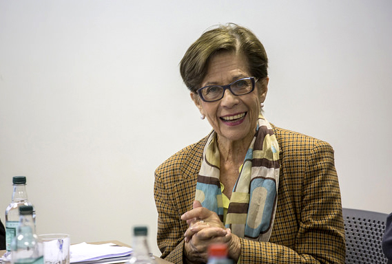

# Beatrice Ávalos Davidson

Nacida en Santiago el 23 de febrero de 1935.

#### Inicios

Se graduó el año 1957 de la carrera de **Pedagogía en Historia y Geografía en la Universidad Católica.**

Una **beca Fulbright** le permitió realizar estudios de doctorado en **St. Louis University, Estados Unidos**. Allí recibió el grado de Ph. D con concentración mayor en Educación y menor en Historia y Filosofía, en 1961.

#### Trayectoria

A su regreso a Chile, comenzó su carrera como profesora de aula de Historia y Geografía en el Colegio Mariano \(1962-1968\) y **fue profesora de Pedagogía General y de Filosofía de la Educación en la Escuela de Pedagogía de la Universidad Católica de Chile.** Posteriormente fue **subdirectora de la Escuela hasta 1974**.

Fue **miembro representante de los académicos** en el Consejo Superior de la Universidad Católica de Chile entre 1968 y 1971, además de coordinadora de las sedes de provincia de la universidad.

A partir de 1974 y hasta 1988, fue **docente del University College Cardiff, Universidad de Gales**. Entre 1988 y 1994, profesora de la **Universidad de Papua New Guinea**, y al año siguiente profesional del Ministerio de Educación de Chile hasta el 2010.

En 2008 se incorporó como **académica al Centro de Investigación Avanzado en**[ **Educación de la Universidad de Chile**.](http://www.uchile.cl/portal/presentacion/historia/grandes-figuras/premios-nacionales/educacion/95814/beatrice-avalos-davidson)

Fue además, académica invitada y colaboradora de numerosas universidades en Chile y el extranjero \(**Universidad de Toronto, New Brunswick, Católica de Valparaíso**\). Fue también miembro del Consejo Editorial de prestigiosas revistas académicas \(entre ellas _Teaching and TeacherEducation_, e _International Journal of EducationalDevelopment_\). También fue consultora de varios organismos internacionales \(como **UNESCO, International Development Research Centre de Canadá, la Unión Europea, el Banco Mundial**\).

En [esta entrevista](https://ciperchile.cl/2013/10/03/la-devastadora-noticia-que-opaco-la-celebracion-de-la-premio-nacional-de-educacion-2013/) ella misma ahonda en su trayectoria y en la dolorosa experiencia de su hermano detenido durante la dictadura.

#### Premios

Son cuantiosas las [contribuciones](http://ww2.educarchile.cl/UserFiles/P0001/File/entrevista_educativa/avalos_bio.pdf) que ha hecho en su área. Entre ellas la **creación del Programa Interdisciplinario de Investigaciones en Educación \(PIIE\)**; su aporte a las políticas de profesionalización docente durante la década de 1990, desde los **Programas MECE-Media y Fortalecimiento de la Formación Inicial Docente**; y la **Dirección del Núcleo Milenio sobre La Profesión Docente en Chile**, en el centro de estudios CIAE de la Universidad de Chile.

Recibió el **Premio Nacional de Educación el 2013**.

