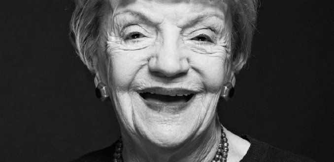

# Bélgica Castro Sierra

#### Sus inicios y su nombre

Nació el 6 de marzo de 1921 en Concepción y fue criada en Temuco.

Antes de ser Bélgica Castro, se cuestionó muchas veces por qué sus papás —inmigrantes españoles que se declaraban anarquistas y apolíticos— la llamaron así. “El día en que le pregunté a mi padre, un obrero medio bruto que se ganaba la vida levantando casas, por qué me había llamado así, dijo que era porque **Bélgica había sido el país más valiente de la Primera Guerra Mundial**. Valiente. Creo que cargué toda mi vida con eso”, [reveló la actriz a La Tercera](https://www.latercera.com/noticia/belgica-castro-75-anos-de-teatro/).

#### Sus estudios

Así fue. Fue valiente para partir de Concepción a Santiago con la idea de estudiar. Fue valiente para dejar la pedagogía, que nunca ejerció, y dedicarse de lleno en la actuación. Fue valiente para fundar en 1941 el _Teatro experimental_ junto a Eloísa Alarcón y Pedro de la Barra, entre otros actores, y desde entonces, nunca alejarse del escenario. Fue valiente para partir a Londres en 1949, como estrella de los radioteatros de la BBC. Y fue valiente en 2016 cuando **a los 95 años, recorrió teatros de Santiago y de regiones con la comedia negra musical** _**Pobre Inés sentada ahí**_, donde interpretó a una madre anciana y cínica que debe enfrentar la desmedida ambición de sus hijas.

#### Amor en las tablas

**El papel fue escrito a la medida de su talento por su marido, el actor y dramaturgo Alejandro Sieveking.** Desde que se conocieron en 1956, a los dos también les tocó ser valientes. A sus 34 años, ella era una actriz consagrada, casada y con un hijo. Él, un alumno de primero hechizado por la profesora de Historia del Teatro que sería su musa.

“Yo tenía 21 años y estudiaba Arquitectura en la Universidad de Chile el día en que mi vida cambió. La vi sobre el escenario, como la Sonia en _Tío Vania_ de Chéjov y me deslumbró. Ella tenía una luz cuando actuaba. Una luz de esas que se irradian. Es una persona capaz de hacer algo irreemplazable en el escenario porque tiene el interior para hacerlo. **Han pasado 61 años y no olvido ese deslumbre**. Renuncié a Arquitectura y me inscribí en Teatro”, dijo Sieveking en [una entrevista de 2017](http://www.economiaynegocios.cl/noticias/noticias.asp?id=383838). Se casaron en 1961.

Desde el flechazo, la carrera del uno no se entiende sin la del otro. Bélgica ha sido la inspiración de Alejandro a lo largo de más de seis décadas. _La remolienda_, _La virgen de la manito cerrada_, _La mantis religiosa_ son algunas de sus célebres colaboraciones. Pero la más significativa fue, quizás, la primera: “Parecido a la felicidad”, en 1959. Esta fue también la primera obra dirigida por su gran amigo **Víctor Jara. La muerte del artista, uno de los dolores más grandes de la actriz,** fue determinante para que se autoexiliaran en 1974.

“Después de eso, no paramos más, y hemos hecho mucho juntos. Fundamos la compañía _Teatro del Ángel_ e incluso nos fuimos a Costa Rica por muchos años. Ya ni me acuerdo de todas las obras que hemos realizado. Alejando siempre escribió personajes para mí y me ayudó a ampliar mi registro, gracias a él pude hacer roles más variados como el de _Ánimas de día claro_”,[ contó Bélgica en una entrevista de revista Cosas.](http://cosas.com/belgica-castro-el-teatro-es-nuestra-vida/)

#### Trayectoria

En 1971, con la actriz [Ana González](https://www.uc.cl/es/component/content/article/244-noticia-principal/30547-ana-gonzalez-actriz-multifacetica-y-diva-popular) y otros artistas compraron **una pequeña sala en el centro de Santiago para llevar a las tablas un teatro de calidad**, alejado de la vanguardia y las modas experimentales. Ese fue el inicio del _**Teatro del Ángel**_**,** que funcionó hasta 1984. Pero en 1974 idearon un interesante repertorio que les permitió itinerar por Ecuador, Colombia, Costa Rica, Guatemala y El Salvador durante 10 años. Entonces, Sieveking y Castro volvieron tentados por la posibilidad de escribir una serie para TVN.

Nadie puede decir exactamente en cuántas obras ha participado. Más de doscientas, asegura su esposo, el único que se anima a decir una cifra. En su extensa carrera ha interpretado textos de los más importantes dramaturgos, como Lope, Chéjov, García Lorca, Graham Greene, Arthur Miller, Brecht, Pirandello, Shaw, Ibsen, Durrenmatt, Valle-Inclán y Sófocles. 

Ha actuado en numerosas películas chilenas como _Hollywood es así_, de Jorge Délano, _El final del juego_ de Luis Cornejo; _Palomita blanca_,  _Días de campo_ y la miniserie _La recta provincia_ de Raúl Ruiz; _El desquite_ y _La buena vida_, de Andrés Wood. **Su última aparición cinematográfica fue en 2013, en la cinta** _**Gatos viejos**_**, de Sebastián Silva, que le valió el quinto premio Altazor de su carrera** y el premio a la Mejor Actriz en el XVI Festivalísimo, Festival de Cine Ibero-latinoamericano de Montreal. Así como sus montajes, es difícil enumerar sus reconocimientos.

#### Premios

**En 1995 recibió el Premio Nacional de Artes de la Representación y Audiovisuales**. En 2001, el APES otorgado por la Asociación de Periodistas de Espectáculos a su trayectoria. Bajo la dirección de Ricardo Larraín participó en _ChilePuede_ donde personificaba a un científico ruso, por el que ganó el Premio Paoa del Festival Internacional de Cine de Viña del Mar a la Mejor Actriz Protagónica Nacional y el premio APES a Mejor Actriz de Reparto. Pero son solo algunos.

Nunca dejó de enseñar. Fue profesora de Actuación en la Escuela de Teatro de la universidad, en la Universidad de Chile y en la Universidad de Costa Rica. Pero lo que hace el **vínculo con la UC aún más profundo son los muchos montajes donde con su talento llenó la salas del Teatro UC.** _Todo pasajero debe descender_, dirigida por Alejandro Goic en 2012, fue el último de ellos.

Tras esos incontables personajes, Bélgica no se cansa. Ahora tiene algunos problemas para memorizar sus textos, lo que la entristece un poco. Porque cuando le preguntaron qué le faltaba por representar, ella respondió muy rápido: “mi próxima obra”. Y **cuando cumplió 75 años de carrera dijo que seguía actuando porque “es lo único que me hace feliz”.**

**Texto tomado de la** [**nota de** Constanza Flores L.](https://www.uc.cl/es/component/content/article/244-noticia-principal/30672-belgica-castro-estrella-prolifica-y-longeva), Dirección de Comunicaciones UC

