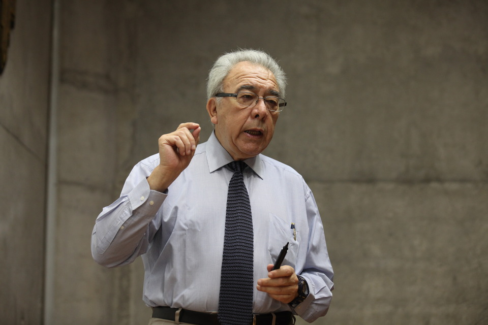

# Bernabé Santelices

Nació en el seno de una familia de campo, que no tenía tradición en la educación formal, pero en la que se promovía el contacto con la naturaleza.

#### Inicios

Desde muy pequeño **se interesó por los micromundos que lo rodeaban** y comenzó a coleccionarlos. Sin microscopios, ni lupas, **se las arregló con anteojos viejos y en desuso** de sus abuelos para aumentar las imágenes de pequeños organismos. Esta y otras anécdotas familiares puedes revisarlas en este [reportaje audiovisual](https://infantil.cntv.cl/videos/bernabe-santelices).

En paralelo era un devoto alumno en un colegio de curas. Al punto de que durante mucho tiempo **pensó en entrar al sacerdocio**. Pero a medida que crecía su curiosidad por la naturaleza, se fue alejando de la religión.

#### Trayectoria 

Quiso entrar a medicina, pero no le alcanzó el puntaje del bachillerato. Optó entonces por la **Escuela de Educación de la Universidad Católica**, donde decidido a estudiar biología y transmitir a sus alumnos su pasión por el mundo microscópico.

En ese proceso [descubrió las algas](https://mim.cl/index.php/pnc-49). Y se fascinó con estos organismos que a diferencia de las plantas terrestres, no tienen raíces.

Es **Profesor de Estado en Ciencias Naturales y Biología de la Pontificia Universidad Católica**. Su tesis de grado versó sobre la identificación de especies de algas del norte de Chile. Un trabajo que hasta ese momento no se había desarrollado con la acuciosidad que se requería para obtener resultados. 

Al terminar sus estudios de grado, viajó a hacer un **doctorado en Ciencias Botánicas de la Universidad de Hawai**, EE.UU.

A su regreso a Chile en 1975, profundizó su investigaciones y descubrimientos en torno a la taxonomía, cultivo y manejo de las algas marinas.

Gracias a sus estudios en torno a las algas se cuantificaron las especies que hay en Chile y se descubrieron nuevos usos que se le pueden dar a estos organismos.

En la década de 1990 comienza a escribir **artículos de divulgación sobre la** [**investigación científica**](http://www.comunicacionesua.cl/2013/06/25/premio-nacional-de-ciencias-dicto-charla-en-la-ua/) y su relación con el desarrollo y mejoramiento de las políticas nacionales.

Su **intenso trabajo de investigación** se ha visto traducido en la publicación de 155 artículos publicados en prestigiosas revistas ligadas a su área. Además ha publicado cuatro libros, participado en 70 conferencias y 205 ponencias en eventos científicos en 30 países.

Ha ejercido como asesor de Ciencia y Tecnología del Ministerio de Economía. 

#### Premios y membresías

Dentro de los reconocimientos que ha recibido destacan el **Primer Premio Marinalg International** por el mejor trabajo científico presentado durante el respectivo International Seaweed Symposium \(Congreso Mundial de Algas\) en 1989 y 1995. Actualmente es **vicepresidente del consejo de la Comisión Nacional de Investigación Científica y Tecnológica**, Conicyt.

Es miembro de número de la **Academia Chilena de Ciencias** y miembro del **Consejo Superior de Educación.**

Fue galardonado con el **Premio Nacional de Ciencias Naturales 2012** por su aporte en el desarrollo de la ecología marina y la botánica marina en nuestro país y su condición de experto mundial en la reproducción, dispersión, reclutamiento y biografía de macroalgas.

