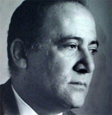

# Carlos Botto Vallarino

#### Inicios

Nació el 4 de noviembre del año 1923 en Viña del Mar.

Realizó sus estudios en el Seminario de San Rafael de Valparaíso.

En 1948 ingresó al **Conservatorio Nacional de Música de la** [**Universidad de Chile**](http://www.uchile.cl/portal/presentacion/historia/grandes-figuras/premios-nacionales/musica/6553/carlos-botto-vallarino)**.** Aprendió directamente de grandes maestros de la música chilena como Herminia Raccagni, Gustavo Becerra, Domingo Santa Cruz y Juan Orrego Salas. Se graduó con **distinción máxima en 1955 como Licenciado en interpretación superior mención piano**.

Fue becado por la **Fundación John Simon Guggenheim** entre los años 1956 y 1957 para realizar estudios de **post-grado con Luigi Dallapiccola en Nueva York**.

Revisa un perfil detallado de su vida y obra en [Música Popular](http://www.musicapopular.cl/artista/carlos-botto/).

#### Trayectoria

Entre 1961 y 1968 fue **Director del Conservatorio Nacional**. Bajo su conducción se iniciaron las actividades del **Instituto Interamericano de Educación Musical** y en su calidad de director dio su aprobación para comenzar a recibir los primeros alumnos extranjeros.

Fue redactor de programas del ex**-Instituto de Extensión Musical de la Universidad de Chile** \(1954 a 1958 y de 1972 a 1973\) y **Presidente de las Juventudes Musicales de Chile**, entre 1961 y 1974.

Ejerció la docencia en la **Universidad de Chile, en la Escuela Moderna de Música y en el Instituto Interamericano de Educación Musical de la OEA.**

En 1977 participó de una experiencia inédita en televisión. Auspiciado por la VicerrectorÍa de Asuntos Académicos y de Extensión y Comunicaciones de la Universidad de Chile, **ofreció un curso a nivel universitario sobre la época y la música de Ludwig van Beethoven transmitido en el entonces Canal 9**.

En este enlace un perfil del autor en [Memoria Chilena](http://www.memoriachilena.gob.cl/602/w3-article-97004.html).

#### Composiciones

Entre sus obras más destacadas se cuentan

_Doce canciones op. 4_ sobre textos de Lope de Vega

_Cuatro cantares quechuas op. 11_

_Poemas de amor y soledad op. 12_ sobre textos de James Joyce.

_Siete cantos al amor y a la muerte op. 8_ para tenor y cuarteto de cuerdas. 

_Variaciones para piano Op.1_

\_\_[_Diez preludios para piano Op.3_](https://www.youtube.com/watch?v=UqGkhK3p6o4)\_\_

_Cuarteto de Cuerdas Op.5_

_Cantos al amor y a la muerte para voz y cuarteto de cuerdas Op.8_

Sus obras constituyen un valioso aporte a la creación musical en nuestro país.

#### Premios

Primer Premio y Premio de Honor en los IV Festivales de Música Chilena de 1954.

**Primer Premio y Premio de Honor en los Festivales de Música Chilena de 1956**.

**Diploma de Caballero Oficial de la Orden al Mérito de la República de Italia en 1965**, galardón que se le otorga a los descendientes de italianos que destacan por su labor en el extranjero.

Diploma de Honor en **reconocimiento a su labor en pro de la cultura chilena, concedido por la Municipalidad de Valparaíso** en 1975

Diploma de Honor por su **valiosa contribución al desarrollo del arte de la música en nuestro país, otorgado por la Municipalidad de Viña del Mar en 1992**

**Premio Charles Ives otorgado por el Instituto Norteamericano de Cultura en 1993** y nombramiento el mismo año como Profesor Emérito de la Universidad de Chile.

En 1995 la **Sociedad Chilena del Derecho de Autor le confirió la calidad de Socio Emérito** de esa corporación. 

En el plano internacional, participó en el **Festival Casals de Puerto Rico y en Italia fue condecorado** como "Caballero Oficial de la Orden del Mérito".

Estos y otros reconocimientos culminaron con el otorgamiento del **Premio Nacional de Arte mención Música en 1996.**

[Murió el 27 de junio de 2004](https://www.emol.com/noticias/magazine/2004/05/31/149140/fallecio-compositor-y-academico-carlos-botto-premio-nacional-de-arte-1996.html).

