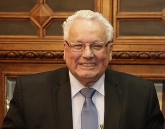

# Cristián Zegers Ariztía

#### Inicios

Nació el 14 de febrero del año 1940.

Estudió **Derecho en la Universidad Católica** donde también participó activamente, en 1961, en la **formación de la Escuela de Periodismo** de esta casa de estudios.

#### Trayectoria

Fue el **primer Director de la Escuela de Periodismo de la Universidad Católica**.

Fue **secretario de redacción de El Diario Ilustrado**; jefe de redacción y comentarista político del diario El Sur; **cofundador de las revistas Portada y Qué Pasa**; Director de la Revista del Domingo, y subdirector de El Mercurio.

Fue durante 25 años **Director del diario La Segunda**. Posteriormente estuvo 12 años \(entre 2006 y 2018\) en similar cargo pero **del Diario El Mercurio**.

Ex **Presidente de la Asociación Nacional de Prensa en dos períodos** \(1968-1998 y 1998-2000\).y de la Federación de Medios de Comunicación Social de Chile.

En 1998 se incorporó como  **miembro de número de la Academia Chilena de Ciencias Sociales, Políticas y Morales del Instituto de Chile**; y Director Secretario del Consejo Chileno para la Relaciones Internacionales \(CCRI\).

También, fue profesor en la Universidad de Chile y la Universidad Católica.

#### Publicaciones

Ha escrito numerosos libros y publicaciones, entre ellas

_Historia política del gobierno de Aníbal Pinto_, publicado por el Instituto de Historia de la Universidad Catóilca en 1967.

#### Premios

Ha sido galardonado con múltiples premios a lo largo de su carrera. Entre ellos: **Premio Academia Chilena de Historia** \(1968\), Premio Diego Portales \(1983\), Premio Editorial Los Andes \(1989\), **Premio Embotelladora Andina**.

También fue premiado con el **Premio Luca de Tena**, que entrega el Diario ABC de España y que busca reconocer la trayectoria periodística y valores como el rigor ético, la exigencia literaria e independencia informativa.

Recibió el **Premio Nacional de Periodismo en 1989**.

#### Fuentes

[Universidad Católica](https://www.uc.cl/es/la-universidad/premios-nacionales/7437-cristian-zegers-ariztia-1940-)

[Universidad de Chile](http://www.uchile.cl/portal/presentacion/historia/grandes-figuras/premios-nacionales/periodismo/6617/cristian-zegers-ariztia)

