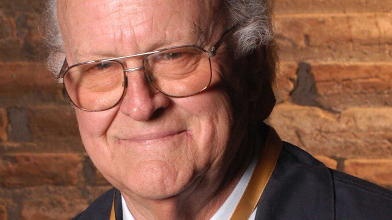

# Egon Wolff Grobler

Nació el 13 de abril de 1926 en Santiago, en el seno de una familia formada por un un estricto ingeniero alemán inmigrante y una dueña de casa chileno-alemana.

#### Inicios

Una “sombra al pulmón” a los 8 años, lo obligó a estar en cama por un largo período. Pasó esos días escribiendo poesía y volcado por completo a su afición por la lectura.

**A los 16 años escribió la novela** _**El ocaso**_. Y aunque su inclinación por la literatura era clara, **estudió Ingeniería Química en la Universidad Católica**. Nunca llegó a ejercer. Apenas terminó esa carrera, entró a estudiar teatro también en la Universidad Católica y posteriormente en la Universidad de Chile.

En 1979 se incorporó como **profesor titular de Dramaturgia en la Escuela de Teatro de la Universidad Católica**, cargo que ejerció hasta 1991.

Revisa aquí otra [reseña sobre sus inicios](http://www.memoriachilena.gob.cl/602/w3-article-100599.html) y su trayectoria.

#### Trayectoria

Fue uno de los principales dramaturgos de la llamada generación literaria de 1950. En su obra se volcó a reflexionar sobre las **condiciones éticas de la élite socioeconómica santiaguina de finales del siglo XX y principios del XXI**.

Consolidó su talento al alero de los teatros universitarios chilenos, el **Teatro Experimental de la** [Universidad de Chile](http://www.uchile.cl/noticias/128173/teatro-nacional-chileno-despide-al-dramaturgo-egon-wolff) **y el Teatro de Ensayo de la Universidad Católica.**

En 1958 estrenó su primera obra, _Mansión de lechuzas_.

Tuvo un paso por la **Universidad de Yale, Estados Unidos**, y una importante participación en los teatros universitarios santiaguinos hasta el golpe de estado. **A partir de 1973 comenzó a distanciarse del mundo teatral.**

En este clásico microprograma [_Visiones_ de Canal 13](https://www.youtube.com/watch?v=nEUHng4vngc), puedes ver una semblanza del autor.

Y aquí una [entrevista en profundidad](https://www.youtube.com/watch?v=Ypa55Uako9k) sobre su obra y su trayectoria.

#### Obras

Sus textos abordan temas **políticos, sociales y existenciales, con una mirada crítica y aguda en las diferencias generacionales y la decadencia social**. Un ejemplo de ello es _Los invasores_, montada en 1963 por un elenco de lujo: Bélgica Castro, Tennyson Ferrada y María Cánepa, entre otros, dirigidos nada menos que por Víctor Jara. La obra \(estrenada en plena Guerra Fría, la Revolución Cubana en su esplendor\) expone a una familia del barrio alto que se refugia en su lujosa casa, a la espera de los pobres, de los marginados, que llegarán a tomarse su hogar. Una **expresiva e inquietante metáfora sobre las diferencias de clase y las desigualdades sociales**.

Entre el resto de su obra se cuentan _Mansión de lechuzas_ \(1957\), _El signo de Caín_ \(1958\), _Discípulos del miedo_ \(1958\), _Parejas de trapo_ \(1959\), _Niñamadre_ \(1961\), [_Flores de papel_ ](http://www.memoriachilena.gob.cl/602/w3-article-93413.html)\(1970\), _Kindergarten_ \(1977\), _Espejismos_ \(1978\), _Álamos en la azotea_ \(1981\), _El sobre azul_ \(1983\), _La balsa de la Medusa_ \(1984\), _Háblame de Laura_ \(1985\), _Invitación a comer_ \(1993\), _Cicatrices_ \(1994\), _Claroscuro_ \(1995\), _Tras una puerta cerrada_ \(2000\) y _Encrucijada_ \(2000\), entre otros.

#### Premios y membresías

Obtuvo el Premio Nuez Martín que otorga la Facultad de Letras y la fundación del mismo nombre por su trayectoria como dramaturgo.

Egon Wolff obtuvo el **Premio Nacional de Artes de la Representación y Audiovisuales de Chile en el año 2013**. Falleció el miércoles 2 de noviembre de 2016 a la edad de 90 años.

En 1983 se convirtió en miembro de número de la **Academia Chilena de la Lengua**.

En 1959 el ganó el **concurso de dramaturgia del Teatro Experimental de la Chile** con _Parejas de trapo._ Al año siguiente la obra fue estrenada en la sala Antonio Varas.

En **2013 se le distinguió con el Premio Nacional de Artes** de la Representación y Audiovisuales de Chile.

Falleció en noviembre de 2016.

