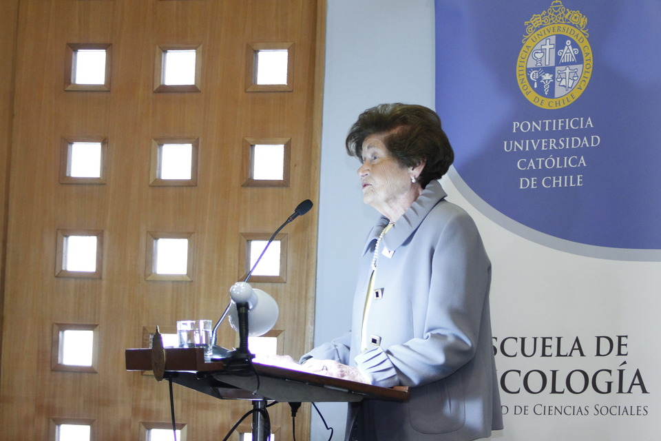

# Erika Himmel König

#### Inicios

Nació en el 27 de agosto de 1930.

Se formó como **profesora de Estado en Matemática** en el Instituto Pedagógico de la Universidad de Chile.

#### Trayectoria

Entre 1953 a 1956 ejerció como **profesora de los Colegios Santo Tomas Moro y Dunalastair**.

En 1956 se incorporó como **investigadora al Instituto de investigación estadísticas de la Universidad de Chile** \(IIE\).

En 1959 obtuvo una beca para realizar un **Magíster en Medición y Evaluación en Psicología y Educación** en la Universidad de Columbia \(Nueva York\).

Participó en la construcción de los principales sistemas de evaluación educativa de nuestro país: la **PAA, el Simce y la actual PSU.**

Fue **vicerrectora académica de la Universidad Católica** y luego decana de la Facultad de Educación. Asimismo ha asesorado a distintos gobiernos latinoamericanos y organismos internacionales en evaluación educativa.

Ha participado activamente en numerosas organizaciones nacionales vinculadas a la educación \(**Consejo Asesor presidencial, Consejo Superior de Educación, CONICYT**\). Asimismo, ha asesorado en numerosas oportunidades a distintos gobiernos latinoamericanos y organismos internacionales en la formulación de sistemas de evaluación educativa.

En este enlace [un perfil de la investigadora ](http://www.diarioelheraldo.cl/noticia/erika-himmel-konig)en Diario El Heraldo, del Maule.

Aquí un video con una [entrevista a la profesora Himmel](https://www.youtube.com/watch?v=UE2eg_RfxjI) exhibido durante la ceremonia de bienvenida de los novatos de la Facultad de Educación, el 03 de marzo de 2012. El documental recoge algunas de las ideas inspiradoras del oficio de educar

**Premios y distinciones**

Fue distinguida con el **Premio a la Trayectoria Académica Monseñor Carlos Casanueva** de la Universidad Católica de Chile.

En 2005 recibió el **Premio Innovadores Críticos de la Universidad del Pacífico**. Al año siguiente la misma universidad le entregó el **Premio Mujeres del Siglo XXI**.

En 2006, tras la llamada “Revolución Pingüina”, fue convocada a la brevedad por la presidenta Michelle Bachelet para ser parte del **Consejo Asesor Presidencial de la Educación**.

También en 2006 recibió el **Premio Santo Tomás de Aquino**, de la Universidad Santo Tomás.

El Gobierno de Chile la premió con la **Orden al Mérito Docente y Cultural Gabriela Mistral** en el Grado de Comendador, el año 2007.

En 2008 recibió la **Medalla Reconocimiento de 50 años al Servicio de la Educación**, por parte de la Universidad de Playa Ancha, Valparaíso.

La Universidad Católica de Chile la nombró **Profesor Emérito el año 2011.**

El 2011 recibió el [**Premio Nacional de Ciencias de la Educación**](https://www.conicyt.cl/mujeres-en-ciencia-y-tecnologia/mujeres-destacadas/premios-nacionales/erika-himmel-konig/) por sus significativos aportes que la galardonada ha efectuado al desarrollo de las ciencias de la educación, principalmente en el área de la evaluación educacional, contribuyendo específicamente a establecer un verdadero Sistema Nacional de Evaluación.

En este enlace una [nota en La Tercera ](https://www.latercera.com/noticia/erika-himmel-konig-recibio-el-premio-nacional-de-ciencias-de-la-educacion-2011/)con motivo del Premio Nacional.

