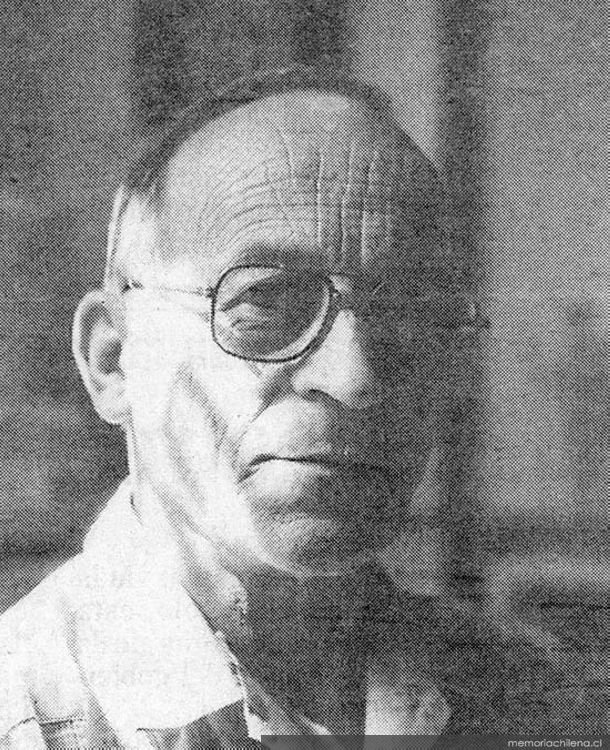

# Ernesto Livacic Gazzano

Nació el 22 de marzo de 1929. Hijo de croatas pioneros que llegaron a Punta Arenas a principios del siglo 20.

#### Estudios

Cursó sus estudios en el colegio **salesiano San José y en el Liceo de Hombres de Punta Arenas**.

Terminado el colegio, a los 17 años viajó a Santiago a estudiar **Pedagogía en Castellano en el Instituto Pedagógico de la Universidad de Chile**. Se recibió como Profesor de Estado en Castellano en 1951. Luego se tituló de **Planificador Educacional de la Unesco y obtuvo el grado de Magíster en Educación en la Universidad Católica**.

#### Trayectoria

En la década de 1950 desempeñó cargos en el **Ministerio de Educación**.

Por esa época publicó su obra más importante: _Literatura Chilena. Manual y Antología,_ publicado en  __1955.

Fue **decano de la Facultad de Filosofía y Letras de la UC,** secretario técnico de la **Superintendencia de Educación Pública** \(1965-1969\) y **subsecretario de Educación** \(1969-1970\). Además integró el **Consejo Nacional de Educación** \(1965-1973\).

En 1983 fue desginado **miembro de la Academia Chilena de la Lengua**.

Fue secretario de la **Corporación de Santiago** de 1984 a 1988 y fue primer vicedirector de esta institución entre 1995 a 1998. En sus últimos años lo tocó **presidir la Comisión de Literatura**.

En 1990 fue miembro de la junta **directiva de la Universidad Metropolitana de Ciencias de la Educación** y en 1992 fue parte del **Consejo Nacional de Televisión.**

#### Premios

En 1989 recibió la **Orden al Mérito del Consejo Mundial de Educación.**

En 1993 fue distinguido con el **Premio Nacional de Educación .**

Murió el año 2007.

#### Fuentes

[Universidad Católica](https://www.uc.cl/es/la-universidad/premios-nacionales/7359-ernesto-livacic-gazzano-1929-2007)

[Universidad de Chile](http://www.uchile.cl/portal/presentacion/historia/grandes-figuras/premios-nacionales/educacion/6580/ernesto-livacic-gazzano)

[Memoria Chilena](http://www.memoriachilena.gob.cl/602/w3-article-78633.html)

