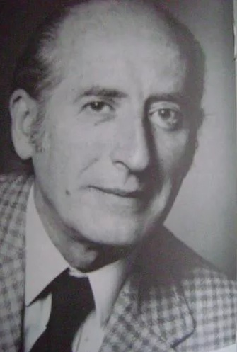

# Fernando Debesa Marín

#### Inicios

Nació en Santiago el 14 de abril de 1921. Hijo menor de tres hermanos de una familia de clase media alta. Fue criado por una __nana llamada Juana Ramos, a quien le dedicará nada menos que su obra más importante.

#### Trayectoria

Se formó como arquitecto en la Universidad Católica, pero en ese período fue clave su acercamiento al teatro. Junto a Juan Orrego Salas, Teodoro Lowey y Pedro Mortheiru funda el [**Teatro Ensayo de la UC** ](http://teatrouc.uc.cl/2014-06-10-15-01-02/historia.html)**en 1943**. Allí se desempeña también como co-director, escenógrafo y diseñador de vestuario teatral.

Fue académico del Departamento de Artes de la Representación de la [Universidad de Chile](http://www.uchile.cl/portal/presentacion/historia/grandes-figuras/premios-nacionales/teatro-y-artes-de-la-representacion/6668/fernando-debesa-marin).

En este enlace una [reseña audiovisual ](https://www.youtube.com/watch?v=HefS05MM-T0)sobre por su vida y su obra.

Aquí, una [valiosa conversación](https://www.youtube.com/watch?v=qrtW1bIVJ88&t=15s) con el autor.

#### Obras

Años después viaja a perfeccionarse a París, donde termina de escribir su primera obra completa destinada a ser publicada: **Mamá Rosa, obra en la que ahonda en el drama de una campesina joven que viaja a Santiago a cuidar a los hijos y nietos de una mujer**, lo que le impide desarrollar su propia vida. Esta fue la obra que dedicó a la mujer que lo crió, Juana Ramos. Mama Rosa se estrenó en Chile en 1957 **y fue reestrenada en 1982**, con gran éxito de público. Ha sido traducida al inglés y representada en España, Argentina y Estados Unidos.

En este enlace, el registro de una [presentación en televisión](https://www.youtube.com/watch?v=VKg7iuBwMzo) de Mama Rosa.

Escribió también _El árbol Pepe_ \(1959\)

_Bernardo O'Higgins_ \(1961\)

_El guerrero de la paz_ \(1962\)

_Persona y perro_ \(1963\)

_Primera persona singular_ \(1964\)

_El guardapelo_ \(1965\).

En toda su obra, buscó explorar el comportamiento del ser humano frente a sus conflictos sociales e individuales.

#### Premios

**Recibió el Premio Nacional de Arte en 1981**.

Murió el [20 de junio de 2006](https://www.emol.com/noticias/magazine/2006/06/20/222625/murio-el-destacado-dramaturgo-nacional-fernando-debesa.html).

#### 

 

