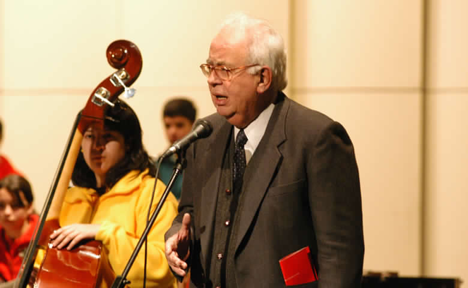

# Fernando Rosas Pfingsthorn

El desarrollo de la música chilena académica chilena no sería el mismo sin la figura de Fernando de Rosas.

#### Inicios

Nació en **Valparaíso, en el Cerro Alegre, en 1931**. Desde niño compartió dos aficiones: la música y las colecciones. Una alimentó a la otra cuando la venta de una colección de estampillas, le permitió comprar sus primeros discos.

Estudió **Derecho en la Universidad Católica de Valparaíso**, donde también **fundó el coro** de esa institución. Estudió **Licenciatura en Interpretación Musical en la Universidad Católica** y fue becado en las academias de música alemanas de **Detmold y de Hamburgo**.

Cursó **estudios en la Julliard School** en Estados Unidos gracias a una beca Fulbright.

#### Trayectoria

De vuelta en Chile, creó el **Departamento de Música de la Universidad Católica de Valparaíso**, en 1960. Un hito que deriva en otro aún más trascendente cuando en 1964 lo nombran **Director del Departamento de Música Universidad Católica** de Santiago, instancia en la que crea el Instituto de Música y la Orquesta de Cámara de esta casa de estudios.

En 1976 funda la **Agrupación Beethoven** junto a Adolfo Flores. Bajo ese alero, crea la Temporada Internacional de Conciertos y la **Radio Beethoven**, que funciona con ese nombre hasta el día de hoy.

En 1982 se hizo cargo de la **Orquesta Sinfónica de Profesores**, también conocida como la Orquesta del Ministerio de Educación.

Cumplió un rol importante en la recordada visita de Claudio Arrau a Chile en 1984, un hito que está consignado en [Sitio Oficial Fernando de Rosas](http://www.maestrofernandorosas.cl/index.html#bio).

En 1991 Organiza la **Orquesta de Cámara de Chile.**

En 1992 Creó el **Programa Nacional de Creación y Apoyo a las Orquestas Sinfónicas Juveniles y la Orquesta Sinfónica Nacional Juvenil**, con jóvenes músicos de hasta 25 años, que él mismo dirigió hasta 2001.

En 1994 fundó la [**Orquesta Sinfónica Nacional Juvenil**](http://www.orquestajuvenilchile.com).

Fue el principal impulsor de la **Fundación de Orquestas Juveniles e Infantiles de Chile \(FOJI\)**, junto a Luisa Durán y otros colaboradores, donde fue el director ejecutivo hasta su fallecimiento y donde llegó a tener a más de 12 mil niños y jóvenes en orquestas digregadas en 190 comunas de Chile.

Revisa un perfil en mayor profundidad en este enlace del sitio [Música Popular](http://www.musicapopular.cl/artista/fernando-rosas/).

#### Premio  Nacional

Fue precisamente por su labor con jóvenes y niños, con especial énfasis en los de escasos recursos, que el año 2006 fue galardonado con el Premio Nacional de Artes Musicales como reconocimiento a su incesante trabajo en la difusión de la música clásica entre los más jóvenes.

Al momento de [su muerte, en 2007](https://www.pucv.cl/uuaa/derecho/noticias/auditorio-del-cea-pucv-en-santiago-fue-bautizado-en-honor-a-ex-alumno-de/2016-11-03/122636.html) contaba en su trayectoria la fundación de 230 orquestas.

En este video de la [Fundación de Orquestas Juveniles](https://www.youtube.com/watch?v=lG8n4zfCA7o), él mismo cuenta parte de su trayectoria.

