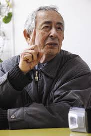

# Gabriel Castillo Inzulza

Nació el año 1927 en Talca.

#### Estudios

Se tituló en 1952 como **profesor de Estado de Castellano en la Universidad de Chile**. Una década después se tituló de **Consejero Educacional y Vocacional en la Universidad Católica de Chile**. En 1973 obtuvo el del **Magister en Educación de la Universidad Católica de Chile.**

#### Trayectoria

Fue **Asesor Pedagógico del Director de Educación Secundaria** entre 1965 y 1968, y también **presidente de la Comisión de Educación del Consejo Nacional de Educación** e integrante de la **Comisión Central de Planeamiento de la Educación** entre 1965 y 1970.

Por encargo del Gobierno de Chile, en 1966 viajó a **Francia, Inglaterra y Alemania para estudiar la reforma educacional en esos países.** Ese mismo año formó parte de la Delegación a la Conferencia Internacional de Educación sobre Investigación Educacional de Ginebra, Suiza.

En 1982 se le encargó escribir y exponer el **documento base del Seminario Regional de Formación sobre Orientación Educacional y Profesional,** organizado por la Unesco en Buenos Aires, Argentina.

Fue el encargado del **Proyecto de Perfeccionamiento de Equipos Directivos Superiores.** Hasta 1992 fue jefe del **Proyecto de Innovación Educativa en las Escuelas Municipales de San Antonio** \(PIEMSA\). Entre 1993 y 1995 se desempeñó como **jefe del Curso de Especialización en Innovación Educativa para jefes superiores, técnicos y administración de la Región del Maule** y de la Provincia de Valparaíso. Desde 1994 es **jefe del Proyecto Escuelas de Anticipación a través de Guías de Aprendizaje** que se realizó en 220 escuelas y liceos de todo el país.

#### Docencia

Fue profesor de latín en el **Liceo Manuel de Salas** y de castellano en el **Liceo de Hombres N°10 de Santiago**. Fue profesor de orientación en la **Escuela de Educación de la Universidad Católica de Chile.**

En 1969 asumió como **profesor Investigador del Centro de Perfeccionamiento, Experimentación e Investigaciones Pedagógicas \(CPEIP\)**.

#### Sobre el Premio Nacional

En 1997 recibe el **Premio Nacional de Ciencias de la Educación** por haber consagrado su vida a la educación, tanto en el campo de la docencia como en el estudio. De modo particular se consideraron sus aportes a la orientación educacional de la cual es un precursor y el más alto representante en Chile.

