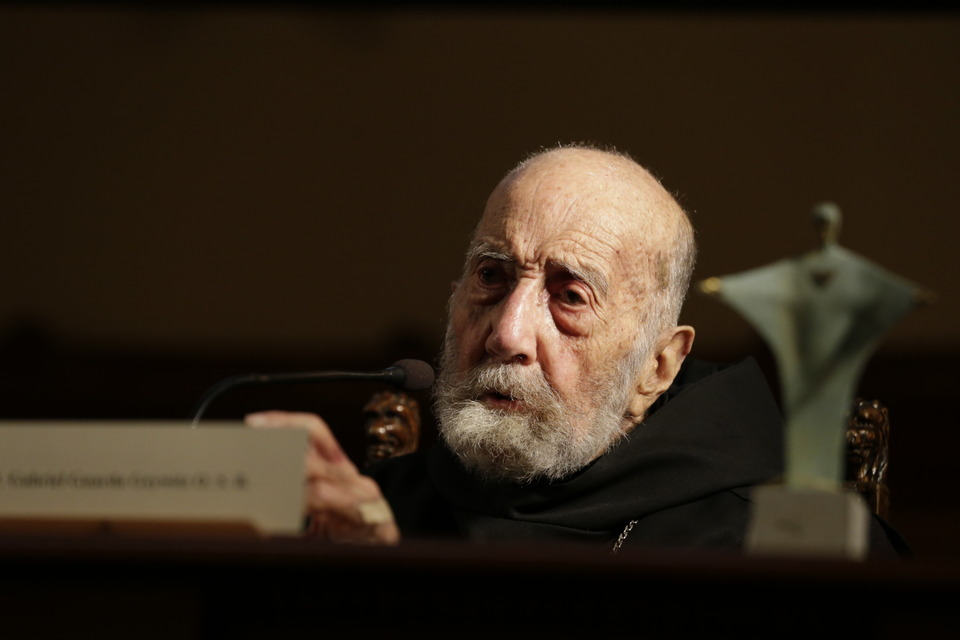

# Gabriel Guarda Geywitz

Fernando Guarda Geywitz nació en Valdivia en 1928, en el seno de una familia muy católica, de la que, además de la religión, heredó el gusto por la lectura y la historia. Entró a hacer su educación básica en el Instituto Salesiano de Valdivia, pero terminó su formación escolar en el Internado Nacional Barros Arana. Egresó en 1947 y al año siguiente entró a la **escuela de arquitectura de la Universidad Católica.**

#### Arquitectura e historia

En paralelo a sus estudios de arquitectura, comenzó a visitar la Biblioteca Nacional, para materializar la **afición por la historia que sintió desde la infancia**. Comenzó de manera autodidacta a desarrollar una investigación sobre la ciudad de Valdivia. El encargado de la Sala de la Biblioteca donde estudiaba, se interesó en su trabajo y lo impulsó a seguir adelante. **De esa investigación surgió su primer libro** _**Historia de Valdivia: 1552 - 1952**_**, publicado en 1953.**

Un viaje a Europa, le dio la posibilidad de profundizar sus conocimientos sobre arquitectura e historia, visitando archivos y documentándose sobre urbanismo colonial.

Al regresar a Chile, se integró al grupo de historiadores discípulos de Jaime Eyzaguirre. Luego en 1958, **se tituló de arquitecto.** 

#### Vocación religiosa

Su primer contacto con la orden de los Benedictinos se dio cuando ingresó a la Universidad Católica y los estudiantes escuchaban los cantos gregorianos en el Teatro Municipal. Tiempo después, comenzó a asistir periódicamente a la misa del monasterio de la orden y a relacionarse con los monjes, lo que lo llevó a que, **quince días después de titularse de arquitecto, ingresara a la Orden Benedictina**. Durante diez años de estricta formación religiosa, realizó estudios de teología y filosofía. Se ordenó sacerdote en 1968 cambiando su nombre a Gabriel Guarda.

#### El Monasterio de los benedictinos

Cuando estaba empezando su formación espiritual, recibió inesperadamente el encargo, junto a Martín Correa, otro monje, también arquitecto, de construir el **templo que la Orden Benedictina** tendría definitivamente en Chile. Pese a su juventud e inexperiencia, los monjes asumieron el desafío con entusiasmo y gran inteligencia y pragmatismo. Luego de realizar un detallado estudio sobre las condiciones de luz que querían darle al templo, **ejecutaron una propuesta a partir de una configuración moderna de volúmenes simples**, con prismas, especialmente cubos y paralelepípedos como figuras principales, que se asocian entre sí a través de sus lados y vértices. . La propuesta fue ejecutada entre los años 1962 y 1964, dando lugar al espacio que permanece hasta la actualidad. **La obra fue considerada de inmediato como una de las más importantes de la arquitectura chilena moderna** y fue declarado monumento histórico nacional en 1981.

**Su vínculo con la UC**

Su estricto régimen como monje benedicto, se rompió solo después de una década para integrarse a la Universidad Católica como **profesor de Historia de la Iglesia en la Facultad de Teología y de Historia Urbana en la Escuela de Arquitectura**. Guarda aprovechaba estas salidas del monasterio, para asistir al Archivo Nacional y a la Biblioteca Nacional para proseguir sus investigaciones sobre la historia urbana y social de la población austral chilena, especialmente de su ciudad natal Valdivia y Chiloé.

#### Premio Nacional

En 1984, sus publicaciones generaban gran entusiasmo en lectores y críticos. Eran artículos y libros especializados sobre **historia religiosa, urbana y regional durante el período colonial y las primeras décadas de la República**, y otras sobre la sociedad austral, especialmente de Valdivia y Osorno, el padre Gabriel Guarda. Ese año fue galardonado con el **Premio Nacional de Historia.**

#### Publicaciones

En las décadas siguientes el padre ha continuado con sus investigaciones. Son **más de 300 publicaciones** sobre historia urbana y arquitectónica, orígenes e influencias de las construcciones coloniales de nuestro país. Algunas de sus obras más destacadas son: _Historia urbana del Reino de Chile_ \(1978\), _Los encomenderos de Chiloé_ \(2003\), _Iglesias de Chiloé_ \(1984\), _La nueva historia de Valdivia_ \(2000\), _La tradición de la madera_ \(1995\), _El arquitecto de la Moneda Joaquín Toesca_, _1752-1799: Una imagen del imperio español en América_ \(1997\) y su monumental **estudio sobre la sociedad en Chile austral antes de la colonización alemana**.

#### Premios

Su intensa labor de rescate del patrimonio cultural arquitectónico de zonas como **Chiloé, Osorno, Valdivia, Colchagua y Valle del Elqui**, además de su participación en diversos proyectos patrimoniales como la construcción de la Catedral de Valdivia y la capilla del Monasterio Benedictino, lo han hecho merecedor de importantes distinciones entre los que se cuentan el **Premio Bicentenario \(2003\) y el Premio Conservación de Monumentos Nacionales** \(2004\), entre otros.

Es presidente de la Comisión de Bienes Culturales de la Iglesia Católica en Chile.

#### Fuentes:

[Universidad Católica](https://www.uc.cl/es/la-universidad/premios-nacionales/7341-gabriel-guarda-geywitz-1928--)

[Colegio de arquitectos](http://colegioarquitectos.com/noticias/?p=16803)

[Memoria Chilena I](http://www.memoriachilena.gob.cl/602/w3-article-94092.html)

[hMemoria Chilena II](http://www.memoriachilena.gob.cl/602/w3-article-637.html)

[Memoria Chilena III](http://www.monumentos.cl/monumentos/monumentos-historicos/monasterio-benedictino)

