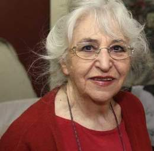

# Gracia Barrios Rivadeneira

Nació el 27 de junio de 1927 en Santiago, Chile

Es **hija del escritor chileno y Premio Nacional de Literatura Eduardo Barrios** \(1884-1963\).

#### Estudios

Recibió desde muy niña estímulos relacionados al arte. Tomó **clases particulares con el artista Carlos Isamitt** y luego, antes de terminar la educación secundaria, comenzó a asistir a **cursos vespertinos en la Escuela de Bellas de Arte de la Universidad de Chile**.

Entre los años 1944 y 1949, continuó con sus estudios formales de arte en la misma universidad. Fue **alumna de Augusto Eguiluz, Carlos Pedraza y Pablo Burchard**. Principalmente de este último reconoce haber recibido importantes influencias que determinaron su trabajo.

#### Docencia, activismo y exilio

Barrios ha compatibilizado su trabajo artístico con labores docentes en diferentes casas de estudio. 

En 1953 inició su carrera docente, como **ayudante del Taller de Dibujo de Carlos Pedraza**. En 1957, fue nombrada **profesora de la Escuela de Artes de la Universidad de Chile**, cargo que ejerció hasta 1973.

Formó parte del **Grupo de Artistas Plásticos de la Universidad de Chile**. Allí articuló la actualización y **mejoramiento de la enseñanza del arte en Chile**, organizando diversas instancias alternativas para la circulación y difusión de prácticas y discursos.

Al iniciarse la década del 60, junto a su marido, el pintor José Balmes y a los artistas Alberto Pérez y Eduardo Martínez Bonati, **formó el Grupo Signo**, que promovía una pintura abstracta, expresiva y gestual, influenciada por el movimiento informalista europeo. **Signo hizo énfasis en el rol político** que deben cumplir los artistas en la sociedad.

En ese contexto, Gracia Barrios participó activamente en las **transformaciones culturales que se estaban desarrollando en el país desde fines de los años 60**. Primero con el proceso de Reforma Universitaria, luego en el marco del programa político de la Unidad Popular.

Con el **Golpe de Estado de 1973, vino el exilio**. La artista junto a su esposo y la hija de ambos, Concepción Balmes \(también artista\), se radicaron en Francia, donde su obra estuvo marcada por imágenes que denunciaban la represión de la dictadura.

Entre los años 1986 y 1993 fue nombrada **Profesora Visitante de la Escuela de Arte de la Universidad Católica de Chile**. Desde 1994 ejerce como profesora de dibujo en la Facultad de Artes de la Universidad Finis Terrae, en Santiago.

 En 1986 la artista se incorporó como profesora visitante en la Escuela de Arte de la Pontificia Universidad Católica de Chile, cargo que ejerció hasta 1993. En la década de los 90, ofició como profesora de dibujo en la Universidad Finis Terrae.

#### Obra

En la década del 70 destacan sus **obras en gran formato** en las que representa grandes masas humanas anónimas, con fuerte acento chileno y latinoamericano.

Al principio su pintura fue figurativa, pero progresivamente fue cambiando y comenzó a manifestar una **fuerte preocupación problemas políticos y sociales**. La condición humana, los sueños y el sufrimiento pasaron a ser temas centrales en su obra, que derivó en un estilo más cercano al informalismo y la abstracción. Sus medios de expresión más utilizados son las técnicas del óleo, el acrílico y la materialidad que proporcionan las tierras.

Volvió del exilio a mediados de los 80.

Su obra ha sido exhibida en distintas ciudades de Chile y en países como _España, Francia, México, Argentina, Colombia, Japón y Estados Unidos_ entre otros. En sus primeros años de carrera, Barrios fue galardonada en varios salones oficiales en Santiago, a lo cual le siguieron otros importantes premios nacionales como internacionales.

Fue galardonada con el **Premio Nacional de Artes el 2011** por su brillante y dilatada trayectoria artística. Por una obra que se distingue por su incesante búsqueda de la condición humana y, sobre todo, por la relación del ser humano con sus contextos existenciales e históricos.

La artista reside en Santiago, Chile.

[Artistas visuales chilenos](http://www.artistasvisualeschilenos.cl/658/w3-article-40247.html)

[Museo Nacional de Bellas Artes](http://www.patrimoniocultural.gob.cl/dinamicas/DocAdjunto_956.pdf)

[Universidad Católica](https://www.uc.cl/es/la-universidad/premios-nacionales/7347-gracia-barrios-rivadeneira-1927)

[Universidad de Chile](http://www.uchile.cl/portal/presentacion/historia/grandes-figuras/premios-nacionales/artes/75085/gracia-barrios-rivadeneira)

