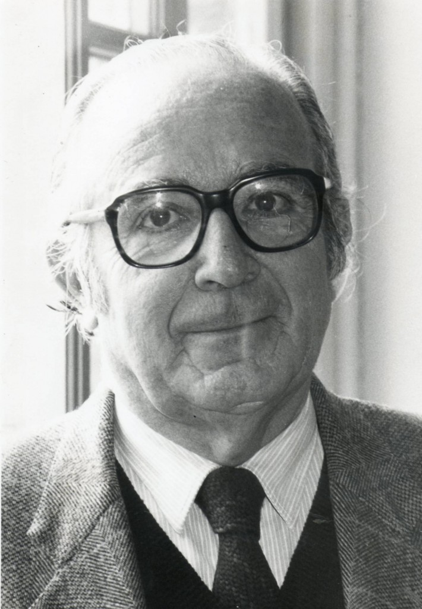

# Guillermo Blanco Martínez

Nació en Talca el 15 de agosto de 1926. A los ocho años se trasladó junto a sus padres a Santiago.

#### Inicios

Estudió en el **Instituto de Humanidades Luis Campino** de donde egresó en 1942. Luego entró a estudiar Arquitectura en la Universidad Católica, pero no terminó la carrera.

Tras dejar la universidad, trabajó por casi una década en la Compañía Salitrera Anglo-Lautaro. Entre 1946 y 1948 **creó junto a un grupo de amigos la revista** _**Amargo**_, donde publicó sus primeros relatos.

#### Trayectoria

En paralelo a la literatura, durante la década de 1950 empezó a ejercer el oficio de periodista.

A comienzos de los 60 fue **redactor de la revista** _**Finis Terrae**,_ perteneciente a la Universidad Católica. Fue **columnista del diario** _**El Sur**_ **de Concepción**, colaboró con la **revista** _**Mensaje**_, fue **director de la revista** _**Rumbos**_ ****y trabajó en el diario _La Voz_, donde llegó a ser subdirector.

En esa época comenzó a hacer **clases de periodismo en la Universidad Católica**, donde formó a varias generaciones de periodistas hasta 1976. En esta universidad llegó a ser **Vicerrector de Comunicaciones**.

A mediados de los 60 entró a trabajar a la **revista** _**Ercilla**_. Por su destacada labor, en 1968 fue **invitado a Vietnam** junto a un grupo de periodistas latinoamericanos, para dar cuenta de la realidad en ese país, durante la guerra contra Estados Unidos. **Sus vivencias fueron publicadas como columnas en** _**Ercilla**_ **y luego en un libro titulado** _**Recuerdos no siempre cuerdos**_**.**

En 1969, formó parte del equipo fundador de **Televisión Nacional de Chile**, donde posteriormente ejerció como Director de Programación.

Tras el golpe de estado, formó parte del **equipo fundador de revista** _**Hoy**_, donde llegó a ser Editor Cultural entre 1976 y 1989.

Con la llegada de la democracia, en 1990, entró a trabajar como **profesor en la Escuela de Periodismo en la Universidad Diego Portales**, donde estuvo hasta el 2003. Por esos años fue también miembro del **Consejo Nacional de Televisión y presidente del Consejo Nacional del Libro y la Lectura**.

El año 2000 **integró la Mesa de Diálogo**, instancia a nivel nacional en la que se intentó acercar posiciones sobre las violaciones a los derechos humanos durante la dictadura.

Puedes ver una versión más detallada de su trayectoria en la [página oficial del autor](http://guillermoblanco.cl/biografia-guillermo-blanco-martinez/).

#### Publicaciones

Sus primeros relatos fueron publicados durante los 50 en revistas como _Amargo_, _Estudios_, _Rumbos_ y _Finis Terrae_.

En 1959 publicó _**Sólo un hombre y el mar**_, su primer libro de cuentos. Ese mismo año apareció la **novela breve** _**Misa de Réquiem**_.

En 1964 fue lanzada la que es **su obra más célebre,** _**Gracia y el forastero**_. Le siguieron en 1969 los colecciones de cuentos _Cuero de diablo_ y _Los borradores de la muerte_.

En [este enlace](http://www.memoriachilena.gob.cl/archivos2/pdfs/MC0036882.pdf) puedes revisar un recorte de prensa con una entrevista de esa época.

También escribió ensayos, siendo **el más relevante** _**El evangelio de Judas**_ **\(1973\)**, donde reflexionó en torno a la figura de Jesucristo y la religión.

Otras publicaciones son [_Camisa limpia_](https://www.academia.edu/12190800/Camisa_limpia_de_Guillermo_Blanco._Discursos_al_margen) \(1989\) y _El joder y la gloria_ \(1997\), entre otras.

En 1992, fue becado por el Ministerio de Asuntos Exteriores de España para pasar una temporada en Salamanca investigando los últimos años de Miguel de Unamuno. Una década después publicó _El león sin gafas_, libro donde volcó el resultado de esa experiencia en España.

#### Premios y distinciones

En 1956 **ganó el concurso de cuentos del diario El Mercurio** con [_Adiós a Ruibarbo_](https://lecturia.org/cuentos-y-relatos/guillermo-blanco-adios-ruibarbo/853/).

Fue el ganador del Concurso Nacional de Cuentos Oscar Castro en 1957.

Su novela _Misa de réquiem_ fue galardonada con el premio Alerce.

En 1973, fue nombrado **miembro de la Academia Chilena de la Lengua** y miembro de número de la Real Academia Española.

Recibió el **Premio Nacional de Periodismo en 1999**, por su “amplia y respetada trayectoria” y por haber sido reconocido por muchas generaciones como “un maestro de periodistas”.

Fue nombrado **Hijo Ilustre de Talca en 2006** y ese mismo año, condecorado por el Ministerio de Educación con la[ Orden al Mérito Docente y Cultural Gabriela Mistral](../../home/ver-mas-noticias.md).

Recibió la **Encomienda de la Orden de Isabel La Católica**, otorgada por el Rey de España y se le otorgó la ciudadanía española, por la vinculación de su obra con la cultura de ese país.

Murió el 25 de agosto de 2010, a los 84 años de edad.

