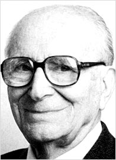

# Héctor Croxatto Rezzio

#### Inicios

Nació en Valparaíso el 3 de julio de 1908. Pasó su infancia y adolescencia en Temuco. Se trasladó a Santiago a cursar Medicina en la Universidad de Chile, de donde se tituló como **médico cirujano en 1930**. Hizo estudios de post título en Basilea, Suiza, y en la Universidad de Harvard, EE.UU.

#### Trayectoria

Su trabajo en **biología, fisiología, bioquímica, inmunología**, estudiando especialmente la hipertensión arterial, el sistema endocrino, el sistema renal y la enseñanza de la ciencia, ha sido **fundamental en el desarrollo de la ciencia y la medicina en Chile**.

Durante veinte años fue **profesor de Fisiología** en el Instituto de Educación Física y Técnica de la Universidad de Chile. En 1955 fue nombrado profesor titular de Fisiología en el **Departamento de Ciencias Naturales y Matemáticas de la Facultad de Filosofía y Ciencias de la Educación,** de esa misma universidad. También realizó docencia en la Facultad de Medicina de la Pontificia Universidad Católica de Chile.

Fue el **primer chileno en participar en un congreso científico internacional,** con un trabajo desarrollado en Chile, en el Congreso Mundial de Fisiología en Suiza, en 1938.

**A partir de 1958 estrecha sus vínculos con la Universidad Católica**. Primero como Secretario Académico, y luego como Decano de la [Facultad de Medicina de la Universidad Católica](https://medicina.uc.cl/noticias/fallecio-el-dr-hector-croxatto-maestro-de-medicos-e-investigadores/) entre 1958 y 1959. Se desempeñó también como académico de la Facultad de Ciencias Biológicas en la misma universidad.

En 1966 fue designado primer **Director del Centro de Perfeccionamiento y Experimentación del Ministerio de Educación Pública de Chile**, creado durante el gobierno del Presidente Eduardo Frei Montalva. Tres años después se integró a la Academia Chilena de Ciencias del Instituto de Chile. El año 1976 es nombrado Miembro de Número de la Academia Pontificia de Ciencias del Vaticano.

Aquí puedes leer un texto homenaje publicado en la [Revista Médica](https://scielo.conicyt.cl/scielo.php?script=sci_arttext&pid=S0034-98872011000100017).

Y aquí un [perfil del doctor](https://www.youtube.com/watch?v=7SO4u8kl6eI) desarollado por Explora Conycit.

#### Premios

**En 1979 recibe el Premio Nacional de Ciencias** por sus investigaciones sobre endocrinología experimental \(estudio de las hormonas hipofisiarias y sus efectos sobre el riñón y la hipertensión arterial\); hipertensión arterial experimental \(causas posibles e incidencia renal en dicha enfermedad\); y estudio de péptidos vinculados al equilibrio y desencadenamiento de la hipertensión.

Dos años después, recibe el **Premio Bernardo Houssay de la OEA.**

En 1985 la **Pontificia Universidad Católica de Chile lo distingue con el grado de Doctor Scientiae et Honoris Causa**.

Desde 1989 es Hijo Ilustre de la ciudad de Temuco.

Recibió el Premio Juan Gómez Millas, de la [Universidad de Chile](http://www.uchile.cl/portal/presentacion/historia/grandes-figuras/premios-nacionales/ciencias-/6657/hector-croxatto-rezzio) en 1992

En 2002 obtuivo el grado de Doctor Sciencia et Honoris Causa de Universidad Metropolitana de Ciencias de la Educación.

En febrero de 2000 y por unanimidad de los miembros del directorio, la Fundación Chilena de Hipertensión Arterial, que ayudó a fundar en Mayo de 1994, pasó a llamarse, [**Fundación Chilena de Hipertensión Arterial**](http://www.presionaldia.cl/pages/homenaje/)  **“Dr. Héctor Croxatto Rezzio”,** en reconocimiento a su trayectoria.

En 2005 fue nombrado profesor honorario de la Facultad de Medicina de la Universidad de Chile.

Murió en Santiago en 2010.

