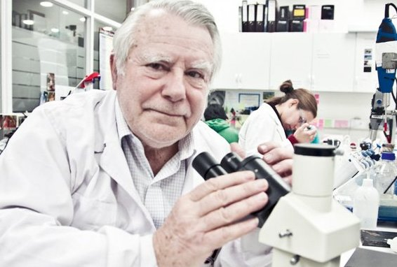

# Horacio Croxatto Avoni

Médico cirujano, biólogo, fisiólogo, investigador y científico chileno.

#### Estudios e investigación

En 1961 obtuvo el título de **doctor en Medicina en la Facultad de Medicina de la Universidad Católica de Chile**. Realizó estudios posdoctorales en neuroendocrinología en el National Institute of Health de la Universidad de California en Los Ángeles \(UCLA\).

Entre 1966 y 1967 hizo **investigaciones de endocrinología reproductiva** en el Population Council de la Universidad Rockefeller, Nueva York junto al doctor Sheldon J. Sega.

Es junto al doctor Sega, el **creador y especialista del anticonceptivo subdérmico o implante subcutáneo, método anticonceptivo**. El doctor Croxatto fue el primero en el mundo en diseñar, fabricar y probar clínicamente un implante femenino y concibió la idea de usar una hormona natural como anticonceptivo durante la lactancia.

Sus investigaciones han **influido directamente en mejorar la calidad de vida de millones** de mujeres, hombres y su entorno, en Chile y el mundo.

**Membresías y distinciones**

Desde 1973 es miembro del Comité Internacional para la **Investigación en Anticoncepción del Population Council** \(Nueva York\) y formó parte del Grupo de Trabajo sobre **métodos de control de la fertilidad de la Organización Mundial de la Salud** entre 1985 y 1991.

Presidió el Instituto Chileno de Medicina Reproductiva \(ICMER\) desde 1985 hasta 2008.

Algunas de las instituciones, organizaciones y fundaciones que han apoyado sus investigaciones se cuentan, el **Population Council de Nueva York**, IDRC de Canadá, HRP-WHO \(Programas de Salud de la Organización Mundial de la Salud\), la **Fundación Rockefeller**, CONRAD, FHI, **CONICYT**, Ernst Schering Research Foundation \(ERSF\), **Fundación Bill & Melinda Gates** y William & Flora Hewlett Foundation.

En 1999, el Gobierno de Chile le otorgó la **Cátedra Presidencial en Ciencias**, por su productividad científica. Ha recibido 22 distinciones en Chile y el mundo. La más reciente en 2014, la Society of Family Planning \(SFPP\) de los Estados Unidos.

#### Premio Nacional

En 2016 recibió el **Premio Nacional de Ciencias por su contribución al desarrollo de importantes métodos anticonceptivos** que han revolucionado el campo de la reproducción humana y han beneficiado a millones de personas”.

Es profesor honorario de la Universidad de Chile y de la Universidad de Valparaíso, académico de la Universidad Nacional Andrés Bello y cofundador del Instituto Chileno de Medicina Reproductiva \(ICMER\).

#### Fuentes

[Mineduc](https://www.mineduc.cl/2016/08/27/horacio-croxatto-avoni-gana-premio-nacional-ciencias-aplicadas-tecnologicas-2016/)

[Museo Interactivo Mirador](https://mim.cl/index.php/pnc-51)

[Universidad Católica](https://www.uc.cl/es/la-universidad/premios-nacionales/31447-horacio-croxatto-avoni)

