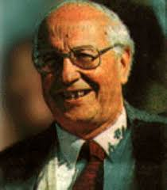

# Hugo Montes Brunet

#### Inicios

Nació el año 1926.

Estudió en el Liceo Alemán.

Se tituló de **abogado en la Universidad Católica de Chile** en 1950. Posteriormente cursó estudios de Pedagogía en Castellano en la Universidad de Chile. En 1953 se tituló de Profesor de Estado.

En 1961 recibió el grado de **Doctor en Filología Romántica en la Universidad de Freiburg**, Alemania.

Revisa en este enlace el perfil de Montes en el sitio del [Centro de Ex Alumnos Liceo Alemán](http://www.cexla.cl/new/historia-la/exalumnos-premiados/hugo-montes-brunet-egresado-1942/).

#### Trayectoria

Fue **profesor de Literatura en la Universidad de Chile y en la Universidad Católica** y decano de la Universidad Austral y de la Universidad Católica de Valparaíso.

Fue **Profesor de Castellano en el Liceo Alemán** \(1950- 1956\); **Decano de Estudios Generales en la Universidad Austral de Chile** \(1958- 1960\) y **Decano de Filosofía y Educación en la Universidad Católica de Valparaíso** \(1964-1967\).

También se desempeñó como **Director Subrogante del Centro de Perfeccionamiento e Investigaciones Pedagógicas del Ministerio de Educación** \(1968-1969\) y Profesor invitado en las Universidades de Cuyo, Costa Rica, Freiburg \(Alemania\) y Notre Dame \(Indiana\). Fue **rector de los colegios santiaguinos Saint George y San Esteban Diácono**; de este último también fue su fundador. También fundó los colegios San Nicolás Diácono \(Colina\) y San Felipe Diácono \(Calera de Tango\).

Revisa aquí un [perfil complementario](https://www.ecured.cu/Hugo_Montes_Brunet)

Y aquí la crítica de Montes a la novela [_Mala onda_ de Alberto Fuguet](http://www.bibliotecanacionaldigital.gob.cl/bnd/628/w3-article-321730.html).

#### Publicaciones

Varias generaciones de chilenos fueron educados con los **libros de castellano de Montes que escribió en colaboración con Julio Orlandi** \(destacado profesor del Liceo Alemán\).

#### Premios

En 1974 fue condecorado por el Gobierno español como **oficial de la Orden de Isabel la Católica** y en 1968 recibió la **Cruz del Apóstol Santiago**, del Arzobispado de Santiago.

**En 1995 recibió el Premio Nacional de Ciencias de la Educación**.

Recibió otras distinciones como el **Premio Alerce de la Sociedad de Escritores de Chile** \(SECH\) \(1960\), el **Premio Ramiro de Maeztu** del Instituto Chileno de Cultura Hispánica \(1950\).

En 1965 se integró como **Miembro de Número de la Academia Chilena de la Lengua.**

